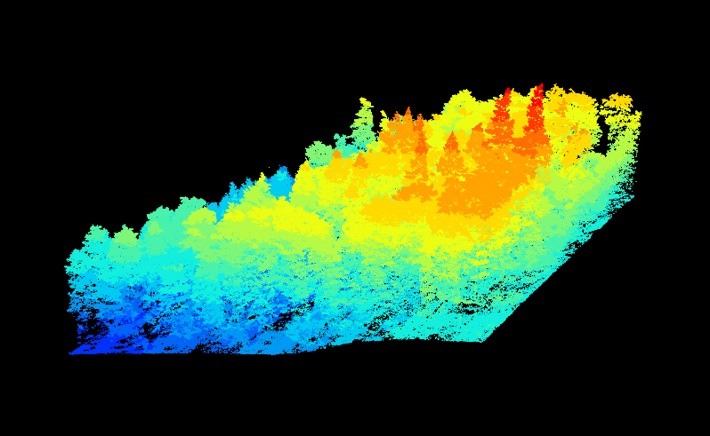
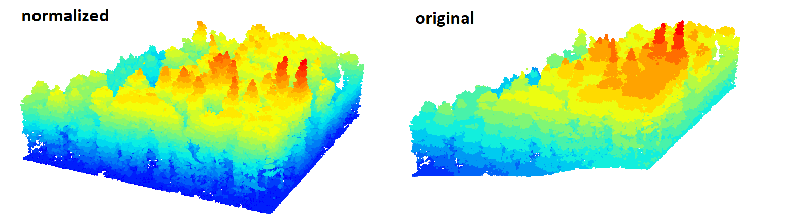

# Getting started with processing laserscanning data

## Overview

In this lecture you will learn how to load, visualize and process airborne laserscanning data in R using the lidR package. The focus will be on established procedures to create standard products such as digital terrain models, canopy height models as well as grids with LiDAR point metrics. You will also get to know a comparably simple method to identify trees from a LiDAR point cloud of a forested area.  Most of the contents of this tutorial base on the official documentation of the lidR package which can be found [here.](https://r-lidar.github.io/lidRbook/)

Some of the contents are directly copy & pasted while other parts are amended by information I deemed relevant. For anyone interested in this topic, I highly recommend to have a closer look at the link above and complete also the additional pratical parts provided there which are not covered in this tutorial.

## Learning Objectives

Getting familiar with the lidR package and acquire skills to process airborne laserscanning data in R. After completing the tutorial you will be able to

- load and visualize LiDAR data saved as .laz or .las file
- filter the LiDAR point cloud data according to attributes
- classify a LiDAR point cloud into ground and other returns
- calculate digital elevation models (digital terrain model / canopy height model)
- create height-normalized point clouds
- extract tree tops from a point cloud
- calculate point clouds metrics

## Dataset used in the tutorial

The dataset used in the tutorial originates from an airborne laserscanning survey conducted in Southern Germany in summer 2019. The dataset was collected in July 2019 under leaf-on conditions using a RIEGL VQ-780i airborne laser scanner mounted on a Cessna C207. Laser scanning was performed with a beam divergence of 25 mm/rad, a pulse repetition frequency of 1000 kHz and a scan frequency of 225 lines per second. The flight altitude was around 650 m above ground, the flight speed was approximately 51 m/s and the swath overlap was 76 percent. The resulting mean point spacing was 28 cm. Point densities in the study sites were between 136 and 164 pts/m². Pulse densities were between 70 and 78 pulses/m². The dataset is a small subset of the point cloud covering an area of approximately 130 x 130 m stored as .laz file. For this area, all trees with a DBH > 5 cm were surveyed in the field and diameter at breast height, tree species as well as the location of the tree were recorded. The corresponding data is provided in a Point-Shapefile.

The .laz file and the shapefile can be downloaded as a zip-archive at:

[https://drive.google.com/file/d/1BI_Sw0aLIcngmotZtKmEGkFEAiLu7G4N/view?usp=sharing](assets/https://drive.google.com/file/d/1BI_Sw0aLIcngmotZtKmEGkFEAiLu7G4N/view?usp=sharing "Dataset for the Tutorial")

Please download the file and copy it into a folder which you can find on your computer. E.g., D:/Studium/Projekt_1/ALS/

Then unzip the data in this folder.

## Overview of the lidR package and acknowledgements

lidR is an R package for manipulating and visualizating airborne laser scanning (ALS) data with an emphasis on forestry applications. The package is entirely open source and is integrated within the geospatial R ecosytem (i.e. raster/terra/stars and sp/sf). This guide has been written to help both the ALS novice, as well as seasoned point cloud processing veterans.

Development of the lidR package between 2015 and 2018 was made possible thanks to the financial support of the AWARE project NSERC CRDPJ 462973-14; grantee Prof. Nicholas C. Coops. Development of the lidR package between 2018 and 2020 was made possible thanks to the financial support of the Ministère des Forêts, de la Faune et des Parcs of Québec.

## Getting started

### 1. Loading point cloud data to R

Discrete return ALS sensors record a number of pieces of data. First and foremost, positional data in three dimensions (X,Y,Z) - this is normally referred to as the "point cloud". The most simple point clouds only include information about X,Y,Z position and nothing else. However, most laserscanning sensors record more information such as the intensity for each point, the position of each point in the return sequence (remember the "multi-return" capabilities of a single laser-beam discussed in the theoretical lecture), or the beam incidence angle of each point. Due to the often massive amounts of data that are collected during a laserscanning survey, reading, writing, and efficient storage of laserscanning data is a critical step prior to any subsequent analysis.

ALS data is most commonly distributed in LAS format, which is specifically designed to store ALS data in a standardized way. These data are officially documented and maintained by the American Society for Photogrammetry & Remote Sensing (ASPRS). LAS files do however require a large amount of memory because they are not compressed. The LAZ format has become the standard compression scheme, because it is free and open-source.

The widespread use, standardization and open source nature of the LAS and LAZ formats promoted the development of the lidR package, which has been designed to process LAS and LAZ files both as input and output, taking advantage of the LASlib and LASzip C++ libraries via the rlas package.

The function readLAS() reads a LAS or LAZ file and returns an object of class LAS. The LAS formal class is documented in depth in a dedicated vignette. To briefly summarize, a LAS file is made of two parts:

- The header that stores summary information about its content including the bounding box of the file, coordinate reference system, and point format.
- The payload, that is the point cloud itself.

The function readLAS() reads and creates an object that contains both the header and the payload. We will now start the practical part by running the following code in R. Make sure that you also carefully read the comments provided in the code. We will now first load all the required packages. R will give you a warning message in case a package is not installed yet. If this is the case, please install the packages either through the main menu of Rstudio by selecting "Tools" => "Install packages" and then following the appearing dialogue, or by entering the corresponding R code to install the packages into the console. E.g., to install the package "raster" use the code:

	install.packages("raster")

But now let's load the packages and the dataset
	
	############################
	## Loading LiDAR data to R
	############################
	
	
	# installing the lidR package (only required one time)
	# if the package is not installed yet

	
	# loading the lidR package
	require(lidR)
	require(stars)
	require(terra)
	require(sp)
	require(sf)
	require(ggplot2)
	require(gstat)
	
	# load the example dataset - a subset from an airborne
	# laserscanning survey conducted in 2020 in study site
	# near Karlsruhe in the South of Germany
	
	# load complete dataset (the path has to be adapted)
	las <- readLAS("D:/Studium/Projekt_1/ALS/BR01.laz")
	
With these lines of code, you should have now loaded the ALS data. To make sure that the data is loaded correctly we can run:

	# check summary of loaded dataset
	summary(las)

This should give us the following outputs:

We can see quite a lot of information is being displayed, but we will not go into every detail. A few points that are quite interesting is that we can see for example the total number of **points** is 1.74 million and based on the coordinates provided in the **extent** attribute we can see that the area covers roughly 130 x 130 m. We can also see that the file currently has no **coordinate reference** system assigned. 

By simply using the readLAS() command, we loaded the complete dataset into R - this is a quite good choice in many situations, but as we can see at the **memory** attribute, we also loaded a quite large dataset of 205.5 MB (hence the original file size of the compressed laz-file was increased by a factor of almost 10 since the original laz-file has a size of approximately 23 MB). 

In some cases, we might be interested in not loading the complete dataset but for example only the positional data while we might not be interested in loading information about intensity of scan-angle. Or we might only be interested in a specific type of returns, for example we might be interested in only using "first return" data (that is all 3D points that were recorded when the laser beam interacted with an object for the first time while we want to disregard any returns that followed) In such cases, the lidR package provides some options to read only parts of the dataset as exemplified in the code below:

	# It is also possible to only load specific subsets of the data
	# by either using the "select" argument to only load certain columns
	# of the dataset (columns are attributes - such as x, y, z position,
	# scan angle, return number, etc.)
	# or by using the filter argument to only load certain rows (data points) of the
	# dataset - for the latter the options are listed here
	readLAS(filter = "-help")
	# load only 3D points and discard other information
	las_xyz <- readLAS("D:/00_FUB/3_lehre/2_Projekt_1/1_tree_attributes/Practicals/2_LiDAR/BR01.laz", select="xyz")
	# load complete dataset but only first returns
	las_fr <- readLAS("D:/00_FUB/3_lehre/2_Projekt_1/1_tree_attributes/Practicals/2_LiDAR/BR01.laz", "-keep_first")

**MINI-EXERCISE:** Try to tun the lines above and check how the size of the loaded datasets has changed (**memory** attribute) using the **summary** command learned already above.

As stated above, a typical lidar dataset does not only contain information about the point locations but also additional information. In the datasets we loaded so far, we can check what kind of additional data is stored by running:

	names(las@data)

This will result in the following output:

So we can see that each of the LiDAR point does not only have a X, Y and Z coordinate but many additional attributes that can be used during the analysis. Even though many of these attributes are not typically being used to extract information of the targeted variable (e.g., forest parameters). The only exceptions are Intensity and ReturnNumber which both normally carry some relevant information about the object with which the laser beam interacted. 

### 2. Visualizing LiDAR data with lidR
	
The lidR package takes advantage of the rgl package to provide a versatile and interactive 3D viewer with points coloured by Z coordinates on a black background as default. The very basic way to render a point cloud is the function plot().

	plot(las)

This will lead to the following plot:

Be aware that the plot is actually interactive and in 3D. That is, by clicking and keeping the mouse-button clicked and then moving the mouse, you can rotate and shift the plot. Using the mouse-wheel you can zoom in and out. Try to play around a bit with this until you get familiar with the navigation in the plot.

As is most R-plots, it is possible to refine and adapt the plot with numerous settings. Here is code for two examples. In the first example, the color of the points (which was determined by the height of the points in the first plot) will be set based on ScanAngle and in the second based on Intensity of the LiDAR returns. In both cases, the background will be set to white.
	
	# Plot las object by scan angle, 
	# make the background white, 
	# display XYZ axis and  scale colors
	plot(las, color = "ScanAngle", bg = "white", axis = TRUE, legend = TRUE)
	# use LiDAR intensity as color, use the break argument to improve color scale
	plot(las, color = "Intensity", breaks = "quantile", bg = "white")
	
This will result in the following two plots:

As you can see, the x and y dimensions are not showing the actual coordinates of the area but start from the origin 0, 0. However, the heights (z axis) actually show their true values. In the current plots these are values above sea level. While these plots are quite nice, there are many cases where a transect view of the point cloud may be more efficient to visually examine the details of a LiDAR point cloud, particularly if the dataset shows a forest. In the lidR package it is also possible to depict transect views, but there are several steps necessary to achieve this. 

First, we have to clip the point-cloud to remain only a small strip (= the transect). There is a dedicated function to do this and we have to define the start point and the end point of the transect as well as a width (in meter). We can do this with the following code:
	
	# make transect plot
	# have a look at y and y coordinates to define start and end point
	# point coordinates have to lay between min and max of X and Y variables
	summary(las$X)
	summary(las$Y)
	
	# define some start and end point
	p1 <- c(476715, 5429035)
	p2 <- c(476758, 5429075)
	
	# clip transect
	las_tr <- clip_transect(las, p1, p2, width = 2, xz = TRUE)
	
Now we clipped out a small transect of our plot and we can visualize it using the **ggplot** function. You might already be familiar with ggplot from other courses in which you used R. It is probably the most famous R-package for preparing more advanced plots and there is ample literature on the package on the internet. I will hence not go into the details of the parameters here, but you can play around a bit for example with the parameter used for coloring the points (argument "color = Z") as well as the point size (argument "size = 0.5").

	# plot transect
	ggplot(las_tr@data, aes(X,Z, color = Z)) + 
	  geom_point(size = 0.5) + 
	  coord_equal() + 
	  theme_minimal() +
	  scale_color_gradientn(colours = height.colors(50))
	

This will result in the following plot:

Since creating a transect plot requires several steps and we might be interested in plotting transects a bit more frequently later on, we can define a custom function that allows us to plot a transect view of our dataset. I will not go into details to explain what the function does exactly here, but we will use it a few times in the parts below. Hence, simple run the complete code below in R and the function will become available in the next parts of the tutorial.

	# prepare function to make transect plotting more easy
	plot_crossection <- function(las,
	                             p1 = c(min(las@data$X), mean(las@data$Y)),
	                             p2 = c(max(las@data$X), mean(las@data$Y)),
	                             width = 4, colour_by = NULL)
	{
	  colour_by <- enquo(colour_by)
	  data_clip <- clip_transect(las, p1, p2, width)
	  p <- ggplot(data_clip@data, aes(X,Z)) + geom_point(size = 0.5) + coord_equal() + theme_minimal()
	  
	  if (!is.null(colour_by))
	    p <- p + aes(color = !!colour_by) + labs(color = "")
	  
	  return(p)
	}
	

## Ground classification

Classification of ground points is an important step in processing point cloud data. Distinguishing between ground and non-ground points allows creation of a continuous model of terrain elevation often referred to as "digital terrain model" (DTM). DTMs are useful for many applications such as calculating the run-off in hydrological models, determining suitable positions for wind turbines or deriving aspect and slope information. Many algorithms to classify ground points have been reported in the literature and lidR currently provides two of them: Progressive Morphological Filter (PMF) and Cloth Simulation Function (CSF) usable with the function classify_ground(). The lidRplugins package provides an additional algorithm called Multiscale Curvature Classification (MCC).

The implementation of PMF algorithm in lidR is based on the method described in Zhang et al. (2003) with some technical modifications. The original method is raster-based, while lidR performs point-based morphological operations because lidR is a point cloud oriented software. The main step of the methods are summarised in the  following figure (taken from the lidR book).

The pmf() function requires defining the following input parameters: **ws** (window size or sequence of window sizes), and **th** (threshold size or sequence of threshold heights). More experienced users may experiment with these parameters to achieve best classification accuracy, however the lidR also contains the util_makeZhangParam() function that includes the default parameter values described in Zhang et al. (2003).

To conduct a ground classification on our dataset, we run the following lines of code:

	
	las <- classify_ground(las, algorithm = pmf(ws = 5, th = 3))
	plot(las, color = "Classification", size = 3, bg = "white") 
	
This will take a moment of processing time and then we can have a look at the classification be using the plot_crossection function that we defined above:

	# have a look at the classification in a transect view
	# define start and end point
	p1 <- c(476715, 5429035)
	p2 <- c(476758, 5429075)
	plot_crossection(las, p1 , p2, colour_by = factor(Classification))
	
This results in the following plot

We can see that the result is not yet perfect as some points that were classified as ground appear to be rather part of the understorey of the forest (some example points are marked in the black box). In the following we will address this issue be refining the PMF algorithm by using not only a single window size but three different window sizes and providing a sequence of threshold heights. In the given case, the provided settings will lead to a quite decent result, but you can try out other parameters as well. The optimal set of parameters may vary depending on your dataset. For example areas with very rough terrain may require other settings than rather flat areas.
 

	# adjust ground classification algorithm
	ws <- seq(3, 12, 3)
	th <- seq(0.1, 1.5, length.out = length(ws))
	las <- classify_ground(las, algorithm = pmf(ws = ws, th = th))
	plot_crossection(las, p1 , p2, colour_by = factor(Classification))

Running this code will take a bit more time since multiple window sizes and thresholds are applied. Finally, this should result in the following plot:

This results looks quite nice and almost all of the points that were classified as ground (green color) look plausible. The classification is stored as an additional attribute in the las-file and we can use the attribute to filter the file and obtain only points that were classified as ground point. The following code does exactly this and then plots the ground points:
	
	# filter ground points and plot them
	gnd <- filter_ground(las)
	plot(gnd, size = 3, bg = "white") 
	
This will result in the following plot:

In this tutorial we only get to know one of the methods that is available in lidR to classify ground control points. If you at some point work with an own dataset and face problems in obtaining a high-quality ground classification, it might be worthwhile to examine the alternative methods of the package which are described with more details in the lidR book (see link at the beginning of this tutorial). 

## Calculate a digital terrain model

Generating a Digital Terrain Model (DTM) is usually the next step in processing that follows classification of ground points. Put simply, a DTM can be described as an “image” of the ground. Methods to generate DTMs have been intensively studied and several algorithms have been proposed for various terrain situations. DTMs are used for a variety of purposes in practice, such as determination of the catchment basins of water retention and stream flow, or the identification of drivable roads to access resources. It also enables users to normalize point clouds i.e. subtract the local terrain from the elevation of points to allow a manipulation of point clouds as if they were acquired on a flat surface.

The construction of a DTM starts with known or sampled ground points and uses various spatial interpolation techniques to infer ground points at unsampled locations. The accuracy of the DTM is very important because errors will propagate to future processing stages like tree height estimation. A wide range of methods exist for spatial interpolation of points.

Below you will find the codes to run three interpolation methods and some information about each of the method.

### Triangular irregular network

This method is based on triangular irregular network (TIN) of ground point data to derive a bivariate function for each triangle, which is then used to estimate the values at unsampled locations (between known ground points).

Planar facets of each generated triangle are used to interpolate. Used with a Delaunay triangulation, this is the most simple solution because it involves no parameters. The Delaunay triangulation is unique and the linear interpolation is parameter-free. The drawbacks of the method are that it creates a non-smooth DTM and that it cannot extrapolate the terrain outside the convex hull delimited by the ground points since there are no triangle facets outside the convex hull. Moreover, the interpolation is weak at the edges because large irrelevant triangles are often created. It’s therefore important to compute the triangulation with a buffer to be able to crop the DTM and clear the edge artifacts.

To run the interpolation with TIN execute the following code:

	# calculate a digital terrain model from the classified
	# ground points. Three methods are available:
	
	# tin
	dtm_tin <- rasterize_terrain(gnd, res = 0.5, algorithm = tin())
	plot_dtm3d(dtm_tin, bg = "white") 

This will result in the following plot:

As you can see there are not many details visible. This is actually a good sign as we would normally assume that a digital terrain model in a forest is rather "smooth" surface since all LiDAR points related to object on the ground are "eliminated" during the ground-classification procedure. The only thing we can see in the figure is that a road is separating the study area into more or less two equally sized parts. The road becomes clearly visible since it is a flat area which interrupts the slightly inclined terrain. Let's have a look at the two other methods to interpolate the ground points.

## Invert distance weighting

Invert distance weighting (IDW) is one of the simplest and most readily available methods that can be applied to create DTMs. It is based on an assumption that the value at an unsampled point can be approximated as a weighted average of values at points within a certain cut-off distance d, or from a given number k of closest neighbours. Weights are usually inversely proportional to a power p of the distance between the location and the neighbour, which leads to the computing of an estimator.

Compared to tin() this method is more robust to edge artifacts because it uses a more relevant neighbourhood but generates terrains that are “bumpy” and probably not as realistic as those generated using TINs. There are always trade-offs to different methods!

To create a digital terrain model using the invert distance weighting method run:
	
	# invert distance weighting
	dtm_idw <- rasterize_terrain(gnd, algorithm = knnidw(k = 10L, p = 2))
	plot_dtm3d(dtm_idw, bg = "white") 

This will result in the following plot:

## Kriging

Kriging is the most advanced approach and utilizes advanced geostatistical interpolation methods that take into account the relationships between the returns and their respective distances from each other. lidR uses the package gstat to perform the kriging. This method is very advanced, difficult to manipulate, and extremely slow to compute, but probably provides the best results with minimal edge artifacts.

To create a digital terrain model using the kriging method run:
	
	# kriging
	dtm_kriging <- rasterize_terrain(gnd, algorithm = kriging(k = 40))
	plot_dtm3d(dtm_kriging, bg = "white") 

This will result in the following plot:
	

If we are interested in obtaining a 2D-hillshade image of our terrain model, we can run the following code.
	
	# create hillshade image from digital terrain model
	dtm_prod <- terrain(dtm_kriging, v = c("slope", "aspect"), unit = "radians")
	dtm_hillshade <- shade(slope = dtm_prod$slope, aspect = dtm_prod$aspect)
	plot(dtm_hillshade, col =gray(0:30/30), legend = FALSE)

This will lead to the following plot:

In our example dataset this is not very spectacular since we do not have a pronounced terrain situation and the area is comparably small. If data from a larger area for example covering a mountain chain is used, this option may become more interesting (at least for producing nice visualizations).
	

## Normalize the LiDAR point cloud

In many application fields, we might be interested in extracting the height of objects from a LiDAR point cloud. And with height I am referring to the height of objects above the ground and not above sea level. For example, we might want to know how high certain buildings or trees are. With LiDAR data this information can be easily obtained for large areas and with a very good precision of a few centimeters. To convert a standard LiDAR point cloud to a normalized point cloud in which the Z value of each LiDAR point indicates the height of the point above ground, we can simply subtract the digital terrain model from the LiDAR point cloud.

To accomplish this in lidR - there are two different approaches. One approach requires a DTM. For example we can use the DTM calculated with the kriging approach:
		
	# create a normalized height point cloud
	# by subtracting the digital terrain model from the
	# lidar point cloud
	nlas <- las - dtm_kriging
	
We can then plot the resulting point cloud and compare it with the original point cloud by plotting

	# plot the result
	plot(nlas, size = 4, bg = "white")
	# and compare it to the original point cloud
	plot(las, size = 4, bg = "white")
	
This will result in two individual plots, which were merged into one in the following plot:

We can clearly see the difference. While in the original point cloud, the height differences between the trees are less clear due to slope which also exists in the plot, the height differences become clearly visible in the normalized point cloud which all stand on a "flat" ground.

One consequence of the normalization of the point cloud should be that all LiDAR points classified as ground points should have a Z-value 0 m. With the following plot we can have a look whether this is true:
	
	# this should lead to a situation where all ground points
	# have a value of 0.0 m. We can check this with the following 
	# command. Be aware that this a nested function. That is, the
	# hist() command is used to create a histogram and the filter_ground()
	# command is used to only show values for point classified as
	# ground in the codeparts before and the $Z is used to only
	# show height values. The breaks command decides how fine the
	# individual bars of the histogram are - this could also be left
	# out. The dev.off() command is used to close any plot that is still
	# open.
	dev.off()
	hist(filter_ground(nlas)$Z, breaks = seq(-0.6, 0.6, 0.01), main = "", xlab = "Elevation")
	
This will result in the following plot:

We can see that the assumption is more or less true but we can also see that the ground points are not all exactly at 0 m but they fluctuate between roughly -0.5 and 0.5 m. This is related to the fact that we used an interpolated DTM with a given grid size. Within a single grid cell of the DTM, the height value is exactly the same in each location of the grid cell. Hence, some ground points may lay below or above this value.

If we want all ground points to have a value of zero, lidR offers a function to normalize the point cloud using the ground points without a grid-based interpolation. There are still some interpolation going on for the non-ground points but all ground-points will have a value of zero. This method can be executed with the following command:

	# create a normalized height point cloud
	# by subtracting the height of the lowest point nearby
	# this is similar to the just described step, but it assumes 
	# a continuous DTM without a pixel size
	nlas <- normalize_height(las, knnidw())
	# the histogram plot now shows that all ground points are at zero.
	hist(filter_ground(nlas)$Z, breaks = seq(-0.6, 0.6, 0.01), main = "", xlab = "Elevation")

And the corresponding plot confirms that now all ground plots have indeed a Z-value of 0.

	

## Calculate digital surface models and canopy height models

Digital Surface Models (DSM) and Canopy Height Models (CHM) are raster layers that represent - more or less - the highest elevation of ALS returns. In the case of a normalized point cloud, the derived surface represents the canopy height (for vegetated areas) and is referred to as CHM. When the original (non-normalized) point cloud with absolute elevations is used, the derived layer represents the elevation of the top of the canopy above sea level, and is referred to as DSM. Both surface models are derived using the same algorithms, with the only difference being the elevation values of the point cloud.

Different methods exist to create DSMs and CHMs. In the most simple case, a grid can be created with a user-defined pixel size and the elevations of the highest point can be assigned to each grid cell. This is called point-to-raster. 

Point-to-raster algorithms are conceptually simple, consisting of establishing a grid at a user defined resolution and attributing the elevation of the highest point to each pixel. Algorithmic implementations are computationally simple and extremely fast. In the first example we will set the pixel size to 1 and the corresponding algorithm = p2r():
	
	# point-to-raster method
	chm <- rasterize_canopy(las, res = 0.5, algorithm = p2r())
	col <- height.colors(25)
	plot(chm, col = col)

This will result in the following plot:
	
	

As we can see the depicted height values are still showing altitudes above sea level. Hence, while we do see height differences of more than 60 m in the study area, not all of these height differences are related to the height of trees. So this would be an example of a "digital elevation model" (DSM) which is a raster which shows the height above sea level of the ground + the objects on the ground at each spatial location. If we are interested in only seeing the height of objects we need a "normalized digital elevation model" (nDSM) or in the case of forests a so called "canopy height model" (CHM). This created by either subtracting the a DTM from a DSM of the same area. Or by directly applying the same algorithm as used for calculating the DSM but this time to the already normalized point cloud:

 	# point-to-raster method
	chm <- rasterize_canopy(nlas, res = 0.5, algorithm = p2r())
	col <- height.colors(25)
	plot(chm, col = col)

This will result in the following plot:

	

In some cases, the point-to-raster method has some drawbacks. For example if you have a LiDAR dataset with comparably few number of returns, you might end up with data caps in your elevation model. One alternative approach to calculate the DSMs and nDSMs is the TIN approach we already used to calculate DTMs.

The triangulation algorithm works by first creating a triangular irregular network (TIN) using first returns only, followed by interpolation within each triangle to compute an elevation value for each pixel of a raster. In its simplest form, this method consists of a strict 2-D triangulation of first returns. Despite being more complex compared to the point-to-raster algorithm, an advantage of the triangulation approach is that it is parameter free and it does not output empty pixels, regardless of the resolution of the output raster (i.e. the entire area is interpolated).

Like point-to-raster however, the TIN method can lead to gaps and other noise in the surface - referred to as “pits” - that are attributable to first returns that penetrated deep into the canopy. Pits can make individual tree segmentation more difficult and change the texture of the canopy in a unrealistic way. To avoid this issue the CHM is often smoothed in post processing in an attempt to produce a more realistic surface with fewer pits and less noise. To create a surface model using triangulation we use algorithm = dsmtin().

	# tin method
	chm <- rasterize_canopy(las, res = 0.5, algorithm = dsmtin())
	plot(chm, col = col)

This results in the following plot:

		

In our dataset, the differences are quite little. 

We are now coming towards the end of this tutorial and so far you have learned the most important basic processing steps for LiDAR / laserscanning data. To finish the tutorial we will have a brief look at two additional steps that are the starting points of most LiDAR-analyses conducted in vegetation and forest analyses. 

## Individual tree detection

Typically LiDAR analyses in forests either work on an individual tree level or in the so called area-based approach. In the latter, the basic unit of the analysis is a cell of a user-defined fixed size (e.g., 20 x 20 m). In the individual tree-based approach, the basic unit of the analysis is a single tree. Automatically delineating trees from a LiDAR point cloud is an own field of research and we will not go into details in this tutorial. However, the lidR package offers one standard algorithm to identify tree tops from a LiDAR point cloud which will be briefly explained below.

Tree tops can be detected by applying a Local Maximum Filter (LMF) on the loaded data set. The LMF in lidR is point cloud-based, meaning that it finds the tree tops from the point cloud without using any raster. The processing, however is actually very similar. For a given point, the algorithm analyzes neighbourhood points, checking if the processed point is the highest. This algorithm can be applied with the 
Local Maximum Filter - lmf() function.

The LMF can be applied with a constant size windows. In the code below with a windows size of ws = 5 meters meaning that for a given point the algorithm looks to the neigbourhood points within a 2.5 radius circle to figure out if the point is the local highest. While the algorithm does not need any CHM to work we chose to display the results on top of a CHM for better visualization.
	
	# detect tree tops with fixed window size of 5
	ttops <- locate_trees(nlas, lmf(ws = 5))
	
	# have a look at results
	chm <- rasterize_canopy(nlas, res = 0.5, algorithm = p2r())
	plot(chm, col = height.colors(50))
	plot(sf::st_geometry(ttops), add = TRUE, pch = 3)

This will take some time for processing and then result in the following plot:

	

We can also have a loot at the result in 3D:
	
	# have a look at results in 3d
	x <- plot(nlas, bg = "white", size = 4)
	add_treetops3d(x, ttops)
	
		

If we are not happy with the results of this comparably simple approach, we can refine the algorithm by adjusting the search window depending on the height of the canopy assuming the trees which are less tall, also have smaller crowns. This can be accomplished by providing the algorithms with a function that describes the relation between the height of the trees and the window size and a sequence of heights for which different window sizes will be used:

	# adapt window size with height
	f <- function(x) {x * 0.1 + 3}
	heights <- seq(0,40,10)
	ws <- f(heights)
	plot(heights, ws, type = "l", ylim = c(0,6))
	
This will result in slightly different results:

	ttops <- locate_trees(nlas, lmf(f))
	plot(chm, col = height.colors(50))
	plot(sf::st_geometry(ttops), add = TRUE, pch = 3)
	
		

Identifying the optimal parameter is not an easy task and may require some sort of reference data which can for example be obtained by visually interpreting a CHM or by identifying tree stem positions in the field. Even though the latter is often also prone to errors since identifying the exact position of a tree in the field is not a trivial task and on top of this, the stem position on the ground may not directly related to the top of the crown since many trees do not grow exactly vertically.

The detection of tree tops is normally only the first step for the individual tree delineation/segmentation since it does not yet allow us to identify the tree crown area. lidR provides function for this task as well, but we will not demonstrate this here with our example dataset. Amongst others because our dataset is missing a coordinate reference system (which first would have to be assigned) and the functions will not immediately work. However, feel free to also try out these functions by using the example datasets delivered with lidR. The corresponding data and instruction can be found in the lidR-book (see link at the beginning of the tutorial).

	
## Calculate point cloud metrics

As very last step, we will get to know two important functions of the lidR package to calculate point cloud metrics. Point cloud metrics are an essential element of the area-based approach briefly mentioned above. The idea is that a regular grid of quadratic or hexagon-shaped polygons is overlayed with the point cloud. Then, in each grid-cell/polygon some metrics are calculated for the points located within the grid-cell/polygon. 

The standard deviation of point heights within a single tree crown is an example of a metric calculated at the tree level. The average distance between a point and its k-nearest neighbours is a metrics calculated at the point level. More complex metrics can even be imagined like the average distance between first and last returns within a pixel or within a tree. In the end, regardless of the scale at which metrics are calculated, they serve as proxies of forest inventory attributes or can be used as independent variables in predictive models.

The standard metrics of the lidR package already include quite a lot of common and often used variables and can be obtained using the following code for either quadratic grid-cells:
	
	a <- pixel_metrics(nlas, func = .stdmetrics, res = 2.5)

or a hexagon-grid:

	b <- hexagon_metrics(nlas, func = .stdmetrics, area = 20)
	
The names of the obtained metrics can be obtained by running:

	a@ptr$names

This will result in the following output:

	

If we want to see how a 2D representation of one of the metrics looks like in either dataset we can pick out one of the variable names and run:
	
	plot(a["zq80"], pal = heat.colors, axes = TRUE, key.pos = NULL, reset = FALSE)

This will result in:

	

or:

	plot(b["zq80"], pal = heat.colors, axes = TRUE, key.pos = NULL, reset = FALSE)

This will result in:

	

These metrics can then be related for example to forest attributes inventoried in the field and regression models can be trained to first relate the field measured data to the metrics and then predict the trained model to the complete area how which laserscanning data has been collected.

This was the final step of this Tutorial and you are now all set for working with the point clouds which we will collect during the field week of this course.
