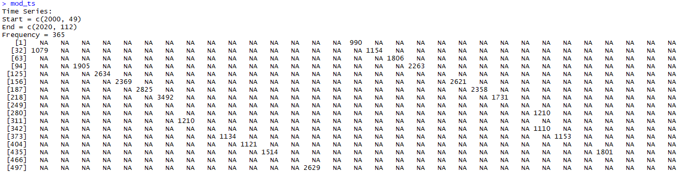
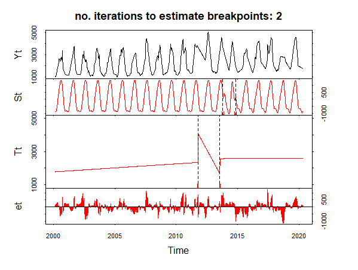
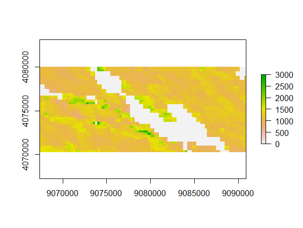
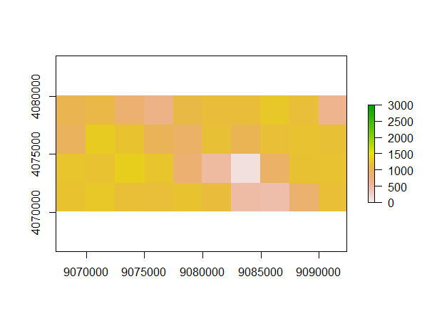
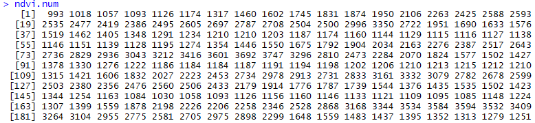
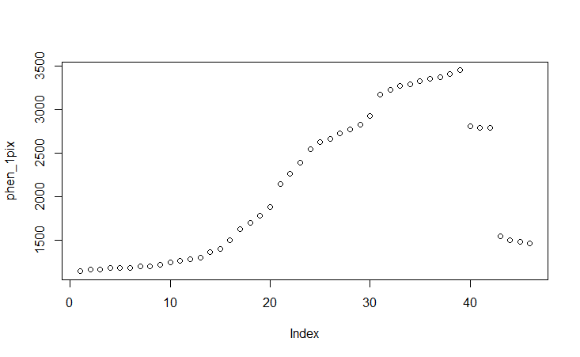
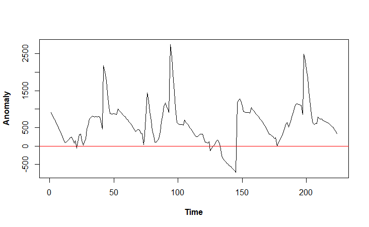

## Analysing time series with BFAST and NPPHEN

### Overview

In our last practical session for the topic of remote sensing-based time-series analysis, we will have a  look at two quite complex algorithms to analyse time series with a comparably high temporal resolution (typically monthly or less). The algorithms are BFAST and NPPHEN - both have already been introduced briefly during the theoretical lectures of the time-series chapter of the course.

You will see that the algorithms are quite time-intensive and we will hence focus on comparably small datasets to keep the processing time manageable. On ILIAS, I will provide some papers that describe the algorithms with more details. In this tutorial I will mostly focus on how to get the algorithms running.

### Learning objectives

The learning objectives of this Tutorial include:

- preparing a remote-sensing based time series for use with BFAST and NPPHEN
- applying BFAST and NPPHEN
- understanding the most important outputs of both algorithms

### Datasets used in this Tutorial

We will use the MODIS time series of Xining, we prepared during the first practical session of the time-series chapter of the course. In case you do not have the dataset available anymore, you can download the files here:

[https://drive.google.com/drive/folders/1eGbvYMEQXicggUmC9I7vMiPbI6DE9HdP?usp=sharing](https://drive.google.com/drive/folders/1eGbvYMEQXicggUmC9I7vMiPbI6DE9HdP?usp=sharing)

### Step 1: Preparing remote sensing time series for analysis with BFAST

One of the most challenging steps for analysing data with the BFAST algorithm is that the time series have to be pre-processed into regular time series. In the case of remote sensing data, most of the time, the observations are not regular. Even though the satellite typically passes over a certain area at a fixed time interval, cloud cover prevents that the satellite collects a valid observation during every overflight. Hence, remote sensing time series often have data gaps and hence an irregular structure. In the case of Landsat data, we furthermore have data from several sensors, so that the time structure is at least for some periods even less regular.

In this first step of the tutorial, we will learn how to transform an irregular time series to a regular time series. We will first load the irregular time series from our MODIS dataset, then we will transform this time series to a daily time-series and finally aggregate it again to a weekly time series. To do this, we require several packages and an additional function which was suggested by my colleague Philipp Gärtner. You can find some related information here:

[https://philippgaertner.github.io/2018/04/bfast-preparation/#](https://philippgaertner.github.io/2018/04/bfast-preparation/#)

So let's have a look at the packages we will use during this tutorial:

	require(raster)
	require(lubridate)
	require(zoo)
	require(bfast)
	require(xts)

The bfastSpatial package is not on the official CRAN list of R, so we will have to install the package manually using:
	
	library(devtools)
	install_github('loicdtx/bfastSpatial')
	# load the package
	library(bfastSpatial)

you can find more information about this package here:

[http://www.loicdutrieux.net/bfastSpatial/](http://www.loicdutrieux.net/bfastSpatial/)

I hope the installation of bfastSPatial will work smoothly - I experienced some troubles with this earlier but this time I had no issues. Besides the packages, we will need a custom function which I copied from the link of Philipp's webpage above. We should run this code to make the function available:

	aggregate.daily.to.weekly <- function(daily.ts) {
	  
	  dates      <- as.Date(date_decimal(as.numeric(time(daily.ts))))
	  xts.daily  <- xts(daily.ts, order.by = dates)
	  xts.weekly <- round(xts::apply.weekly(xts.daily, median),0)  # xts
	  
	  start(xts.weekly)
	  ts.weekly <- ts(data = xts.weekly, 
	                  # define the start and end (Year, Week)    
	                  start = c(as.numeric(format(start(xts.weekly), "%Y")),
	                            as.numeric(format(start(xts.weekly), "%W"))), 
	                  end   = c(as.numeric(format(end(xts.weekly), "%Y")), 
	                            as.numeric(format(end(xts.weekly), "%W"))), 
	                  frequency = 52)
	  
	  return(ts.weekly)
	}

After running the function, it will be available in our workspace and also be listed in the environment shown in RStudio:

Now we will load the MODIS raster dataset and the corresponding dates as we already did in the first time-series analysis Tutorial:

	###
	# load raster-stacks exported from the Google Earth Engine
	###
	
	# set working directory
	setwd("D:/Multiskalige_FE/5_Practicals/Tag_8_bfast")
	
	# load MODIS NDVI time series with images from 2000-2020
	mod_ndvi <- brick("MODIS_all_00_20_sm.tif")
	
	###
	# load corresponding dates of the time series
	###
	
	# MODIS
	m_dat <- read.table("dates_mod.txt")
	m_dat_fin <- m_dat[seq(2, nrow(m_dat),2),]
	m_dat_fin2 <- as.character(m_dat_fin)
	m_dat_for <- as.Date(m_dat_fin2, format = c("%Y%m%d"))
	
Now we are all set for conducting our time-series analysis. First, we extract again the NDVI time series of an individual pixel:
	
	# MODIS (here, row 3, column 32)
	m_ts <- as.vector(mod_ndvi[3,32])
	# set values of 0 to NA (masked pixels in this MODIS dataset have a value of 0)
	m_ts[m_ts==0] <- NA

Then we create a daily time-series using the NDVI values and the corresponding dates. Be aware that we are using a special function of the bfastSpatial package to create the daily time series. This is necessary as the other packages do now allow us to transform an irregular time series with a periodicity longer than a day to a daily time series. Basically, the function "bfastts" just adds empty observation for each day to get a complete daily time-series (see figure below). While this process seems quite straightforward in this tutorial, I would like to mention that the bfastts() function is still a bit of a prototype and while it works fine with the MODIS data of this tutorial, I had troubles running it for the Landsat-based dataset we used in the other Tutorials. I think it has something to do with the doubling of some acquisition dates due to the simultaneous acquisitions of multiple Landsat satellites, but I did not figure out a solution, yet. So far, the work-flow in this tutorial is hence only working for the MODIS dataset.

	###
	# create time series objects 
	###
	
	# create daily time series object
	mod_ts <- bfastts(as.vector(m_ts), m_dat_for, type = c("irregular"))
	mod_ts

This will lead to the following object:

	
Now, we interpolate the time series and have a look at it:

	# interpolate time series
	mod_ts_ip <- round(na.approx(mod_ts),0) 
	
	# plot the resulting time series
	plot(mod_ts_ip)

This results in the following plot:

Now we are already almost ready to run bfast. The last step, before we run it is to aggregate the time series from daily to weekly time series using:

	mod_ts_ip2 <- aggregate.daily.to.weekly(mod_ts_ip)
	
If you are interested, you can also plot this new time series, but you will not see any real differences to the daily time series.

### Step 2: Running BFAST for an individual pixel

We are now ready, to run BFAST. In the BFAST algorithm several parameters have to be defined. We can have a look at the help of the bfast function to find a bit more about the settings:

	?bfast

Unfortunately, the information given in the help is comparably sparse - it might hence be valuable to also read the two papers in which BFAST is described with more details. One key-setting is the "h" parameter which defines how large the time-difference between two breakpoint has to be at least before a second breakpoint can be detected. From the limited experience I have with BFAST in practice, I know that the h parameter has a quite notable impact on the results. However, unfortunately, I do not have a good general recommendation how to set it. It might be worthwhile to have a closer look at the literature about this. The other important settings are "season". This defines which model will be used to fit the seasonal (phenological) cycle which is inherent in most vegetation datasets. In case there is now clear seasonal cycle observable in the study area of interest (e.g., in the tropics), this parameter can be set to "none". Otherwise, the standard setting "harmonic" should work well in most cases. Finally, another important parameter is "breaks" which defines the maximum number of break points that should be detected by BFAST. In our example, we set this to 2. The decision about the number of breakpoints has to be taken based on the knowledge of the ecosystem under study. Typically, ecosystems experience heavy disturbances in a certain time-interval which might be quite large. So given the maximal length of current remote sensing time series (approximately 40 years), in most ecosystems, we cannot expect more then 2 or maybe 3-4 disturbances. Here, we have a MODIS time series of 20 years and hence I decided to set the number of disturbances to two.

So let's run the algorithm:

	bfm2 <- bfast(mod_ts_ip2[,1], h = 10/length(mod_ts_ip2[,1]), 
	         season = "harmonic", breaks = 2, max.iter = 2)
	
You will see that even running BFAST for a single pixel, takes quite a bit of time (depending on your computer  and depending also on the properties of the selected pixels several seconds, up to 1-2 minutes is realistic). 

After the code has run, we can have a look at the results by running:

	plot(bfm2)

This will results in the following plot:

We can see, that for the current pixel, BFAST detected two break points which are rather close together in time. Whether these are real breakpoints can be discussed. They might also be related to an artefact in the time series. At least at first glance, the overall impression is not that of a clear drop.

Nevertheless, it is worthwhile to have a closer look at the graph as it describes quite well how BFAST works. On the top panel, we can see the original time series. In the second panel from the top, we can see the seasonal model that was fitted by BFAST. In the third panel, we can see the linear trend components which are fitted separately for each continuous segment between breakpoints. The last, bottom panel shows the residuals which are not explained by the seasonal and the trend component together.

You can now re-run the bfast function and have a look how for example changing the number of breaks or the h parameter influences the results and maybe also rerun the algorithm for some other pixels. This is good for getting a feeling how variable the results can be which is important if BFAST is used for an analysis over a larger area and the final, often summarized, results have to be interpreted.

One more important point is to access some key-results contained in the bfast object created by the bfast() function. Two pieces of information that can be accessed quite easily is the magnitude and the time-point of the largest breakpoint. This can be achieved by running:

	bfm2$Magnitude
	bfm2$Time

Which will result in:

This can be interpreted that we had a drop in NDVI of 1709 (0.1709) as compared to the expected value at the 605th value of our time series. We can get the exact date by running:

	as.yearmon(time(mod_ts_ip2)[bfm2$Time])

Which will result in:

### Step 3: Running BFAST over a complete raster

So far, we applied BFAST to a single pixel of a raster-time-series. In this step, we will use the "calc()" function to apply it to a smaller raster dataset. As we have seen before, BFAST is quite time-intensive, so we will apply it to a really small raster which we first have to create by spatially aggregating our already comparably small MODIS dataset by the factor of 10:

	# plot the 5th time point of the MODIS time series (earlier time points were mostly data gaps)
	plot(mod_ndvi[[5]])
	# spatially aggregate the the MODIS raster stack to a spatial resolution 2500 m
	mod_ndvi2 <- aggregate(mod_ndvi,10)
	# plot the same time point after the aggregation
	plot(mod_ndvi2[[5]])

This will show the following two plots:

As you can see, by using the aggregate function we reduced the spatial resolution of the raster stack to reduce the number of pixels. An alternate way of reducing the size of the raster would have been to crop the raster to a smaller extents. Anyway, now we only have 4 by 10 pixels left, which will result in a comparably low computational time for the BFAST calculations.

To later see the progress of our calculations we activate the progressbar setting of the raster package using:

	rasterOptions(progress = 'text')

To enable using the "calc()" function in combination with BFAST, we have to put the complete bfast-workflow we used above for a single pixel into a function. This function looks like this:

	# the function takes two inputs: pixels = the NDVI time series values; dat_hard = the corresponding dates
	bfmRaster2 = function(pixels, dat_hard){
	  
	  # the following lines mirror exactly what we did above:

	  # first we set MODIS pixels with value of 0 to NA
	  pixels[pixels==0] <- NA
	  
	  # then we create a daily time series
	  day_ts <- bfastts(as.vector(pixels), dat_hard, type = c("irregular"))
	  
	  # we fill the data gaps
	  day_ts_ip <- round(na.approx(day_ts),0) 
	  
	  # we transform the daily to a weekly time series
	  week_ts_ip <- aggregate.daily.to.weekly(day_ts_ip)
	  
	  # we run bfast
	  bfm_f <- bfast(week_ts_ip[,1], h = 10/length(week_ts_ip[,1]), 
	                 season = "harmonic", breaks = 2, max.iter = 2)
	  
	  # and extract and return the Magnitude and time point of the largest breakpoint
	  return(c(bfm_f$Magnitude, bfm_f$Time))
  
	}

Then wen can apply the function to the raster stack by using the "calc()"-function. 

	bfras <- calc(mod_ndvi2, function(x){bfmRaster2(x, dat_hard = m_dat_for)})
	
The call of the function is written in this a bit more complicated way because we additionally have to define the second variable "dat_hard" during the function call. So we basically define a function that calls the bfmRaster2 function with the second variable already defined. 

This will run for a few minutes (there should appear a progress bar, after the first few pixels were processed) . Then we can have a look at the results which will also be stored as raster datasets:

	# change the name of the output rasters
	names(bfras) <- c("Magnitude", "Timepoints")
	# plot the output maps
	plot(bfras)

This should result in the following plot:

In these graphs, we can see that only for a few pixels (all pixels with Magnitudes > 0), breakpoints were detected and we can also see whether they were more towards the beginning or the end of the time series. In theory, it is of course possible to also extract more detailed information from the bfast-object but in this tutorial, we will not further explore these options. I am again also referring to the two publications of Verbesselt et al (2010+2010a) in which BFAST is explained with more details and which are provided on ILIAS.

If you are interested, you can also try to apply BFAST to another study area and with higher resolution data, you just have to consider the notably increased processing time. Even though, the bfast()-function also supports multi-core processing (check the help-function ?bfast) which may be beneficial for such use-cases if a computer with more the than one cores is available.

### Step 4: Exploring the NPPHEN algorithm

After BFAST we will now explore one more algorithm that accounts for the seasonal signal but in a slightly different approach. Instead of fitting a seasonal signal to the full time series, NPPHEN takes observations of the whole or a part of the time series (that is, from several years) and summarizes them into one general annual phenological cycle. This summary is accomplished by calculating a kernel-density-map in which for each date within a year, the probability of a given time-series value is defined.

This sounds quite abstract, but if you go back to the theoretical lectures and check the corresponding graphs, the idea becomes quite clear. You can also find more information about NPPHEN in the manuscript of Estay & Chavez provided on ILIAS and here:

[http://www.pucv.cl/uuaa/site/edic/base/port/uuaa/labgrs/proyectos/introduction-to-npphen-in-r/2018-06-27/114109.html](http://www.pucv.cl/uuaa/site/edic/base/port/uuaa/labgrs/proyectos/introduction-to-npphen-in-r/2018-06-27/114109.html)

I would like to point out at the beginning, that the NPPHEN package is still under development. I came across some issues which I will also mention below, that make me doubt a bit the conducted analysis of some of the functions. As I still like the basic idea behind the package, I am still presenting the functionalities below, but this should all be considered carefully. In case someone would like to use this approach for a real analysis, I would highly recommend to re-check the source code of the package. I had a quick look and it does not seem to be that complex.

The first part of the code is almost identical to the BFAST code - we load the required packages, define the additional function to convert daily time series to weekly time series, we load the MODIS data and extract the time series for a single pixel:

	aggregate.daily.to.weekly <- function(daily.ts) {
	  
	  dates      <- as.Date(date_decimal(as.numeric(time(daily.ts))))
	  
	  xts.daily  <- xts(daily.ts, order.by = dates)
	  
	  xts.weekly <- round(xts::apply.weekly(xts.daily, median),0)  # xts
	  
	  start(xts.weekly)
	  ts.weekly <- ts(data = xts.weekly, 
	                  # define the start and end (Year, Week)    
	                  start = c(as.numeric(format(start(xts.weekly), "%Y")),
	                            as.numeric(format(start(xts.weekly), "%W"))), 
	                  end   = c(as.numeric(format(end(xts.weekly), "%Y")), 
	                            as.numeric(format(end(xts.weekly), "%W"))), 
	                  frequency = 52)
	  
	  return(ts.weekly)
	}
	
	# load required packages
	require(raster)
	require(xts)
	require(zoo)
	require(bfastSpatial)
	library(rgdal)
	library(npphen)
	library(rts)
	library(lubridate)

	
	###
	# load raster-stacks exported from the Google Earth Engine
	###
	
	# set working directory
	setwd("D:/Multiskalige_FE/5_Practicals/1_GEE_basics_v2")
	
	# load MODIS time series with images from 2000-2020
	mod_ndvi <- brick("MODIS_all_00_20_sm.tif")
	
	###
	# load corresponding dates of the time series
	###
	
	# MODIS
	m_dat <- read.table("dates_mod.txt")
	m_dat_fin <- m_dat[seq(2, nrow(m_dat),2),]
	m_dat_fin2 <- as.character(m_dat_fin)
	m_dat_for <- as.Date(m_dat_fin2, format = c("%Y%m%d"))
	
	# extract single MODIS pixel (here, row 3, column 32)
	m_ts <- as.vector(mod_ndvi[3,32])
	m_ts[m_ts==0] <- NA
	
	###
	# create time series objects by merging the NDVI time series values with the corresponding dates
	###
	
	# create daily time series
	mod_ts <- bfastts(as.vector(m_ts), m_dat_for, type = c("irregular"))
	
	# interpolate missing values
	mod_ts_ip <- round(na.approx(mod_ts),0) 
	# have a look at the time series
	plot(mod_ts_ip)
	
	# aggreate time series to weekly time series
	mod_ts_ip2 <- aggregate.daily.to.weekly(mod_ts_ip)

So far, the code is more or less identical to the one we used for BFAST. Now we have to extract two input variables from the weekly time series in a format that is compatible to algorithms of the NPPHEN package.

First, we extract the weekly NDVI values which is comparably straightforward:

	# extract index values
	ndvi.num <- as.vector(mod_ts_ip2[,1])
	ndvi.num

As we can see, this is now really only a vector and not a time series object anymore:

Next, we have to extract the corresponding dates. The dates have to be a date-vector. I played around a bit with some transformations, and the one that worked for me was this option:

	# extract the dates from the time-series object and covert it to numeric values
	mts <- as.numeric(time(mod_ts_ip2))
	## then retransform them to dates in decimal form
	tms <- date_decimal(mts)
	tms

This will look like this:

There might be smarter ways for extracting the dates, but this solution worked for me.

After this step, we are ready to run the key-functions of the NPPHEN package. The first function will calculate the phenological signal of the complete time series. The main inputs are the ndvi-values we extracted from the MODIS pixels and the dates. Furthermore, we have to define on which hemisphere the study site is located - in our case Northern hemisphere and we hence set h=1. If we would be on the Southerm hemisphere, we would have to set h=2 as the seasons would be turned around. rge defines the value range of the provided time-series values which in our case are NDVI values scaled between 0 and 10000. Finally, we have to define the number of observations for the growing season. This basically tells the algorithm how many observation exist per year. The strange thing about this setting is, however, that only certain values will work. I did not yet find out what is the reason for this, but it seems to be an error in the function to me. The correct value for the standard MODIS 16-days product is 23, if we select this value here, the code runs even though our time series is weekly and we have 52 observations per year. We can also change the number to 46 and it will also run, and in this case the results will slightly vary. So far I have no explanations for this. The resulting plots are not fully plausible, but we will ignore this for the moment (see the tutorial linked on ILIAS where you can see how a typical result should look like). I will try to contact the developers of NPPHEN and ask them how they explain this. To produce the first plot, run the following code:

	# conduct the phenological reconstruction
	phen_1pix <- Phen(ndvi.num, tms, h=1, rge=c(0,10000), nGS = 46)
	# plot the result
	plot(phen_1pix)

This will result in this graph:

We can see that the beginning of the phenological curve seems plausible, but the end of the curve seems incomplete. Given the fact that there should be 52 instead of 46 observation, this somehow makes sense.

The current plot is only showing the mean NDVI values for the different time periods of the year. Next we will calculate and examine the kernel density plot where we can see the probabilities of certain NDVI values over the phenological year:

	# kernel density of the reconstructed phenology (for a numerical vector)
	PhenKplot(ndvi.num, tms,h=1,nGS=23, xlab="Day of the growing season",ylab="EVI", rge=c(0,10000))

This will result in the following plot:

We can also see in this plot that the shape of the curve is not fully plausible, but again, I will have to further examine this and I cannot deliver a good explanation at this point.

Finally, we can use NPPHEN to calculate anomalies for a given time-period in comparison to a reference time period. For this we use the "PehnAnoma()" function. We again have to define the input time-series values, the dates and the hemisphere. Then, we can define a certain time period as reference time-period and a second period as the one in which anomalies will be identified. Here, I selected the time period from the start of the time-series until the end of the year 2015 as reference period and the last part of the time series will be checked for anomalies. This is all not very comfortable at the moment, as the user has to define the time-points himself by checking which id of the vector corresponds to which date. In my case, you can see for example that tms[824] is the last observation of 2015 and tms[826] is the first observation of 2016.

	tms[824]
	tmx[825]

This will result in:

Ok, so lets run the code:
	
	ano_GS16_1pix <- PhenAnoma(ndvi.num, tms,h=1,refp=c(1:824), anop=c(825:1048), rge=c(0,10000)) 
	plot(ano_GS16_1pix) 

This will result in:

In this plot, the anomalies for the examined time-periods can be checked - however, the fact that there is a rather regular up- and down pattern makes me worry, that these results might not be fully correct. 

### Additional time series functionalities

While putting together the material for this Tutorial, I came across another r-package named "greenbrown" that could be interesting for those who became more interested in time-series analysis during the last weeks. It offers several functions that are similar to the ones, we got to know over the last weeks but may be even more suitable for some remote sensing applications. One option for the final assignment could be to provide a Tutorial (similar as the ones you have been working now throughout the course) about the functionalities offered in this packages and using an own illustrative dataset.

  

[http://greenbrown.r-forge.r-project.org/trends.php](http://greenbrown.r-forge.r-project.org/trends.php)
