# Preparing time series data stacks with Google Earth Engine #

## Overview ##

In this lecture you will learn how to use the Google Earth Engine (GEE) to extract time series of all available Landsat and MODIS data for a study area defined in a Polygon shapefile. Before we work with the actual code, I will provide some links to the official documentation of the Google Earth Engine, which you should read carefully. I decided to not reproduce all of this information in this tutorial as many of the contents on the official page are very well described and easy to understand.

One important aspect of today's tutorial is that we will not use R to work within the GEE but java-script. However, there is no need for you to learn a new programming language from scratch. One efficient way to use the GEE is to simply copy & paste code snippets that can be found on the official GEE page and in online forums and then only adapt some smaller parts of the code to make them run with your data. Most of the basic processing chains in the GEE which are required to prepare datasets for further processing in R have been already implemented and are well documented in the internet. 

## Learning objectives ##

Besides getting familiar with the Google Earth Engine itself, we will also learn some concrete processing steps within the GEE: 

- how to upload a Shapefile to the Google Earth Engine and use it as region of interest / study area
- load Landsat and MODIS image collections in the GEE
- select certain time-windows in the image collection
- perform cloud-masking on the image collection in the GEE
- calculate NDVI within Landsat image collections
- store the prepared NDVI time-series to a Google Drive

In the later parts of the tutorial we will load the time series raster stacks exported from the GEE to R and convert the raster-data to time-series objects and we apply some basic tools on them.

## Datasets used in this Tutorial ##

The only dataset used in this Tutorial is a shapefile defining the boundary of the examined study area which is the city Xining, in the Qinghai province in China. Xining is the province capital of Qinghai and has been rapidly expaning its area over the last few years. The Shapefile can be downloaded here:

[https://drive.google.com/drive/folders/16OjLRl2HPM3_eiBklzRoHwDU3NQihpcS?usp=sharing](https://drive.google.com/drive/folders/16OjLRl2HPM3_eiBklzRoHwDU3NQihpcS?usp=sharing)

## Short Overview of the Google Earth Engine ##

First of all: What is the Google Earth Engine (GEE)? The GEE is an online platform developed and hosted by Google which provides several very interesting opportunities for conducting geospatial analyses using remote sensing and other geodata. The idea of the platform is that most of the data (particularly data with large file sizes) is already available directly on the platform and that the user does not have to download the files before processing. Furthermore, the GEE also provides processing power directly in the online platform. That means, it is not only possible to access large amounts of geodata online but it is also possible to directly work with the data in the google cloud. The big advantage of this is, is quite obvious. This constellation allows users such as scientists to process huge amounts of data with a super-computer which may not be available at their university and for sure not at their institute. The only thing that is required to access the GEE is a computer with internet access.

While this sounds great at the beginning, there are also some shortcomings to this system. At the moment the GEE is by far not offering as many algorithms as for example R. However, Google offers an interface to Python which provides a similar amount of algorithms as R with direct access to the GEE and a lot of opportunities to work with the data. A second problem is that even though the service is free at the moment, this philosophy could change any moment- in case Google simply decides to not longer provide the GEE services for free. Another small issue is, that for downloading the processed data, it is required to have a Google Drive which in the cost-free version has limited storage space. Hence for processing large dataset, it might be necessary to sign-up for plans with extended data volume to download the results and hence some costs will be created by processing within the GEE. However, for the exercises we will conduct in this course, a normal google account should be sufficient to download the results.

## Dataset in the GEE ##

An overview over the geo-datasets that are directly available in the GEE can be found here:

[https://developers.google.com/earth-engine/datasets](https://developers.google.com/earth-engine/datasets)

This should lead you to a webpage hat looks like this:

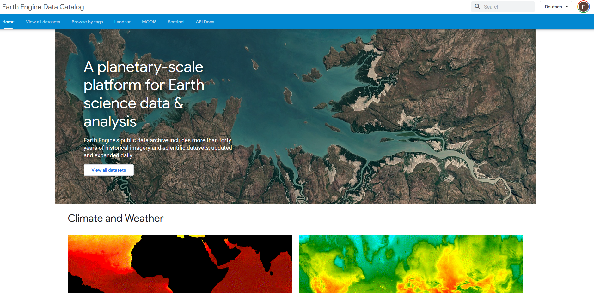

Take some time to browse the data catalogue! It is quite impressive how many of the typical remote sensing datasets are directly available in the GEE. Amongst others, the GEE hosts the complete Landsat archive of Landsat 4, 5, 7 and 8 as well as the Sentinel-2 archive and most parts of the Sentinel-1 data. You can also find MODIS data. Most of the data are not only available as raw data but also as higher-level data. That is, the images have already been pre-processed with the standard processing chains of the original data providers. This can save a lot of time, as most of the tiring, repetitive tasks have already been completed and the user can directly focus on analyzing the data.

For accessing the individual datasets (called "collections") in the GEE code editor (will be explained below), it is necessary to know the exact name and access-link of each image collection. You can find the corresponding values when you select one of the datasets under the link provided above. For example if we want to access the Landsat 8 surface reflectance data (that is, an atmospheric correction has already been applied to the raw satellite data), we would find the correponding name/link here:

[https://developers.google.com/earth-engine/datasets/catalog/LANDSAT_LC08_C01_T1_SR](https://developers.google.com/earth-engine/datasets/catalog/LANDSAT_LC08_C01_T1_SR)

The entry "Earth Engine Snippet" is the access-link/name under which we can access the LS 8 data within the GEE:

**ee.ImageCollection("LANDSAT/LC08/C01/T1_SR")**

As a first small exercise, try to find out what the corresponding Snippets are for Landsat 5 Surface Reflectance Data and one of the MODIS products in which NDVI is included and at a spatial resolution of 250 m. Please provide the answers in ILIAS (Aufgabe 9 - Code Snippets).

## Step 1: Registering for the Google Earth Engine ##

If you don't have a Google Earth Engine account yet, you can sign-up here:

[https://developers.google.com/earth-engine](https://developers.google.com/earth-engine)

Simply press on the marked link and follow the instructions:

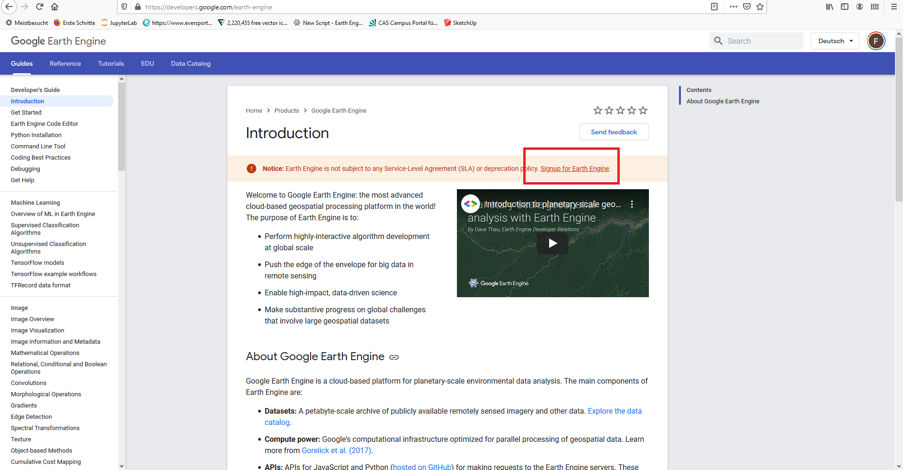

## Step 2: The Google Earth Documentation ##

The official GEE documentation provides a rich amount of tutorials explaining the functionalities of the GEE from scratch. It is highly recommended to read some of the materials provided here to gather a first understanding how the GEE works and to develop a basic understanding of the java-script language being used in the GEE code editor. However, please be aware that many things can also be accomplished without understanding the java-script syntax completely but rather by modifying code-snippets as mentioned already above. The GEE documentation can be accessed here:

[https://developers.google.com/earth-engine/tutorials](https://developers.google.com/earth-engine/tutorials)

Some recommendable tutorials to play around with and get acquainted with the way the GEE works are linked below. Take some time and explore some of the tutorials - you will see it is quite interesting how fast data can be accessed and visualized. If you participated in the remote sensing course in the winter semester you will quickly understand how much more comfortable the data access in the GEE is, in comparison to downloading individual satellite images, pre-processing them and then loading them in R or another programming environment. Before starting with the Tutorials below, it might be worthwhile to have a quick look at Step 3 first were the GEE code editor is briefly introduced.

Some recommended Tutorials:

[https://developers.google.com/earth-engine/image_visualization](https://developers.google.com/earth-engine/image_visualization)

[https://developers.google.com/earth-engine/image_info](https://developers.google.com/earth-engine/image_info)

[https://developers.google.com/earth-engine/image_math](https://developers.google.com/earth-engine/image_math)

[https://developers.google.com/earth-engine/image_relational](https://developers.google.com/earth-engine/image_relational)

[https://developers.google.com/earth-engine/ic_filtering](https://developers.google.com/earth-engine/ic_filtering)

These are just some recommended tutorials to get started with remote sensing data, but you will see that in the same documentation page, there will be loads of additional examples to also conduct more complex analyses directly within the GEE environment.

## Step 3:  The GEE code Editor ##

After registering for the GEE you can access code editor (the main interface we will be using for working in the GEE) here:

[https://code.earthengine.google.com/](https://code.earthengine.google.com/)

This will lead to an interactive web-page which looks like this:

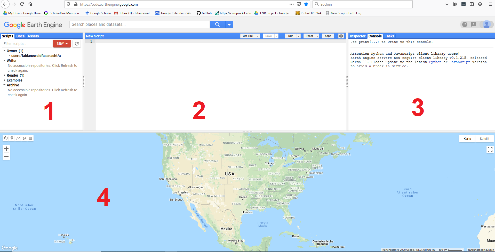

The code editor window is separated into four major sections. In section 1 you can find all the Scripts, documentations and Assets (basically, data that the user uploads) connected to your user account. In section 2 the code you are currently working on will be displayed and in section 3 you wil be informed about the processing progress of your code (Console) and you can for example start the export of files (Tasks). Finally, in section 4, a world map is displayed and you will later on also learn how to display the data you have processed in the GEE on this map.

## Step 4: Exporting a complete time series of MODIS NDVI data ##

In this first hands-on part of the tutorial, we will export a complete time series of MODIS NDVI products for a small area located at the border of the Qinghai Tibetan Plateau. The area covers parts of the city Xining in China. At this point, I am assuming that you have already played around with the Google Earth Engine by exploring some of the tutorials mentioned in Step 2.

As first step to perpare our work-flow we will upload the Shapefile provided in the "Datasets used in this Tutorial section". For this, we will select the tab Assets in section 1 of the code editor:

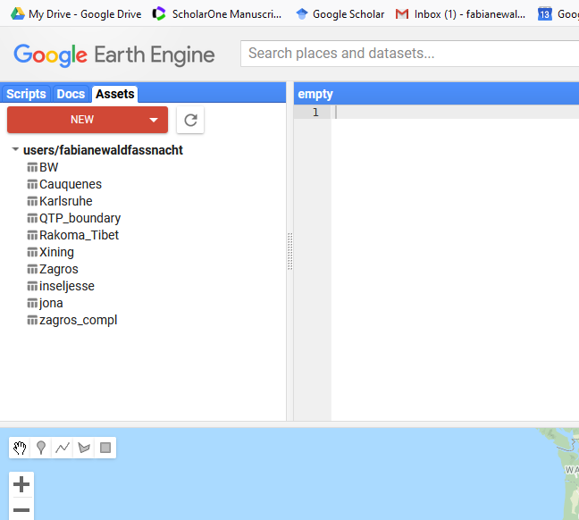

Then we will click the red NEW button and select "Shape files":

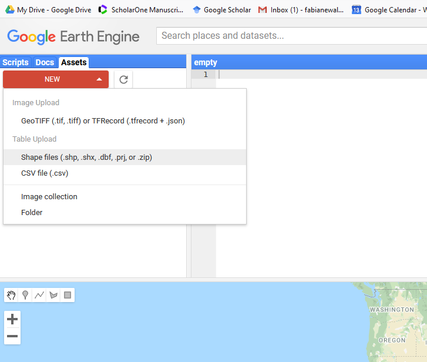

In the appearing window, we have to first select all the supported Shapefile sub-files (marked with 1) and then assign a name to the uploaded files, for example "Xining" (marked with 2). Then we can upload the files by pressing "UPLOAD" in the bottom right part of the window.

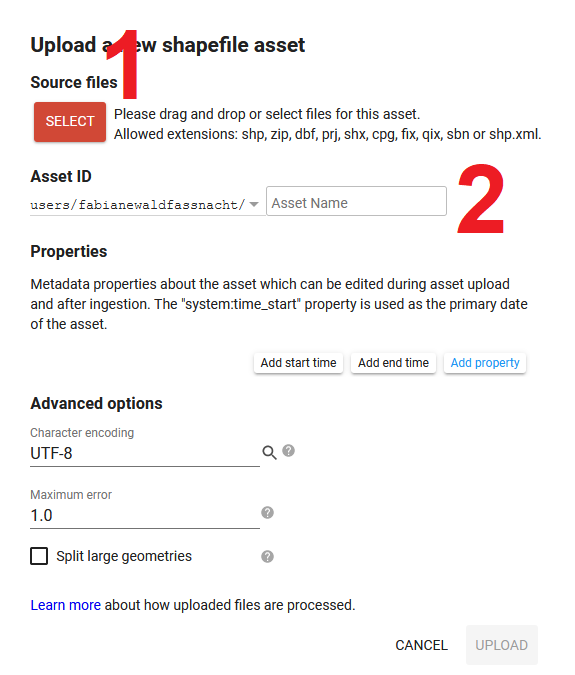

The files will then be uploaded to the Google Earth engine and saved in your list of asstes. You might have to press the "refresh" button next to the red "NEW" button to make the new asset named "Xining" appear in your list. We can now use the uploaded Shapefile for working with the GEE.

In order to this, we have to import the asset into the script we are currently working on. We can do this by selecting the "arrow" button marked with 1 in the screenshot below.

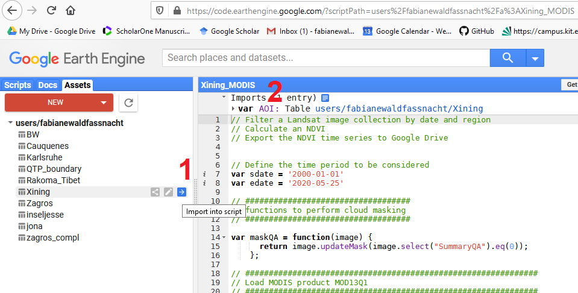

After clicking the "arrow" button, the asset/Shapefile will be imported to t he current script and a new line will appear on the top of the script. We can define a name for the imported Shapefile by changing the default name "table" to some other term. In the given example, I changed the name to "AOI" - area of interest.

In the following I will now provide the complete code for exporting MODIS NDVI data from the GEE - you can simply copy & paste this code to the code editor window and you should be ready to run it. More detailed explanations can be found directly in the code and further below:

	// Filter a MODIS image collection by date and region 
	// Calculate an NDVI
	// Export the NDVI time series to Google Drive
	
	
	// Step 1: Define the time period to be considered 
	var sdate = '2000-01-01'
	var edate = '2020-05-25'
	
	// Step 2: define functions requires for processing

	// ###################################
	// functions to perform cloud masking
	// ###################################
	
	var maskQA = function(image) {
	      return image.updateMask(image.select("SummaryQA").eq(0));
	    };
	
	// Step 3: Process the data

	// Load the MODIS collection and filter the collection for the
	// considered time period and the area of interest

	// ##############################################################
	// Load MODIS product MOD13Q1 (please check the specifications
	// in the GEE data catalogue)
	// ##############################################################
	var MODIS_VI = ee.ImageCollection("MODIS/006/MOD13Q1")
	    .filterDate(sdate, edate)
	    .filterBounds(AOI);
	
	// ##############################################################
	// Apply cloud masks to image collections
	// ##############################################################
	
	var MODIS_best = MODIS_VI.map(maskQA)
	print(MODIS_best)
	
	// ##############################################################
	// Select the NDVI band from the MODIS product 
	// ##############################################################
	
	var MODIS_ndvi = MODIS_best.select('NDVI');
	print(MODIS_ndvi)

	// ##############################################################
	// transform the NDVI image collection to a stack of bands so that they can
	// be exported to the Google Drive
	// ##############################################################
	var MODIS_ndvi_fin = MODIS_ndvi.toBands();
	
	// ##############################################################
	// Apply a work-around to access the image dates (see further instructions below)
	// ##############################################################
	
	function ymdList(imgcol){
	    var iter_func = function(image, newlist){
	        var date = ee.Number.parse(image.date().format("YYYYMMdd"));
	        newlist = ee.List(newlist);
	        return ee.List(newlist.add(date))
	    };
	    return imgcol.iterate(iter_func, ee.List([]));
	}
	var dates = ymdList(MODIS_ndvi);
	
	print(dates);
	
	
	// ##############################################################
	// Export Landsat time series to GeoTiff (see further instructions below)
	// ##############################################################
	
	
	// Export a cloud-optimized GeoTIFF.
	Export.image.toDrive({
	  image: MODIS_ndvi_fin,
	  description: 'MODIS_all_00_20_sm',
	  scale: 250,
	  maxPixels: 5937315072,
	  region: AOI,
	  fileFormat: 'GeoTIFF',
	  formatOptions: {
	    cloudOptimized: true
	  }
	});

To successfully run this code, copy & paste the complete code to the code editor window. Then click save or save as and the current script will be saved and appear in your list of scripts in section 1 of the code editor. Alternatively you can also access the code here:

[https://code.earthengine.google.com/9468bf79e67904e6cb0a639aa3b7019b](https://code.earthengine.google.com/9468bf79e67904e6cb0a639aa3b7019b)

Be aware that you have to still define the Shapefile using your assets-list if you access the code via the link. After accessing and saving the script, you should be able to run the code by clicking Run.

Once you pressed Run, new information will appear in the Console in section 3. 

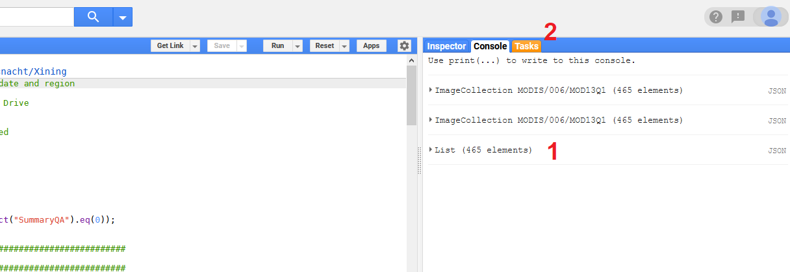

In the console, we can mostly find some information that was printed to the Console by the code-lines that start with the "print()" command. In this example, the two upper entries of the console simply allow us to see how many images have been processed/selected based on our definition: 465 images were available for the selected product and time-window. The last entry, is in our case the most important one, as this entry contains all the dates at which the satellite images were acquired. In this tutorial we will simply copy and paste the dates to a text-file by opening the list (click on the text marked with 1) and then mark all the entries and copy them

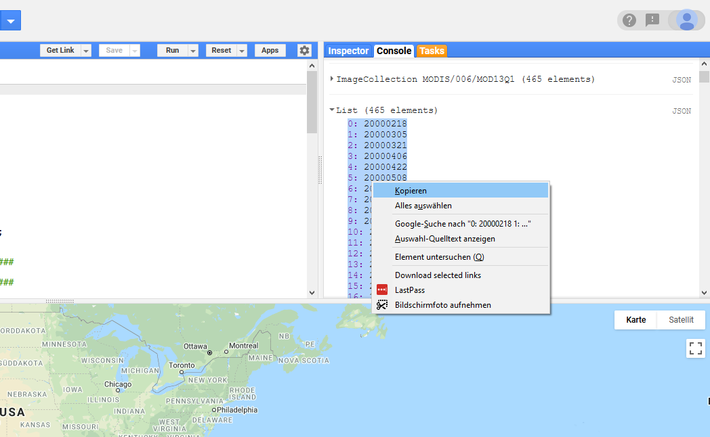

Then open the Windows Editor program:

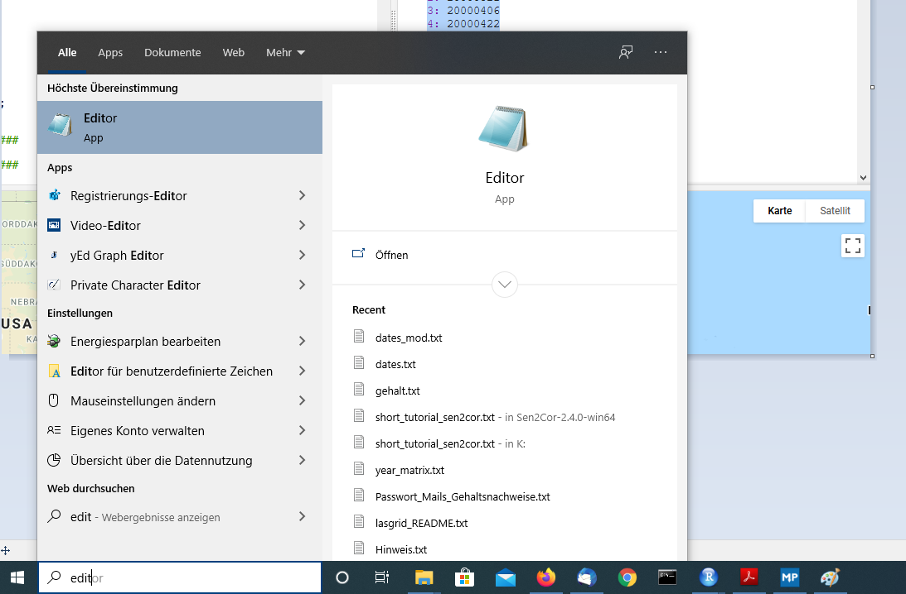

And paste the entries to the text file:

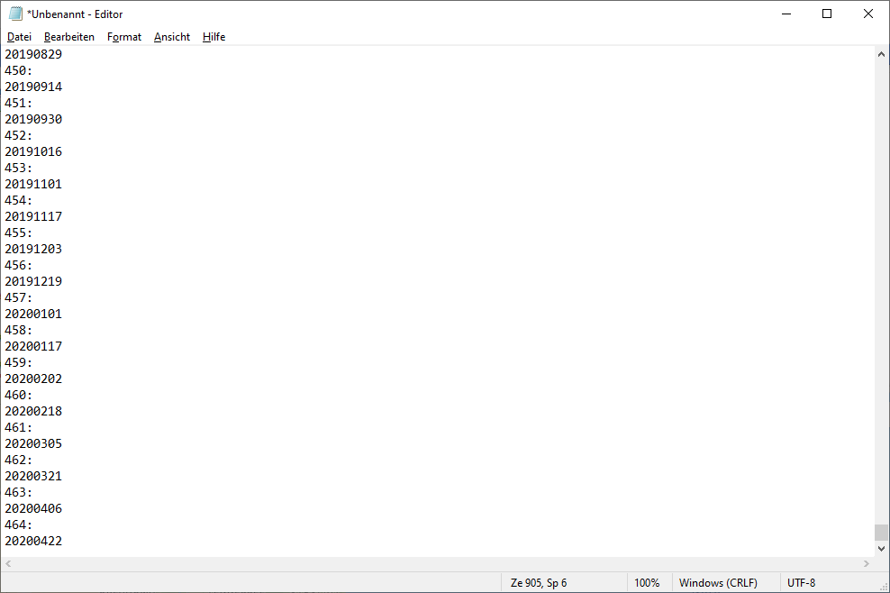

And finally save this text-file to a folder in which we can find it again. Let's name it for example "dates_mod.txt". This is not a very elegant wy of exporting the acquisition dates but while preparing this Tutorial, I had troubles finding a straightforward solution directly in the GEE and as this workflow works, we will stick with it for now and I hope that by next year, I will have found a smoother option to accomplish this.

With this step, we have saved the acquisition dates, but we did not yet export the corresponding images. We will now do this by selecting the "Tasks" tab in section 3 of the code editor (marked with 2):

We will then see a list of tasks that wait for being executed. In my case, there are several tasks from earlier scripts in the list, in your case there might only be on task which is named as the one in the top of my list - MODIS_all_00_20_sm:

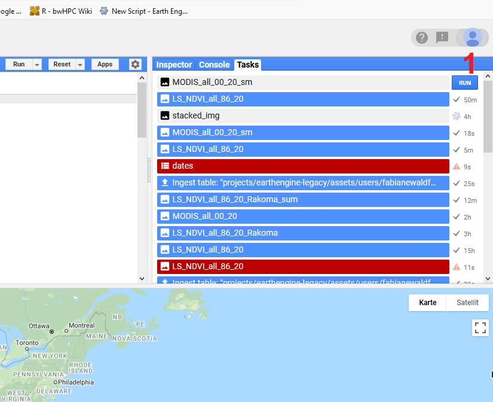

We can now start the export of the raster stack to our Google Drive by clicking the "RUN" button (marked with 1). This will open a new window in which we can define the spatial resolutiojn with which we want to export the images and a folder in our google drive in which the data shall be stored. We can also not define a folder, then the image will simply be exported to the parent folder of the Google Drive. Once you are happy with your settings click "RUN" and then you will have to wait a few minutes or up to a few hours (if the data is large) until the data appears in your Google Drive. In this example a file named "MODIS_all_00_20_sm.tif" will occur in your google drive. If you are not sure how to access your Google drive, please google it. Should be very easy to find. Then download the data from your google drive in a folder on your hard-disc which you will be able to find again (we will need the data in Step 6).

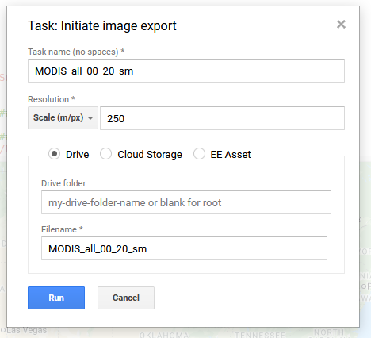

## Step 5: Exporting a complete time series of Landsat 5, 7 and 8 data ##

After we managed to export all available NDVI MODIS images of the MODIS product MOD13Q1 for our area of interest, we will now try to accomplish the same but for the complete Landsat archive of the satellites Landsat 5, 7 and 8. The basic processing steps are the same, but the code itself is a bit more complex as we have to merge data from several image collections and also have to first calculate the NDVI from the original images.

We will again have to load the Shapefile available in our "Assets" list as we have just learned for the MODIS example and will also again have to apply the work-around described in Step 4 to export the image acquisition dates manually by copy and pasting the dates to a text-file. I will not go into details about these steps again but simply provide the code for exporting the Landsat raster stack below. There are more detailed comments provided in the code itself. In case there are more questions related to the code, please formulate them in the Forum and I will try to reply as soon as possible. Be aware, that the data exported in this step are a bit larger as in the MODIS example (550 MB vs. 2 MB) - hence the export from the GEE might take notably longer in the Landsat case.

Here is the code that should be ready to run - please go through it carefully and try to understand what is happening. It is not of utmost important to understand each individual step, but rather to understand the coarse work-flow:

	// Filter a Landsat image collection by date and region 
	// Calculate an NDVI
	// Export the NDVI time series to Google Drive
	
	
	// Define the time period to be considered 
	var sdate = '1986-01-01'
	var edate = '2020-05-25'
	
	// ####################################
	// functions to perform cloud masking
	// ####################################
	
	// Landsat 4+5+7
	
	var cloudMaskL457 = function(image) {
	  var qa = image.select('pixel_qa');
	  // If the cloud bit (5) is set and the cloud confidence (7) is high
	  // or the cloud shadow bit is set (3), then it's a bad pixel.
	  var cloud = qa.bitwiseAnd(1 << 5)
	          .and(qa.bitwiseAnd(1 << 7))
	          .or(qa.bitwiseAnd(1 << 3))
	  // Remove edge pixels that don't occur in all bands
	  var mask2 = image.mask().reduce(ee.Reducer.min());
	  return image.updateMask(cloud.not()).updateMask(mask2);
	};
	
	// Landsat 8
	function maskL8sr(image) {
	  // Bits 3 and 5 are cloud shadow and cloud, respectively.
	  var cloudShadowBitMask = 1 << 3;
	  var cloudsBitMask = 1 << 5;
	
	  // Get the pixel QA band.
	  var qa = image.select('pixel_qa');
	
	  // Both flags should be set to zero, indicating clear conditions.
	  var mask = qa.bitwiseAnd(cloudShadowBitMask).eq(0)
	      .and(qa.bitwiseAnd(cloudsBitMask).eq(0));
	
	  // Return the masked image, scaled to reflectance, without the QA bands.
	  return image.updateMask(mask).divide(10000)
	      .select("B[0-9]*")
	      .copyProperties(image, ["system:time_start"]);
	}
	
	// #############################################
	// define function to calculate Landsat NDVI
	// separate function for Landsat 5+7 and Landsat 8
	// #############################################
	var addNDVI_LS8 = function(image) {
	  var ndvi = image.normalizedDifference(['B5', 'B4']).rename('NDVI');
	  return image.addBands(ndvi);
	};
	
	var addNDVI_LS5_7 = function(image) {
	  var ndvi = image.normalizedDifference(['B4', 'B3']).rename('NDVI');
	  return image.addBands(ndvi);
	};
	
	
	
	// ##############################################################
	// Load the Landsat image collection of Landsat 5, 7 and 8
	// ##############################################################
	var surfaceReflectanceL5 = ee.ImageCollection('LANDSAT/LT05/C01/T1_SR')
	    .filterDate(sdate, edate)
	    .filterBounds(AOI);
	var surfaceReflectanceL7 = ee.ImageCollection('LANDSAT/LE07/C01/T1_SR')
	    .filterDate(sdate, edate)
	    .filterBounds(AOI);
	var surfaceReflectanceL8 = ee.ImageCollection("LANDSAT/LC08/C01/T1_SR")
	    .filterDate(sdate, edate)
	    .filterBounds(AOI);
	
	// ##############################################################
	// Apply cloud masks to image collections
	// ##############################################################
	
	    
	var LS5 = surfaceReflectanceL5
	    .map(cloudMaskL457);
	    //.median();
	print(LS5)
	
	var LS7= surfaceReflectanceL7
	    .map(cloudMaskL457);
	    //.median();
	print(LS7)
	
	var LS8 = surfaceReflectanceL8
	    .map(maskL8sr);
	    //.median();
	print(LS8)
	
	// ##############################################################
	// Calculate NDVI and merge Ls 5, 7, and 8
	// ##############################################################
	
	// merge Landsat image collection 5 to 7
	var LS_5_7 = LS5.merge(LS7)
	// calculate NDVI for merged collection
	var LS_5_7_NDVI = LS_5_7.map(addNDVI_LS5_7).select('NDVI');
	print(LS_5_7_NDVI, "LS_5_7_NDVI");
	
	// calculate NDVI for Landsat 8 collection
	var LS8_NDVI = LS8.map(addNDVI_LS8).select('NDVI');
	print(LS8_NDVI, "LS8_NDVI");
	
	// merge all NDVI data
	var LS_NDVI_all = LS_5_7_NDVI.merge(LS8_NDVI)
	print(LS_NDVI_all, "LS_NDVI_all");
	
	// transform collection to bands
	var LS_NDVI_all_fin = LS_NDVI_all.toBands();
	// crop bands to AOI
	var LS_NDVI_all_clip = LS_NDVI_all_fin.clip(AOI);
	
	// extract acquisition dates
	function ymdList(imgcol){
	    var iter_func = function(image, newlist){
	        var date = ee.Number.parse(image.date().format("YYYYMMdd"));
	        newlist = ee.List(newlist);
	        return ee.List(newlist.add(date))
	    };
	    return imgcol.iterate(iter_func, ee.List([]));
	}
	var dates = ymdList(LS_NDVI_all);
	
	// print acquisition dates
	print(dates);
	
		
	
	// ##############################################################
	// Export Landsat time series to GeoTiff
	// ##############################################################
	
	
	// Export a cloud-optimized GeoTIFF.
	Export.image.toDrive({
	  image: LS_NDVI_all_clip,
	  description: 'LS_NDVI_all_86_20',
	  scale: 30,
	  maxPixels: 5937315072,
	  region: AOI,
	  fileFormat: 'GeoTIFF',
	  formatOptions: {
	    cloudOptimized: true
	  }
	});
	

Alternatively, you can also access the code via this link:

[https://code.earthengine.google.com/82beb77c79bea6813967a6ad07056c7e](https://code.earthengine.google.com/82beb77c79bea6813967a6ad07056c7e)

After you have successfully executed the code and exported the file using the same work-flow as described for MODIS, you should also download the corresponding file (named LS\_NDVI\_all\_86\_20.tif) from your google drive to the same folder where you stored the MODIS raster. The two text-files containing the image acquisition dates for MODIS and Landsat should also be in the same folder.

## Step 6: Exploring the exported data in R ##

As final step in this tutorial, we will load the NDVI raster-stacks exported from the GEE in R and create time-series by merging the NDVI values with the image acquisition dates stored in the text-files. We will need the exported raster-files and the text-files. So please make sure that you have all data stored in a folder and know where this folder is.

Next, we open RStudio and load the required packages:

	# load required packages
	require(raster)
	require(xts)
	require(zoo)

In case some packages are missing, please install them (you should know how to do this by now, if not, please check the older Tutorials). Next, we will load the raster-files containing the MODIS and Landsat time series:

	###
	# load raster-stacks exported from the Google Earth Engine
	###
	
	# set working directory
	setwd("D:/Multiskalige_FE/5_Practicals/1_GEE_basics_v2")
	# load Landsat time series with images from 1986-2020
	ls_ndvi <- brick("LS_NDVI_all_86_20.tif")
	nlayers(ls_ndvi)
	# load MODIS time series with images from 2000-2020
	mod_ndvi <- brick("MODIS_all_00_20_sm.tif")
	nlayers(mod_ndvi)

Be aware, that this time, we use the brick() command instead of the stack() command to load the raster files. This command will allow to access the raster-files in a slightly different way which increases the speed to access all raster-layers of an individual pixel (which in our case refers to a time-series). If you want to see the difference, you can re-run the code using the stack() command instead of the brick() command and you will see that one of code lines will run very slow (find out which one if you are interested!).

After loading the raster stacks, we will also load the text-files containing the image acquisition dates, we copy & pasted from the GEE console. We will use the following code to do this:

	###
	# load corresponding dates of the time series
	###
	
	# Landsat

	# read table
	ls_dat <- read.table("dates_ls.txt")
	# drop every second line (containing only the id)
	ls_dat_fin <- ls_dat[seq(2, nrow(ls_dat),2),]
	# transform remaining rows from factor to character
	ls_dat_fin2 <- as.character(ls_dat_fin)
	# transform character-expression to dates
	ls_dat_for <- as.Date(ls_dat_fin2, format = c("%Y%m%d"))
	
	# MODIS

	# read table
	m_dat <- read.table("dates_mod.txt")
	# drop every second line (containing only the id)
	m_dat_fin <- m_dat[seq(2, nrow(m_dat),2),]
	# transform remaining rows from factor to character
	m_dat_fin2 <- as.character(m_dat_fin)
	# transform character-expression to dates
	m_dat_for <- as.Date(m_dat_fin2, format = c("%Y%m%d"))

 Be aware that R has an own data-type for dates. To transform the entries of the text-files into a vector containing only dates, we have to follow several processing steps as indicated in the code above. First we load the text-file into a variable. In this stage, the imported file looks like this:

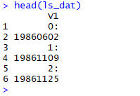

That is, we  have the ID in one row and the actual acquisition dates in the format: YYYYMMDD in every second row. Hence, we are only interested in every second row of our variable. That is we we run the code:

	ls_dat_fin <- ls_dat[seq(2, nrow(ls_dat),2),]

which will then lead to the following output:

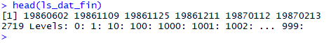

We now only have the acquisition dates in the variable, but as we can see the current vector is still in the wrong format. The information on "Levels" indicates that the data type of the vector is currently "factor". We hence first transform the vector to "character" and then to a "date" vector using the lines:  

	# transform remaining rows from factor to character
	ls_dat_fin2 <- as.character(ls_dat_fin)
	# transform character-expression to dates
	ls_dat_for <- as.Date(ls_dat_fin2, format = c("%Y%m%d"))

Now, we have prepared the acquisition dates in a way, so that they can be used to create time-series objects. But before we will do this, we will have a quick look at the raster data we exported from the Google Earth Engine. We will use a for-loop to plot some of the NDVI images of the time series. We will not plot all images, as this would take a really long time (particularly for the Landsat data which generally requires a lot more time to plot the individual NDVI images). Be aware that you can stop the ploting-loop at any time by pressing the little "stop" button in RStudio. We will plot 10 of the Landsat scenes and 40 of the MODIS scenes. Depending on the speed of your computer this may take a while. Have a look at the images that appear and reflect what you are seeing.

	###
	# have a brief look on the data by plotting the individual time series
	# raster of MODIS and some selected scenes of Landsat
	###
	
	# plot selected Landsat NDVI rasters
	
	for(i in 420:430){
	  
	  plot(ls_ndvi[[i]], main=ls_dat_for[i], zlim=c(-0.5,1))
	  
	}
	
	# plot MODIS NDVI rasters
	
	for(i in 1:40){
	  
	  plot(mod_ndvi[[i]], main=m_dat_for[i], zlim=c(-5000,10000))
	  
	}

Probably most of you observed at least two things: 1. The plotted raster data in many cases showed data gaps with NA or 0 values; 2. The NDVI images show quite clear seasonal signals with a lot more positive NDVI values during the summer months. Both of these observations are quite typical for dense time series of remote sensing data. Due to cloud cover and snow, there are many missing values included. Particularly, if no temporal mosaicing is conducted. The latter we will learn next week. We will now have a closer look at the seasonal signal by plotting NDVI time series of individual pixels. To do this, we first extract the complete NDVI time series of one MODIS and one Landsat pixel:

	###
	# extract NDVI time series for individual pixels
	###
	
	# extract Landsat pixel (here row 45, column 56)
	ls_ts <- as.vector(ls_ndvi[45,56])
	
	# MODIS (here, row 1, column 1)
	m_ts <- as.vector(mod_ndvi[1,1])
	m_ts[m_ts==0] <- NA  

You could easily modify the codes above to select different pixels and explore how the corresponding time-series look like. In case of the MODIS pixels, a value of 0 indicates a masked pixel which had a low data quality due to cloud-cover or snow. We hence set al values of 0 to NA.

Next, we will create time series objects. Time series objects are a special kind of data type in R which typically contain some sort of observational values (in our case NDVI values) and corresponding time stamps (which in our case were prepared from the text files as described above). There are different packages in R that allow creating time series objects. Here, we use the xtc package. A summary of the most important xtc commands can be found here:

[https://drive.google.com/open?id=1sAe2GalxPk2T3Ce8R53Zz5fqooY9Katt](https://drive.google.com/open?id=1sAe2GalxPk2T3Ce8R53Zz5fqooY9Katt)

To create the time series object, we first create a dataframe containing the NDVI values of the pixel and the time-stamps and subsequently create the xtc object:

	# prepare dataframe with NDVI values and dates
	ls.df <- data.frame(ls_ts, ls_dat_for)
	m.df <- data.frame(m_ts, m_dat_for)
	
	# create time series object
	ls.NDVI.ts <- xts(ls.df$ls_ts, order.by=ls.df$ls_dat_for)
	mod.NDVI.ts <- xts(m.df$m_ts, order.by=m.df$m_dat_for)

Next, we will plot the prepared time-series datasets:

	# plot the time series
	plot(ls.NDVI.ts)
	plot(mod.NDVI.ts)

This will lead to the following graphs:

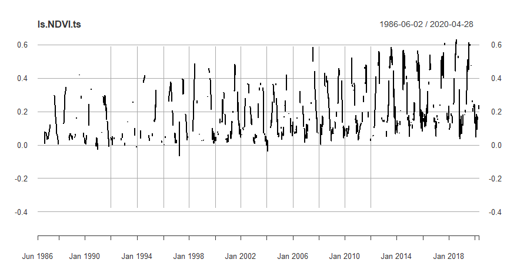
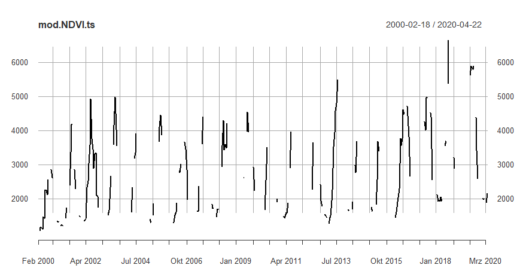

As we can see, both time series show a quite clear seasonal signal. The MODIS time series is notably shorter than the Landsat time series. Be aware that the two time series do not represent the exact same location and should hence not be directly compared. They are just meant to be a random example. Even though, you could adapt the code and extract a time series for pixels that are actually overlapping. The signal is most likely not directly comparable anyway as the MODIS pixels are a lot bigger than the Landsat pixels (250 m x 250 m vs. 30 m x 30 m). To get a better understanding of how the time series actually looks like, we can interpolate the gaps in the time series using some standard processing options offered by the xtc package:

	###
	# work with time-series object
	###
	
	# interpolate missing values
	
	ls.NDVI.ts.ip <- na.approx(ls.NDVI.ts)
	plot(ls.NDVI.ts.ip)
	
	mod.NDVI.ts.ip <- na.approx(mod.NDVI.ts)
	plot(mod.NDVI.ts.ip)

Running this code will lead to the two following graphs:

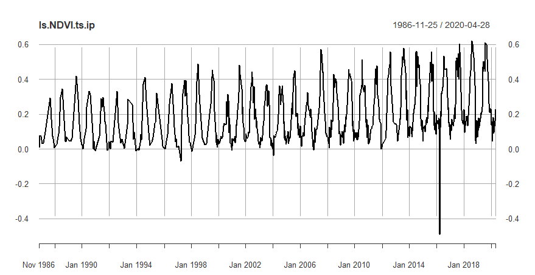
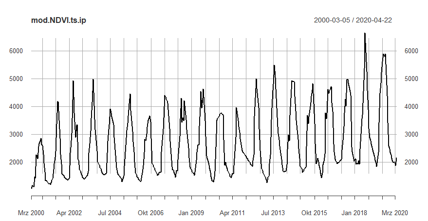

The interpolated time series look a lot smoother and it seems even possible to observe some trends in these new graphs. In the NDVI time series there seems to be one outlier in 2016 which does not seem to be very realistic and is most likely some sort of artefact in the raw data which was not detected by the automated pre-processing routines. In both time series, there seems to be an overall trend to increasing NDVI values. We can try to depict this trend a bit clearer by converting the high-frequency time series of approximately one observation every 16 days to an annual time-series. We can do this with the following code:

	# convert time series to yearly values
	ls.NDVI.ts.y <- to.yearly(ls.NDVI.ts)
	mod.NDVI.ts.y <- to.yearly(mod.NDVI.ts)
	
	# plot yearly time series
	
	plot(ls.NDVI.ts.y)
	plot(ls.NDVI.ts.y$ls.NDVI.ts.High)
	
	plot(mod.NDVI.ts.y)
	plot(mod.NDVI.ts.y$mod.NDVI.ts.High)

This will in total lead to four plots:

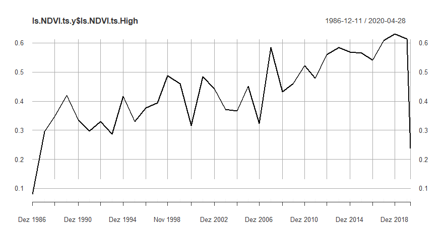
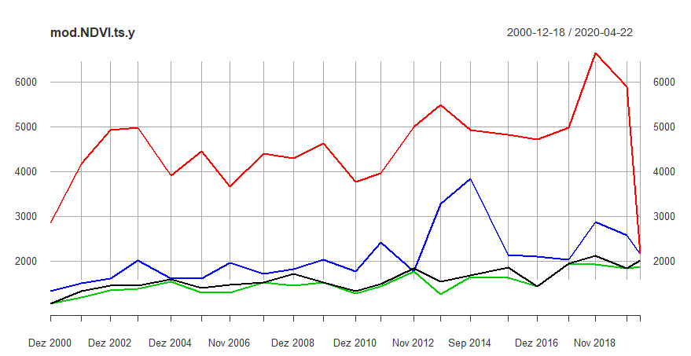
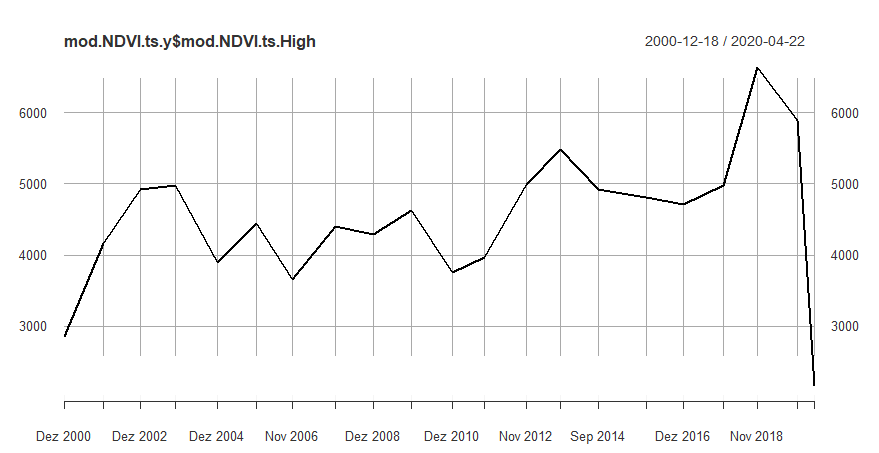

In the first and the third plot here, four trend lines are shown representing the first and the last NDVI value of the corresponding year (black and blue - could not find out yet which one is which) as well as the highest (red line) and lowest NDVI value (green line). In the second and forth plot, only the highest NDVI value of each year are depicted in a trend line. Here, the general increase in NDVI maxima is well depicted for the Landsat pixel, while a similar but weaker trend can be observed for the MODIS pixel.

## Step 7: ILIAS Exercise  - find a pixel with decreasing vegetation trend or a pixel where vegetation disappeared completely ##

You know now, how to extract a NDVI time-series for an individual pixel and we have learned above how to also interpolate and plot the corresponding time series. As we have so far only seen the time series signal for two pixels (one Landsat and one MODIS), we will play around with this a bit more in this exercise. The objective of the exercise is to identify a Landsat or a MODIS pixel in which a either a declining NDVI trend can be observed or the trend suggests that a vegetation area (showing the typical seasonal NDVI signal) has been transformed to another land-cover type (for example a comparable stable urban or bare soil signal which should show constantly low NDVI values). Please try to find such a pixel by changing the code above. Once you identified a pixel, make a screenshot of the time series and upload it to ILLIAS 

With this, we reach the end of this first Tutorial on remote sensing time-series analysis. Next week, we will learn how to directly prepare annual time-series datasets in the GEE engine and get to know some algorithms for analyzing (remote sensing based) time series objects in R.  
