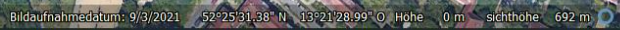
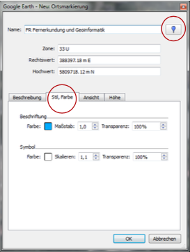
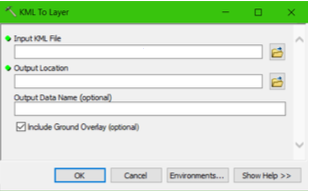

# 0. Bildinterpretation mit Google Earth

- **Lesen Sie sich dieses Handout ausführlich bis zum Ende durch** , **bevor** Sie mit der Übung beginnen!
    Sehr häufig klären sich Ihre aufkommenden Fragen in den nächsten Arbeitsschritten!
- Legen Sie einen Ordner auf Ihrem Computer an, in dem Sie alle zukünftigen Daten für unseren
    Fernerkundungskurs speichern. Wir empfehlen, diesen Ordner **FE_Kurs** zu nennen und in diesem
    weitere Unterordner für jede einzelne Sitzung anzulegen (z.B. ...\FE_Kurs\ **01 _GoogleEarth** für die
    heutige Sitzung).
- **Wichtig für alle Sitzungen:** Bitte achten Sie auf die korrekte Benennung Ihrer Ordnernamen: erlaubt
    sind Zahlen, gängige Buchstaben sowie Unterstriche. Zu Problemen mit ERDAS bzw. einzelnen Tools
    in ERDAS (Absturz!!) kann es kommen, wenn Sie Umlaute, Leerzeichen oder Sonderzeichen in Ihren
    Ordnernamen verwenden!

## Lernziele

- Kennenlernen der Google Earth-Benutzeroberfläche
- Satellitenbilder zeitlich einordnen können
- Geoobjekte in Satellitenbildern erkennen
- Digitalisieren in Google Earth

## Zeitliche und räumliche Orientierung in Google Earth Pro

- Starten Sie Google Earth Pro und machen Sie sich mit der Oberfläche vertraut.


- Nutzen Sie die Tipps zum Programmstart.
- Deaktivieren Sie alle Ebenen (im Fenster auf der linken Seite alle Häkchen entfernen) und
schalten Sie nun nach und nach Ebenen hinzu, um diese besser kennenzulernen.

- Betrachten Sie mehrere Gebiete Ihrer Wahl in **Berlin** , um nur anhand der Bilder folgende Fragen zu
    beantworten:

1. Zu welcher Jahreszeit wurde die jeweilige Bildaufnahme gemacht? Woran können die
einzelnen Jahreszeiten generell erkannt werden?
2. Können Sie Monat und Jahr feststellen?
3. Woran haben Sie die Mensa erkannt?
4. Wie beurteilen Sie die Qualität der Bilddaten?

➔ Notieren Sie sich Ihre Antworten, wir besprechen diese im Seminar.

In der _Google Earth_ - Statusleiste rechts unten sind Informationen über die verwendeten Bilddaten

(Aufnahmedatum, Koordinaten, die Höhe über NN und die Sichthöhe) ablesbar, z.B.:



**Tipps:**

- Google Earth verwendet in der Voreinstellung geographische Koordinaten mit WGS84 als Ellipsoid.
    In der Google Earth Menüleiste unter ```Tools > Optionen > 3D-Ansicht``` lässt sich die Anzeige von
    Breite und Länge auf das UTM Koordinatensystem („ **Universales transversales Mercator-**
    **Koordinatensystem** “) umstellen.
- Beim Zoomen wird die Ansicht automatisch geneigt. Dies können Sie ausstellen unter ```Tools >
    Optionen > Navigation```: „ **Beim Zoomen nicht automatisch neigen** “.

## Digitalisieren in Google Earth

In Google Earth können Geodaten selbst erstellt und in einem Datenformat gespeichert werden, welches

anschließend in ein Geographisches Informationssystem (GIS, z.B. _ArcGIS_ oder _QGIS_ ) importiert werden

kann.

- Links unter „My Places (Meine Orte)“ können Sie selbsterstellte **Punkte** , **Polygone** und **Linien**
    speichern.
- Fügen Sie unter ```My Places (Meine Orte) > Rechtsklick > Hinzufügen``` einen neuen Ordner in
    My Places ( _Meine Orte)_ hinzu und erstellen Sie die folgenden Digitalisierungen in diesem Ordner.
- Nutzen Sie die Werkzeugleiste um...
    - die S-Bahn (einen Abschnitt) als Linie zu digitalisieren.


- den FU Campus Lankwitz als Polygon zu digitalisieren (halb transparent, mit Umrandung).
- die Gebäude des Geocampus‘ zu markieren (vergeben Sie als Namen die Gebäudenamen,
wählen Sie die Symbole entsprechend der Fachbereiche bzw. Nutzung aus).
- Symbole und Farben können in dem sich



öffnenden Fenster angepasst werden:

Tipp: Punkte, Polygone und Linien können bearbeitet und
auch ergänzt werden, solange dieses Fenster geöffnet ist!

- Speichern Sie nach der Digitalisierung Ihren Ordner ```Rechtsklick > Ort speichern unter...```_ in einer

kmz - Datei (Keyhole Markup Language, Dateiendungen: .kmz, .kml) in Ihrem persönlichen FE-Ordner
z.B.:

```
 ...\FE_Kurs\01_GoogleEarth
```

- Schließen Sie _Google Earth_ und starten Sie das Programm erneut. Rekonstruieren Sie Ihre


digitalisierten Geoobjekte über die kmz-Datei. Die kmz-Datei kann über ```Datei > Öffnen``` wieder in

Google Earth importiert werden.

## Daten in ArcGIS bzw. QGIS öffnen

###ArcMap

- Öffnen Sie _ArcMap_ und importieren Sie dort die gerade erstellte kmz-Datei. Benutzen Sie die


Suchfunktion, um das Tool KML to Layer aufzurufen.

- Input- Datensatz z.B.:

```
...\FE_Kurs\01_GoogleEarth\... .kmz
```

- Output- Ordner z.B.:

```
...\FE_Kurs\01_GoogleEarth\...
```



- Die importierten Dateien werden in ArcGIS in einer Geodatenbank (.gdb) temporär abgelegt.
- Exportieren Sie danach die Layer-Dateien (jeweils Punkte, Polygon(e) und Polylines) als Shapefiles
    ```Data > Export Data``` und speichern Sie diese Dateien in Ihrem FE-Ordner.
- Beachten Sie die Projektion der neuen Datensätze. Was müssen Sie tun, um diese ggf. zu ändern?

### QGIS

- Öffnen Sie QGIS und importieren Sie dort die gerade erstellte kmz-Datei.
- Wählen Sie in der oberen ```Menüleiste > Layer > Add Layer > Add Vector Layer```
- Im sich öffnenden Fenster des ```Data Source Manager > Vector > Vector``` klicken Sie auf den Browse-Button. Navigieren Sie hier zu Ihrem Ordner und laden Sie Ihre erstellte kmz-Datei.

- Exportieren Sie nun die Layer-Dateien (jeweils Punkte, Polygon(e) und Polylines) als Shapefiles
    ```Rechtsklick > Export > Save Features as... > ESRI Shapefile``` und speichern Sie diese Dateien in
    Ihrem FE-Ordner.
- Beachten Sie die Projektion der neuen Datensätze. Was müssen Sie tun, um diese ggf. zu ändern?

Das waren die Inhalte der ersten Sitzung „Bildinterpretation mit Google Earth“.

Wenn Sie dieses Handout durchgearbeitet haben, haben Sie

- sich damit beschäftigt, wie man Satellitenbilder zeitlich und räumlich einordnen kann und
- gelernt, Geodaten in Google Earth für Ihr eigenes Projekt zu nutzen.