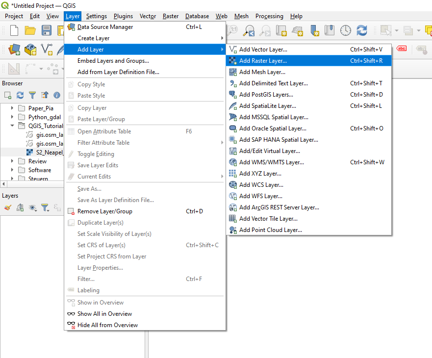
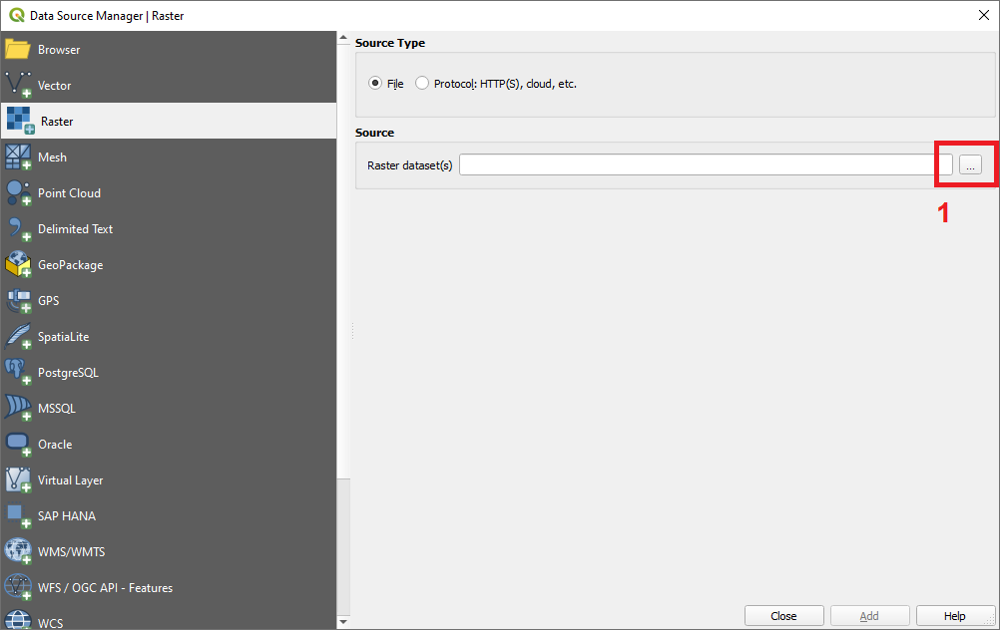
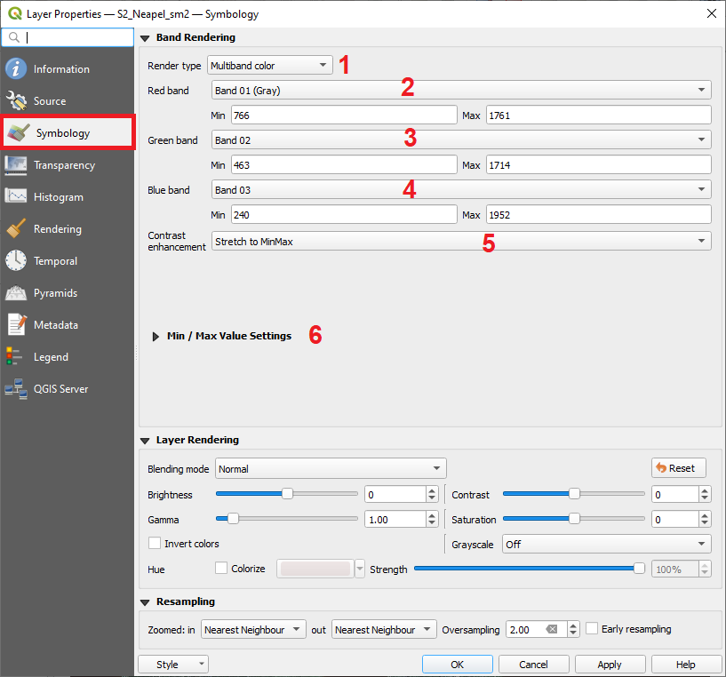
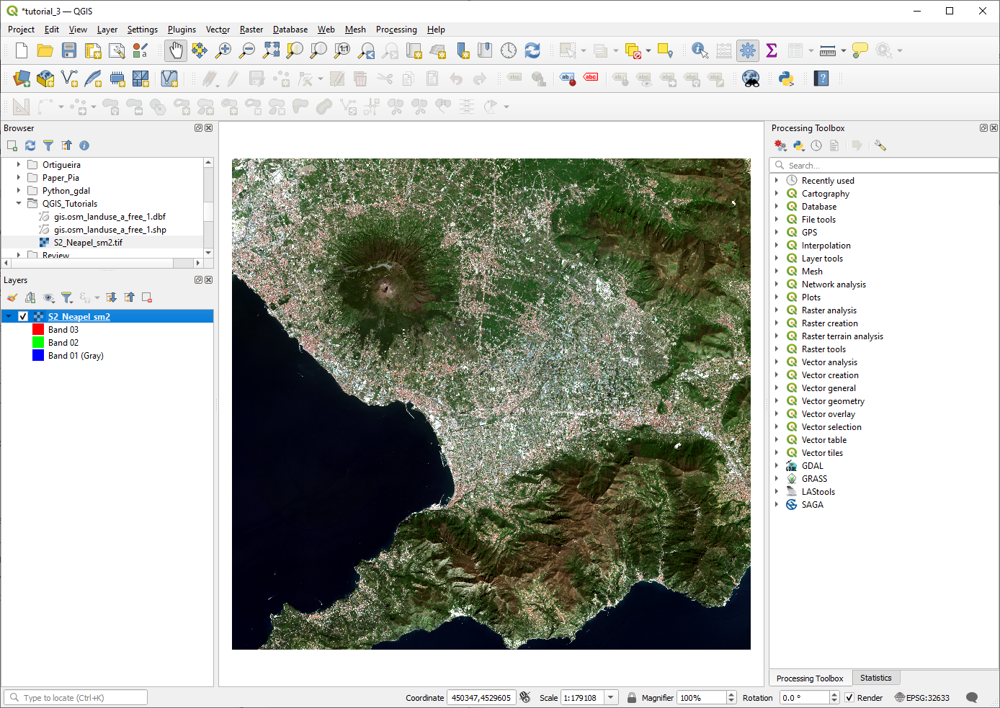
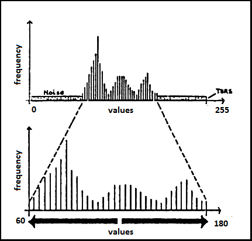
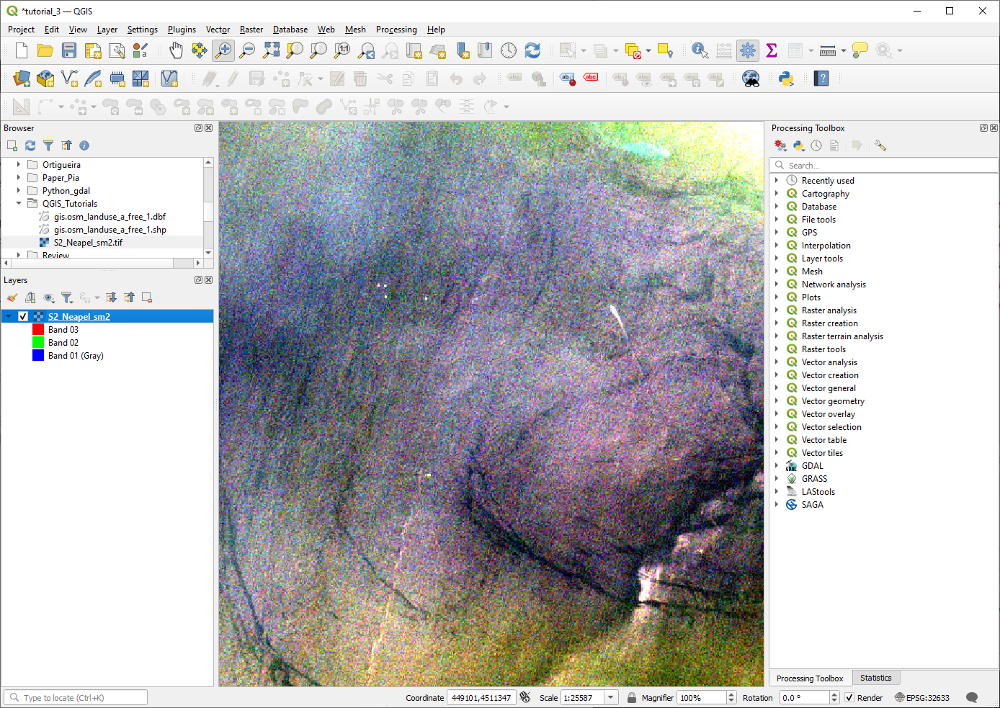
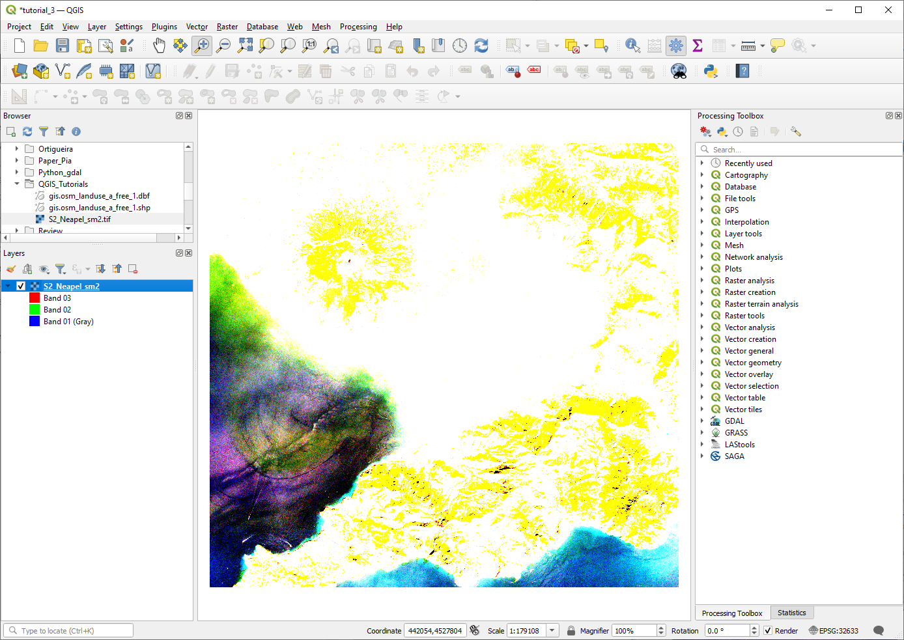

# Loading and visualizing raster data

**Abstract** 
In this Tutorial we will learn how to load and visualize raster files in  QGIS. The concept of histograms and which role they play for adapting the visualization of raster datasets in QGIS will be explained. As example dataset we will make use of a satellite image of the satellite sensor Sentinel-2.

Developed with QGIS version - Bialowieza 3.22.5

## Download data for the tutorial

For this and the subsequent tutorials you will need to work with a Sentinel-2 satellite image. Please download the data required for this tutorial here:

[Download](https://drive.google.com/file/d/1ElqgGZQDfB2M7rADM3_hMbPE-H6MYjP7/view?usp=sharing)

## Loading a raster file in QGIS

Similarly as learned in the last tutorial, we can open a raster file by **simply dragging and dropping the file from the browser-window to the layer window** (see Figure 1). 

<figure markdown>
  
  <figcaption>Figure 1: Opening a raster file via drag and drop in QGIS</figcaption>
</figure>

Alternatively, we can also use the main file-menu of QGIS to add a raster file / raster layer as seen in the Figure 2. This option was not described in the previous tutorials on vector files, but this also works with vector files.

<figure markdown>
  
  <figcaption>Figure 2: Opening a raster file via the file menu of QGIS</figcaption>
</figure>

If you chose the option to use the file menu, a new window will pop-up and you will then have to select the path to the raster file you want to open by clicking the button marked with 1 in Figure 3.

<figure markdown>
  
  <figcaption>Figure 3: Open file dialogue menu of QGIS</figcaption>
</figure>

Once we have successfully opened the raster file, it should be displayed in the main visualization window of QGIS, similarly as shown in Figure 04.

<figure markdown>
  
  <figcaption>Figure 4: View after loading the raster file</figcaption>
</figure>

The opened raster dataset is a satellite scene from EU's Sentinel-2 satellite. QGIS will automatically select a visualization setting of the raster dataset based on the statistics of a few randomly selected pixels. However, in most cases these settings will not be optimal. So do not worry if the displayed raster seems to be very dark or with strange colors when using other datasets. In some cases it might even look completely black but still contain relevant data which will only show up after the visualization has been optimized. In our case the first impression should already be quite good, eventhough, it is not yet a realistic true-colour visualization (which describes a visual impression similar to what we see with our eyes). In the next section we will learn how the achieve this.

## RGB-Visualization of raster files

To better understand how the optimization of the visualization of raster files works, it is important to have a good understanding how raster files are structured. Raster files can be pictured as a grid of pixels where each pixel contains a value. The range of these values depends on the data source for the raster data. They could for example originate from a model simulation that predicted air temperature. Then each pixel might have a value between approximately -30 and +50 showing the air temperature above the Earth surface in Degree Celsius. The values might also contain information about the altitude above (and below) sea level and might then range from -413 m (deepest point below sea level on a land surface, an area close to the Dead sea) to 8848 m (top of the Mount Everest). 
In our case, the raster dataset stems from a satellite sensor which measures the amount of electromagnetic radiation reflected in certain wavelengths of the electromagnetic spectrum. In simpler words, one could say that the satellite sensor measures the amount of different colours (careful - this is a very simple way of putting it and physically not really correct) at certain locations (pixels) on the Earth surface and then stores this information into individual raster layers (see Figure 5). In our case, the satellite raster dataset consists of 10 raster layers that store information on how much blue, green and red light (and some additional colours that humans cannot see with their eyes) have been reflected in the different areas of the Earth surface that were observed by the satellite. Each raster layer contains information on one colour. Hence, our raster dataset can be pictured as a stack of individual raster layers or images which will be called **bands** or **channels** in the following (Figure 6 )[^1].

<figure markdown>
  
  <figcaption>Figure 5: Structure of raster data</figcaption>
</figure>

<figure markdown>
  
  <figcaption>Figure 6: Raster stack</figcaption>
</figure>

In QGIS we can always only use either just one band - Render type: Single band gray (render type can be selected in drop-down menu marked with **1** in Figure 8) or a set of three bands - Render type: Multiband color (also known as **RGB-composite**) - to create a visualization of the raster dataset. This is related to the way computers create colours on the screen. Basically, there are only three colours: red, green and blue which are then mixed on a very fine scale to create a visual impression of all colours that we see on the screen. During the visualization optimization we tell QGIS which three bands of the raster dataset should be used to create red, green and blue colours on the screen. 

So let us try this with our satellite image. To change the visualization settings of the loaded raster data,

we either perform a right click on the raster layer in the layer window of QGIS and select properties or alternatively, we can perform a double-click on the same layer. This will open up the properties window, where we will select the **Symbology** tab. (marked with the red box in Figure 7)[^2]

<figure markdown>
  
  <figcaption>Figure 7: Raster symbology window of QGIS</figcaption>
</figure>

Now we will assign the satellite bands which collected information on blue, green and red colours to the corresponding channels of QGIS. The red channel of QGIS (marked with **2** in Figure 7) is currently assigned to Channel 1. We will now change this by

Clicking the drop down menu for the **Red Band** (marked with **2** in Figure 7) and select Band 03, which corresponds to the band of the satellite that collected information on electromagnetic radiation that corresponds to red light. Analogously, we will select Band 02 for the **Green Band** of QGIS (marked with **3** in Figure 7 normally, this channel should already be correct) and then Band 01 for the **Blue band** of QGIS (marked with **4** in Figure 7). Then we select **Apply** and then **OK** to see how this changes the visualization of the image (Figure 8).

<figure markdown>
  
  <figcaption>Figure 8: View after adjusting the settings</figcaption>
</figure>

In the new visualization (as seen in Figure 8) we can see that the colours on the land surface of the satellite image look more natural to us now. However, we can also see that the sea surface seems to be very dark and not blue as we might have expected. This relates to the fact
that water has very low reflectance values across all wavelengths (**colours**) and typically appears very dark in satellite images as it absorbs most of the incoming radiation/energy/light. This raises the question whether we can increase the information content for these areas by adjusting the settings some more. Let's try!

To do this,

We return to the **Properties** window and select the **Symbology** tab. Now we will click the area marked with **6** in Figure 7 to open some additional options to load minimum and maximum values for each raster layer as depicted in Figure 9.

<figure markdown>
  
  <figcaption>Figure 9: Raster symbology window in QGIS - advanced settings</figcaption>
</figure>

There are three options available to automatically derive minimum and maximum pixel values between which the available range of colours intensities will be spanned. These minimum and maximum values are marked with **1** in Figure 9. To estimate the minimum and maximum values, QGIS uses a set of random pixel values that it collects in the image. Then it applies some statistics on the pixel values to understand how the pixel values are distributed in the value range. The three options to calculate the statistics are **cumulative count cut**, **min / max** and **mean +/- standard deviation** (box marked with **2** in Figure 9).

So why do we have to use such statistics to improve the visualization? This can be explained best using a histogram. A histogram shows the distribution of values of a dataset by plotting the frequency of values occurring in a defined value range on the y-axis and the value ranges themselves on the x axis. In Figure 10 an example for a histogram of the pixel values of a raster image is shown. In the upper part of Figure 10 one can see the histogram of the full value range of the raster image with values between 0 and 255 (which would indicate an eight bit image). In this histogram one can clearly see that there are hardly any very low values (close to 0) and also hardly any very high values (close to 255), while most values accumulate in the middle of the value range (between around 60 and 180).

<figure markdown>
  
  <figcaption>Figure 10: A histogram of raster values</figcaption>
</figure>

So how would QGIS now translate these values into colours? Assuming QGIS is attempting to visualize a single raster layer with pixel values as indicated in Figure 10 it would conduct the following steps: Pixels having a value of 0 will be set to the colour black and pixels having the maximum value of 255 will be set to the colour white. All pixels with values inbetween will receive a grey value that is darker if the value is low (closer to black) and brighter if the value is high (closer to white).

If such a translation between the minimum and maximum value is conducted based on the full value range, most pixels of the image will be displayed in intermediate grey levels, while there will be hardly any white or black pixels (as there are hardly any pixels having values close to 0 or to 255). That means the visualization will loose a lot of so called **contrast** in the image. To avoid this, it is possible to adapt the value range displayed on the screen in QGIS. With this step, the **extreme** values to which black and white colours are assigned will be newly assigned. In the bottom of Figure 10 this is done by setting the minimum value (corresponds to black) to 60 and the maximum value (corresponds to white) to 180. Now the histogram is **stretched** and we would see the full range of colours between black and white in the image with a maximized contrast.

The same procedure is applied in QGIS when changing the Min and Max values of the three bands (section marked with **1** in Figure 9). As said before, this can be done automatically by using the three options to calculate statistics based on some pixel values or it can also be accomplished by editing the min and max values manually. You could for example change the **Min** values of all bands to a higher values and see how this affects the visualization of the image. In the next step, we will learn a standard-procedure to adapt these settings.

We will now adapt the value ranges of the three channels of our satellite image using the standard statistical approach. We do this by

selecting the option **mean +- standard deviation** and keeping the default settings. We confirm by pressing **Apply** and **OK**.

This will result in the image shown in (Figure 11)[^3]

<figure markdown>
  
  <figcaption>Figure 11: View after adjusting the image stretch</figcaption>
</figure>

The colour of the sea has turned from very dark or black to blue which may match better what we would expect to see. However, one can also see that the land surface areas seems to be quite bright now compared to the sea. So adjusting visualization options is often a compromise and it might not be possible to show all areas/surface types in their optimal settings at the same time.

In the new visualization settings, the sea appears blue but also shows some more details in compared to the earlier two visualization settings. However, might there be ways to further  adapt the visualization to see even more details of the sea? 

<figure markdown>
  
  <figcaption>Figure 12: The zoom tool of QGIS</figcaption>
</figure>

Indeed there are! One solution is to adapt the value range again but this time only considering pixels from the sea. In QGIS, there is one option to do this which we will explore as next step. First, we use the zoom-tool of QGIS (marked in Figure 12) to zoom into an area where only sea is visible by

clicking the **zoom** tool-button and then dragging a square within an area of the image which is only covered by the sea. This will lead to a view where only blue areas are visible in the QGIS visualization window (as shown in Figure 14). Next, we will repeat the steps to optimize the value ranges as we have learned before. That is, we will open the properties window, select the **symbology** tab and open the option to automatically estimate minimum and maximum values by clicking the area marked with **6** in Figure 7. The only thing we will do difffferent this time, is that we will change the dropdown menu marked with 3 in Figure 9 from **Whole Raster** to **Current canvas**. Then we will press **Apply** and then **OK** and close the Properties window.

<figure markdown>
  
  <figcaption>Figure 13: View after applying the zoom tool to zoom into an area only covered by the sea</figcaption>
</figure>

<figure markdown>
  
  <figcaption>Figure 14: View after optimizing the visualization settings for the sea</figcaption>
</figure>

The will lead to a new visualization as shown in Figure 14. As you can see, the formerly uniformely blue image turned into a quite colorful image where lots of fine details about the sea surface became visible. By activating the **Current canvas** option, QGIS calculated the statistics only for pixels located in the currently visible part of the image. That is, only sea pixels were considered to derive the min and max values. If you now use the **zoom-out** button, located next to the **zoom-in** button, you can see that all the other areas in the image are very bright and no details can be seen anymore in these areas (Figure 15). This is because all of the land-surface areas have notably higher pixel values than the pixels located in the sea and are hence mostly assigned the maximum value of the defined range. You can also re-open the properties window and the style tab and have a look at the current value.

<figure markdown>
  
  <figcaption>Figure 15: View of the full image after the adaptation of the visualization options to improve the level of details displayed in sea areas</figcaption>
</figure>

## Exercise

To practice a bit more raster visualization options, try do conduct the following exercises:

1. Change the multi-band visualization by assigning other bands of the satellite image to the red, green and blue channel of QGIS. For example you can try the combination Red Channel: 6 Green Channel: 3 and Blue Channel 2. This is the so called color-infrared-view where the red channel is replaced by near-infrared information which makes the vegetation appears in red colours in the image. 

2. Zoom to the extent of the satellite image and export the current view by selecting **Project** -> **Save as Image** from the main menu of QGIS (Figure 16). This will be the first proof that you completed the Tutorial.

<figure markdown>
  
  <figcaption>Figure 16: Save current view to image</figcaption>
</figure>

3. Try to switch the render type from **multi-band color** to **single-band gray** and compare the gray values of band 3 and band 6 of the raster dataset. What do you see? Are there any differences in the patterns you observe? Give some short descriptions of you observe - you can export images with the same procedure as explained in step 2. This should with your explanations. This will be the second proof that you completed the Tutorial.

## Reference

[^1]: [Figure 6](http://desktop.arcgis.com/en/arcmap/10.3/manage-data/raster-and-images/GUID-4F5A176A-D52A-4F07-9C2E-9922C1B6097D-web.gif)
[^2]: [Figure 7](http://neondataskills.org/images/dc-spatial-raster/single_multi_raster.png)
[^3]: [Figure 11](http://www.uky.edu/kiernan/eBeoarchives/articles90s/images/fig3/ksk-llc.gif)
