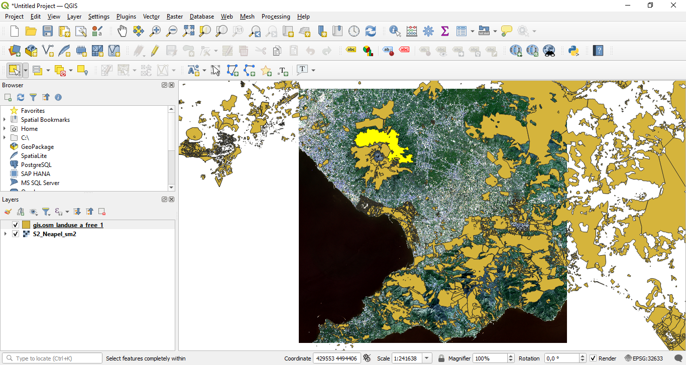

# Useful general tools in QGIS

**Abstract**
After completing this tutorial you will know how to navigate efficiently in the main visualization window of QGIS. You will be able to arrange and directly zoom to layers, add transparency to a layer, measure distances in the visualization window, and obtain information on a pixel or a spatial object. Developed with QGIS version - Developed with QGIS version - Bialowieza 3.22.5

## Efficient navigation in the visualization window of QGIS
In the last tutorials we have learned how to open and visualize raster datasets as well as vector datasets. Now we will learn how we can navigate within the main visualization window of QGIS. We already got to know the “zoom-tools” in the last Tutorial. We will now add some more tools and procedures that make life easier when navigating in QGIS. 

To learn about these functionalities, we first have to load some data. In this case we will use the same data we already know from the two preceding Tutorials. So to start

**we load the raster dataset “S2 Neapel sm2.tif” and the Shapefile “gis.osm landuse a free 1.shp” in the same way as you have already learned in Tutorial 2 and 3. First load the raster dataset and then the shapefile.**

<figure markdown>
  
  <figcaption>Figure 1: Overview of the tools we will get to know today</figcaption>
</figure>

This will lead to a situation that looks like illustrated in Figure 1. We will now learn what we can do with the buttons marked in Figure 1. A brief overview of the functionalities of each button is summarized in Table 1.

Table 1: Overview of most important buttons to navigate and measure in QGIS
| **Button Nr** | **Brief description** |
|--|--|
| Button 1 | This is the “pan” button which allows you to easily navigate through the QGIS visualization window without changing the zoom-level. |
| Button 2+3 | These are the “zoom-buttons”. They can be used to change the zoom level of the visualization window. |
| Button 4 | This is the “info-button”. With this button you can obtain information on a pixel of a raster layer or a spatial object stored in a vector file. |
| Button 5 | This is the “measure-tool”. It can be used to measure distances, angles and areas within the main visualization window. |
| Button 6 | This is the “‘select-tool”. It allows to select an individual or several spatial objects from a vector file. |
| Button 7 | This button allows to zoom to the currently selected spatial object. |
| Button 8 | This is the “zoom-to-full-extent” button. 

So let us try out the different buttons with the loaded data. First,

**select the “pan-button” (marked with “1” in Figure 1), navigate the cursor over the main visualization window and then click and hold the mouse button and simultaneously drag the mouse cursor to navigate within the visualization window. Repeat this step until you have reached an area where there is not data to be visualized anymore.**

Now you are more or less “lost” and you would like to return to the area where your data is located. So in order to do this, we will learn an additional function hid in the “right-click menu” of each layer. So what we do next is

**perform a right-click on the “S2 Neapel sm2” layer as listed in the layer window of QGIS, then select the first option in the menu which is called “Zoom to Layer”.**

You will see that QGIS will now automatically returns to the extent of the “S2 Neapel sm2” layer. This is a very useful tool that you will probably use frequently.

OK, now we have learned how we can directly zoom to the extent of a loaded layer. However, we might also want to zoom-in to a specific subset of our study area. We can do this by

**selecting the “zoom-in” button marked with “2” in Figure 1 and then either click on the area where we want to zoom-in or alternatively click and drag the mouse curson to form a rectangle to which QGIS will then zoom in. A further alternative to using the “zoom-in” button is to simply use the mouse–wheel. If you navigate the mouse cursor over the main visualization window and rotate the mouse-wheel you will directly see the zoom–effect.**

In case you want to zoom-out again, you have several options to do this. We have already learned to use the right-click on one of the layers to select the option “Zoom to Layer”, alternatively we can either

**use the “zoom-out” button marked with “3” in Figure 1 or we can also use the “zoom to full extent” button marked with “8” in Figure 1. If we click this button QGIS will zoom out to a view where all currently loaded layers are completely displayed. Try it out!**

As a last alternative for zooming, we will now learn how to first select a specific spatial object in a vector file and then zoom-in to this object. To achieve this,

**select the “select Features” button marked with “6“ in Figure 1. Then click on one of the polygons of the “gis.osm landuse a free 1” layer. You have to make sure that the “gis.osm landuse a free 1” layer is currently activated/selected in the layer window of QGIS. Otherwise, the button might be greyed out.**

<figure markdown>
  
  <figcaption>Figure 2: Selecting a spatial object in QGIS</figcaption>
</figure>

This will lead to a situation similar to the one presented in Figure 2. Here, a polygon located close to the volcano was selected and is now highlighted with yellow color. As next step, we

**press the “zoom to selected object” button marked with “7” in Figure 1**

QGIS will now zoom-in to the selected object as seen in Figure 3.

<figure markdown>
  
  <figcaption>Figure 3: Zooming in to a selected spatial object</figcaption>
</figure>

You are now able to efficiently navigate within the QGIS visualization window. In the next sections we will learn three more useful general tools of QGIS that you will most likely often use.

## Arranging Layers and adding transparency
If you have followed the recommendation above to first load the raster file and then the shapefile, the raster layer is currently displayed below the shapefile. If we want to change this, we can re-arrange the layers in the layer window of QGIS. To do this, we simply

**click and hold the “gis.osm landuse a free 1” layer and drag it below the “S2 Neapel sm2” layer.**

You will see that this will shift the vector file below the satellite raster data in the main visualization window (Figure 4).

<figure markdown>
  
  <figcaption>Figure 4: Shifting the satellite layer to the top</figcaption>
</figure>

So, as quite inuitively understandable, the layer position in the layer window also always determines the order in which the layers are visualized. However, the visualization of a layer can also be completely deactived **by unchecking the checkboxes on the left besides the name of the layers that are depicted in the layer window of QGIS**

In Figure 5 the layer containing the satellite raster layer was deactivated by unchecking the box. We will now re-activate the layer so that both datasets are visible.

<figure markdown>
  
  <figcaption>Figure 5: Deactivating a layer</figcaption>
</figure>

Shifting the satellite data on top of the vector layer did not really improve the visualization situation as now all spatial objects overlaping with the satellite raster data became invisible. So we will now try to find a solution in which both datasets are displayed at the same time with a minimum loss of information due to the overlapping. To do this, we first

**rearrange the layer once more to have the satellite raster layer below the shapefile layer. Next we will right-click the “gis.osm landuse a free 1” layer and select “properties”. In the appearing properties window we select the “Symbology” tab. As shown in Figure 6, we will now change the “Layer transparency” option in the “Layer rendering” section from 0 to 50 and accept the new settings with pressing “Apply” and then “OK”.**

<figure markdown>
  
  <figcaption>Figure 6: Adapting the transparency settings of a layer</figcaption>
</figure>

<figure markdown>
  
  <figcaption>Figure 7: New visualization with the transparent Shapefile</figcaption>
</figure>

As visible in Figure 7 the “gis.osm landuse a free 1” layer is now displayed transparently and both datasets can be seen at the same time. Transparency can be added to any dataset loaded in QGIS except using the same dialogue as just described.

## The measuring tool in QGIS
We will now have a look at the “measure-tool” which is marked with “5” in Figure 1. If you have a closer look at the button of the tool you can see that there is a small arrow pointing downwards next to the button symbol. If you press this arrow you can see that there are four options for the measuring tool:

**Measure Line** To measure linear and non-linear distances **Measure Area** To measure areas of Polygons **Measure Angle** To measure angles between two lines and **Measure Bearing** to measure the horizontal angle of an object.

To see how the tool works,

**we will first zoom-in to the vulcano displayed in the satellite raster file. Then we select the “Measure Line” option of the tool and measure the East-West expansion of the vulcano as shown in Figure 8**

<figure markdown>
  
  <figcaption>Figure 8: Measuring the East-West expansion of the vulcano</figcaption>
</figure>

**Next, we will switch to the “Measure Area” option and measure the whole extent of the volcano by drawing a polygon around it as depicted in Figure 9. As marked in Figure 9 that unit can be changed by using the marked drop-down menu.**

<figure markdown>
  
  <figcaption>Figure 9: Measuring an area in QGIS</figcaption>
</figure>

## The info–button in QGIS

<figure markdown>
  
  <figcaption>Figure 10: Zoom in to the area marked with the red rectangle</figcaption>
</figure>

As last useful tool in this Tutorial, we will get to know the “info-tool”. This tool allows us to find out either the value of a pixel of a raster file or attributes of a vector file as stored in the attribut table. To see how the tool works, we

**will first zoom-in to the area marked with the red rectangle in Figure 10, then we select the “info-button” marked with “4” in Figure 1. Next, we select the “gis.osm landuse a free 1” layer in the layer window of QGIS and then click on a spatial feature of the Shapefile. QGIS will then display the attribute table information stored for this spatial feature in the new “Identify results” window that has opened after activating the “info-button” tool. In Figure 11 you can see an example for this.**

<figure markdown>
  
  <figcaption>Figure 11: Retrieving attribute information using the info-button tool.</figcaption>
</figure>

The same procedure can be repeated for the raster file by

**first selecting the “S2 Neapel sm2” layer in the layer window of QGIS and then again using the “info-button” tool to click on any pixel of the raster dataset. All values of the 10 raster bands will then be shown in the “Identify results” window. By switching the view-option from "tree" to "graph" as shown in Figure 12 you can visualize the spectrum of a given pixel**

You should now be familiar with the most important general tools of QGIS that will ease your daily life with handling and navigating through geodata in QGIS.

<figure markdown>
  
  <figcaption>Figure 12: Deriving a spectrum using the “info-button”.</figcaption>
</figure>

## Exercises

To further familiarize yourself with the tools you have just learned to handle, please solve the following tasks:

1. Measure the area of the crater of the volcano

2. Identify the residential area (visually) closest to the crater and register its osm_id (one attribute you can derive using the info button)

3. Measure the distance of the residential area to the center of the crater (use the approximately shortest distance between the polygon and the center of the crater)

4. Try to identify four different land-cover classes in the satellite image and use the info-button to display the spectra of the land-cover classes. Please make screenshots (using the "print screen/Druck" button on your keyboard and then "paste/einfügen" in some graphic program - or maybe you also have an alternative screenshot tool on your computer) of the spectra and describe the differences you observe for the four classes in your own words. Feel free to make more than one screenshot per class to better understand how the classes you identified differ in their spectral behaviour.

Please upload a single pdf-file including the results of Exercises 1-4 in the corresponding assignment in Blackboard.
