# Basic vector processing in QGIS

**Abstract**

After completing this tutorial you will know how to create a new shapefile and digitize new spatial objects into the shapefile. Furthermore, you will be able to conduct a buffer analysis, and add geometric information to the newly created spatial objects. Developed with QGIS version - Bialowieza 3.22.5

## Creating a new Shapefile vector file
In this tutorial we will get to know the most important basics for creating and processing vector Shapefiles. We will first load the already familiar satellite image as base information from which we can digitize information into a Shapefile. After creating the shapefile, we will conduct some more analysis steps with it.

To start,

**we load the raster dataset “S2_Neapel_sm2.tif” as already learned in previous tutorials. Next, adapt the visualization settings to have a balanced view of all classes by using the channels R=3, G=2, B=1 and loading new max / min values using the “Symbology”-tab in the properties window.**

As next step, we will create an empty shapefile by

**selecting the menu “Layer” then “Create Layer” and “New Shapefile Layer” as indicated in Figure 1**

<figure markdown>
  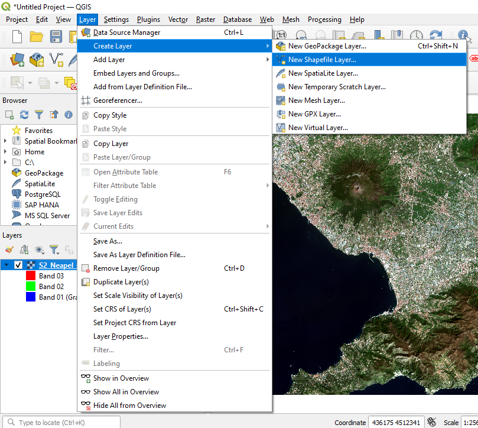
  <figcaption>Figure 1: Creating a new shapefile layer.</figcaption>
</figure>

This will open a new window in which you can define the type of Shapefile you want to create. There are three options: 1. Point 2. Line and 3. Polygon – see also area marked with “1” in Figure 2. Furthermore, it is necessary to define a coordinate reference system (CRS) - marked with “2” in Figure 2. We will now do this by

**selecting “Polygon” and then defining the CRS by clicking the little “globe” button marked with the red frame in Figure 2**

<figure markdown>
  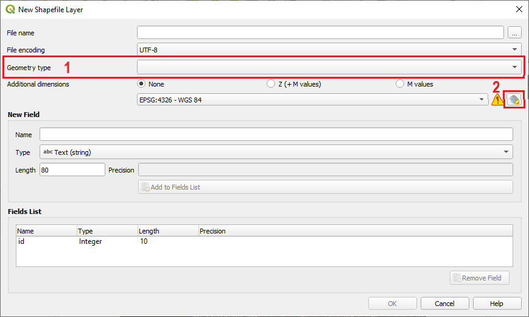
  <figcaption>Figure 2: Selecting the correct settings for a Shapefile.</figcaption>
</figure>

However, we first have to decide what is the correct coordinate reference system. As you can see form Figure 3 there are very many coordinate reference systems (CRS) to choose from. In our case, we will simply select the coordinate reference system of the already loaded satellite image. This is often an easy solution if no further information about coordinate reference systems is available. 
In our case, we can find out the coordinate reference system of the satellite image by having a look at the lower right corner of the QGIS graphical user interface as marked in Figure 4. At this position you will always see the current CRS of the QGIS project. It is normally defined by the first datasets that gets loaded into a project. In our case, the satellite image was loaded first, so the whole project was adapted to the CRS of the satellite image. In case several datasets are loaded, they might have differing CRS. We will investigate such a case in one of the Tutorials which are still to come.

<figure markdown>
  
  <figcaption>Figure 3: Defining the coordinate reference system.</figcaption>
</figure>

<figure markdown>
  
  <figcaption>Figure 4: Identify the coordinate reference system of the current QGIS project.</figcaption>
</figure>

So how do we ensure that the CRS of our new Shapefile matches the CRS of the satellite image? In Figure 4 we can see that the CRS of the current QGIS project and hence the satellite image has the EPSG code: 32633. We will now select the same CRS in the “select CRS dialogue” in QGIS by

**clicking in the “Filter” area marked with “1” in Figure 3, then we enter the digits of the EPSG code, that is “32633”. By doing this, all CRS systems except for a single one will disappear (see Figure 5). As you will learn in the theoretical lectures, each EPSG code is unique! So we will now select the coordinate system “WGS 84 / UTM zone 33N” and confirm with clicking “OK”. As final step, we will have to define a name for the shapefile and the folder where you want to store it. To do this, we click the ... button in the top right of the form next to the "File name" field and enter a filename and navigate to the folder where we want to store the new Shapefile. Name the Shapefile “Polygon_tut5.shp”, press “OK" and "OK" again in the main form to create the new Polygon Shapefile.**

<figure markdown>
  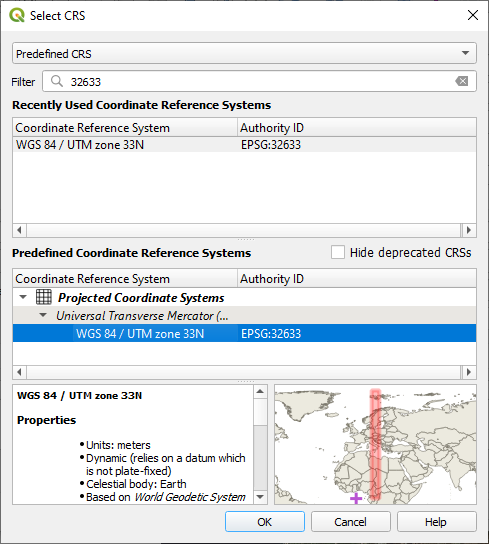
  <figcaption>Figure 5: Filtering using the EPSG code.</figcaption>
</figure>

This should lead to a new situation as depicted in Figure 6. As you can see, not too much has changed as the Polygon-Shapefile currently is still empty and contains no spatial features. We will learn how we can add new features in the next section.

<figure markdown>
  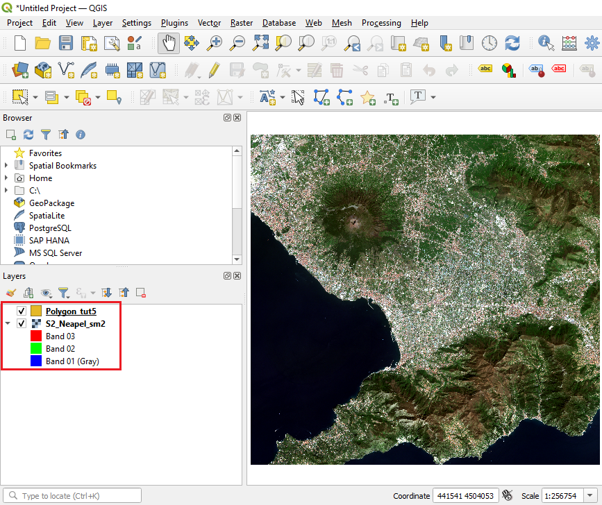
  <figcaption>Figure 6: Situation after creating a shapefile.</figcaption>
</figure>

## Digitalization of new spatial objects into a Shapefile layer
In this section we will mostly work with the “Digitizing toolbar” which can be seen in Figure 7. In your case the buttons of the editing toolbar will most likely be still greyed out and only the button marked with “2” might be a active depending on which layer is currently selected in the layer window section of QGIS. So to activate the other buttons, we have to initialize the digitalization process. To do this, we

**we first select the newly created “Polygon_tut5” layer in the layer window. Then we initialize the digitalization process of this Shapefile by clicking the button marked with “2” in Figure 7. The Shapefile is now in the “Editing mode” and new spatial features can be added and old spatial features can be changed or deleted.**

<figure markdown>
  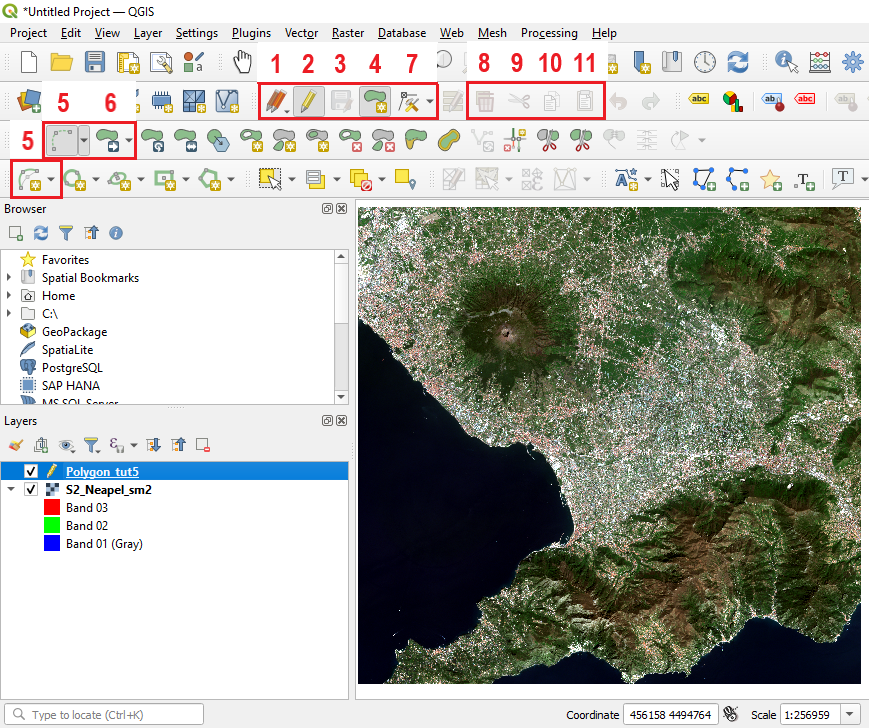
  <figcaption>Figure 7: Filtering using the EPSG code.</figcaption>
</figure>

As next step we will digitize the crater area of the vulcano and calculate its area. To accomplish this, we

**first zoom in to the vulcano area by using the zoom-in tool which we already know from the earlier tutorials. Then select the button marked with “4” in Figure 7. This button allows us to create a new spatial object - in this case a Polygon as we are editing a polygon shapefile. The symbol would differ in case we would edit a point or a line–shapefile. After selecting the button, start digitizing the circumference of the vulcano crater by navigating the mouse cursor over the edges of the crater and performing a left–click, then move the mourse cursor a bit further and perform another left–click and so on until you have surrounded the whole crater (see Figure 8). When you are happy with your polygon, perform a right–click to finish the polygon. QGIS will ask you to enter an id - you can either enter a number or just click “OK”. For the moment this option is not yet relevant.**

<figure markdown>
  
  <figcaption>Figure 8: Polygon surrounded the whole crater.</figcaption>
</figure>

After finishing the polygon, the transparent colour of the “polygon-in-progress” will change to a solid colour (see Figure 9). In case you do not like this format of the Polygons, you can switch the colour, or add transparency using the “Symbology” tab in the “Properties” window as you have learned in the earlier Tutorials. Be aware that you can also adapt the transparency of only the fill-colour while keeping the colour of the Outline solid (try to find out how this works!). If you are happy with your newly ceated Polygon click the button marked with “3” in Figure 7 to save the edits you made. If you do not want to add any further objects click button marked with “2” again to stop the editing mode.

<figure markdown>
  
  <figcaption>Figure 9: Creating a new Polygon over the crater area of the vulcan.</figcaption>
</figure>

In case you think that your Polygon is not accurate enough and you would like to correct some of the points between which the Polygon is spanned (this points are called “nodes”), QGIS offers a tool to adapt the shape of Polygons. This function is available when pressing the button marked with “7” in Figure 7. So let’s try this out.

**First activate the editing mode as already learnt, then select the “Node” Tool (button 7) and then click on the Polygon you want to edit. In our case we only have a single Polygon. Once the Polygon has been selected, all nodes appear as rectangles and can now be rearranged / moved by putting the mouse cursor over them clicking and holding the left mouse–button and draging them to the desired position - see Figure 10**

<figure markdown>
  
  <figcaption>Figure 10: Editing Nodes of a Polygon.</figcaption>
</figure>

Now you are able to create new spatial objects and adapt the shape of an existing object. Next, we will have a quick look on the other buttons illustrated in Figure 7. First we will try to create a Polygon element of a circle. To do this, we

**click the button marked with “5”. Then we click somewhere in main visualization window of QGIS to set the starting point, a second time to set the ending point and a third time to set the point of maximum distance from the “baseline”. Then QGIS will create an element of a circle as illustrated in Figure 11**

<figure markdown>
  
  <figcaption>Figure 11: The newly created element of a circle Polygon.</figcaption>
</figure>

In our case this new polygon does not make too much sense. So we would like to delete it again. In order to this,

**we first select the “Select Feature” button as highlighted in Figure 11 and then click on the newly created element of a circle Polygon. By clicking on it, it will be selected and turn its colour to yellow - see Figure 12 . To delete the element, we can either click on the button marked with “8” in Figure 7 or simply press the “del” or “entf” key on the keyboard.**

<figure markdown>
  
  <figcaption>Figure 12: Selecting the newly created element of a circle Polygon.</figcaption>
</figure>

Now the polygon should disappear again. The remaining buttons are typically used less frequently, but are still very useful in some occasions. In brief, the button marked with “6” in Figure 7 allows to move complete spatial objects around after they have been selected with the “Select Feature” tool. The buttons marked with “9”, “10” and “11” offer the possibilities to “cut out”, “copy” and “paste” polygons. To find out how this works,

**play around a bit with the buttons and try to create a situation which looks similar to Figure 13**

<figure markdown>
  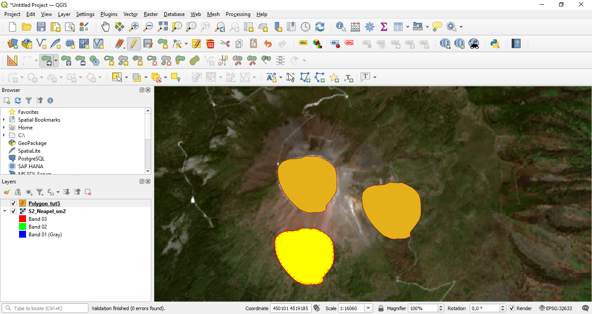
  <figcaption>Figure 13: Situation after copy and pasting the original polygon two times and shifting the pasted Polygons to new locations.</figcaption>
</figure>

## Buffer analysis
In this section, we will for the first time use a tool of QGIS that is not included in the standard processing tools and can only be found using the processing toolbox. Normally, the processing toolbox is already opened when opening QGIS (see box marked on the right part of Figure 14). In case it is not visible, it can be opened by selecting “Processing” and then “Toolbox” from the main menu of QGIS as also shown in Figure 14.

<figure markdown>
  
  <figcaption>Figure 14: The processing toolbox.</figcaption>
</figure>

Finding the correct tool that is able to conduct the action we want to perform on our data is not always easy. The best option is to directly know the name of the tool. This is similar to learning vocabulary in a foreign language. In case you know the name of the tool that you want to use, you can simply type in its name in the field marked with “1” in Figure 15. Alternatively, you can browse through the available tools by opening the menus in the “Processing Toolbox window”. Typically, the tools are sorted according to their input data type, that is there are separate tools for raster datasets and vector datasets.

<figure markdown>
  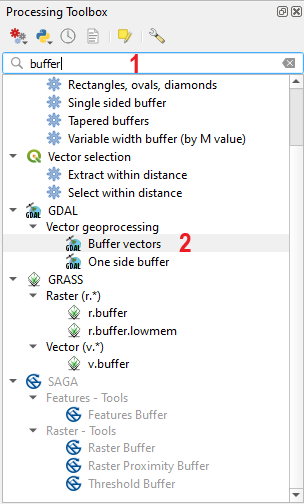
  <figcaption>Figure 15: The processing toolbox.</figcaption>
</figure>

You can find further tools including the most commonly applied ones in the main menu of QGIS where you can find the two menu sections called “Vector” and “ Raster” which contain plenty of options to process each datatype. It is highly recommended to also try out some of these tools and find out yourself what they are doing. In most cases there is also some further information given once the tool is started.

The best way to learn to handle a GIS is to first learn the basics (for example using these Tutorials) but then also try out a lot on your own! Don’t be shy!

But back to our polygon. The first analysis tool we want to apply to our newly created Polygon is the “buffer-tool”. It will create a zone of equidistance around an existing spatial feature. This will become fully clear once you see the results. So in order to create a buffer-Polygon around our existing Polygon, we

**write the word “buffer” in the area marked with “1” in Figure 15. From the multiple options appearing we select the tool “Buffer vectors” from the “GDAL/OGR toolbox” and the “[OGR] Geoprocessing” menu (marked with “2” in Figure 15). By double clicking the tool, we can open a new window which allows us to specify the settings for the new buffer polygon we will create. In this window, we primarily have to define the buffer distance - in this case we set the distance to 500 - and we have to specify an output file. The corresponding fields are marked in Figure 16 with “1” and “2”. Then we click “run” and a new Shapefile containing the newly created buffer Polygon will be created and added to the QGIS project.**

<figure markdown>
  
  <figcaption>Figure 16: The processing toolbox.</figcaption>
</figure>

After re-arranging the layers in the layer window section of QGIS, the new situation should look as shown in Figure 17. You can see that the new Polygon surrounds the old Polygon with a fixed distance of 500 m. It is important to consider that the **buffer distance** we defined in the preceding step is always in **map units**. In our case we used a UTM coordinate reference systems which is a metric system. So the defined buffer distance will be in meters. In case we would apply a buffer on a dataset projected in latitutde and longitude, the buffer distance would be in degree! So in case you experience that even with a small buffer distance the resulting buffer shapefiles become really large, it is likely that this relates to a problem of the buffer distance unit.

<figure markdown>
  
  <figcaption>Figure 17: The processing toolbox.</figcaption>
</figure>

## Calculating the area of Polygons using the Field Calculator tool
In this section, we will learn how to calculate the area of spatial polygon objects stored in a Shapefile. The same procedure can also be used to calculate lengths of Polylines and the x,y-coordinates of Points stored in Shapefiles. In our case we will calculate the area of the crater Polygon we have created earlier. To do this,
**we perform a right–click on the “Polygon_tut5” layer in the layer window of QGIS and select the “Open Attribute Table” option (see Figure 18).**

<figure markdown>
  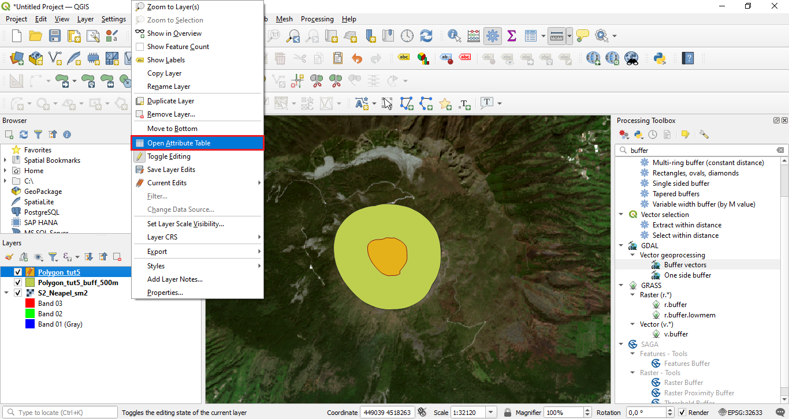
  <figcaption>Figure 18: Opening the attribute table.</figcaption>
</figure>

This will open the new window displayed in Figure 19. Here we will now

**click the “Open Field calculator” button marked with “1”.**

<figure markdown>
  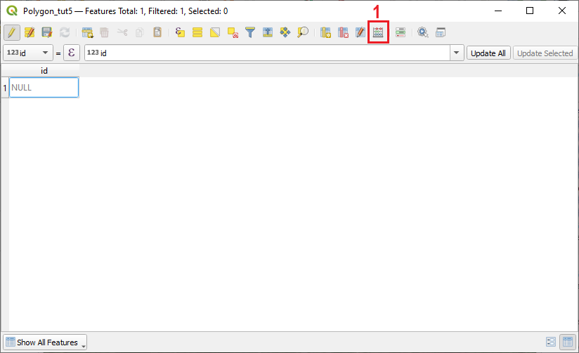
  <figcaption>Figure 19: The attribute table.</figcaption>
</figure>

This will open another new window as seen in Figure 20. This new window represents the “Field calculator” tool which is a powerful tool to update the attribute table of any vector layer and add new information to it. We will now use it to add a new columns to the attribute table of the Shapefile that contains the crater Polygon. As we can see in Figure 19, this Polygon currently contains only a single Polygon. We will later see other attribute tables with a lot more objects.

To now add the area of our crater Polygon, we

**select “Create a new field”, then we define an “Output field name” by typing in “area” in the field marked with “1” in Figure 20. Next, we have to define the “Output field type”. Here we click on the drop–down–menu marked with “2” and select “Decimal number (real)”. After selecting this option, the “Precision” field marked with “3” gets activated.**

This field together with the field “Output field length” defines how many digits can be stored in the new columns of the attribute table. This is similar to defining the cell format in Excel. In our case we want the area to be a decimal number which means that we can also have digitis behind the comma. As you remember from the thoretical lecture, the option “Whole number (integer)” can only store whole numbers like 1, 2, 3, 34, 789 etc., while a “Decimal number (real)” field is able to store decimal numbers such as 45.3 or 648.99932. The number of digits behind the comma are defined with the “Precision field” while Output field lengths defines the number of total digits (digits before and after the comma together). So in our case,

**we will set the “Output field lengths” to 15 and the “Precision” to 2.**

A short summary what the other “Output field types” mean is given in Table 1.

Table 1: Output field types
| **Field type** | **Brief description** |
|--|--|
| Whole number (integer) | This field type can store whole numbers (numbers without commas) between 2,147,483,648 and 2,147,483,647. Larger or smaller values cannot be stored |
| Whole number (integer 64bit) | This field type is identical with “Whole number (integer) but its value range is larger. It can stores numbers between 9,223,372,036,854,775,808 to 9,223,372,036,854,775,807 |
| Decimal number (real) | This is the field type that can store any numbers with decimals. |
| Text (string) | This field type will store everything as text. Applying mathmatical functions will not work with this field type - even if only numbers are stored in the column. |
| Date | This field type will only store Dates.

<figure markdown>
  
  <figcaption>Figure 20: Opening the attribute table.</figcaption>
</figure> 

We have now defined how the output column of the attribute table that will store the “area value” of our Polygon should look like. Now we have to tell QGIS that it should calculate the area of the Polygon. To do this,

**we open the menu marked with “4” in Figure 20 and then double-click the option “$area” which will then also appear in the “Expression” section on the left, which has been empty so far.**

After conducting all these steps, the “Field Calculator” window should look like shown in Figure 21. If this is the case,
**click “OK” and the window will disappear.**

If we now have another look at the attribute table of the “Polygon_tut5” Layer, we will see that a new column has been added to the attribute table that contains the area of the Polygon (see Figure 22). In our case the value is given in square meters as the defined UTM coordinate system is a metric system. For the Polygon created in this Tutorial the area is 249400.03 square meters. This value is likely to differ in your case, eventhough it should be similar.

<figure markdown>
  
  <figcaption>Figure 21: Opening the attribute table.</figcaption>
</figure>

<figure markdown>
  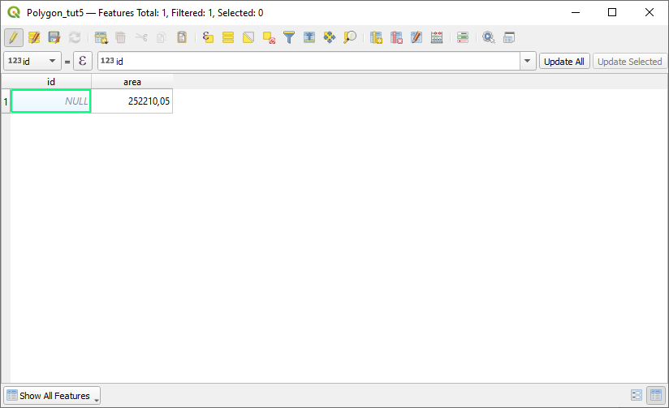
  <figcaption>Figure 22: Opening the attribute table.</figcaption>
</figure>

As a last step for this section, we will transform the area value given in square–meters to square kilometers. Do this we will again use the field calculator tool:

**Open the attribute table of “Polygon_tut5” Layer, then click the “Field calculator” button. Define a new field called “area_km”, select “Decimal number (real)” as “Output field type” and set the “Output field length“ to 15 and “Precision” to 5.**

<figure markdown>
  
  <figcaption>Figure 23: Field calculator.</figcaption>
</figure>

All these steps should already be familiar. However, now a new aspect comes into to play. While we used the tool or command “$area” in the first application of the “Field calculator” to calculate the area, we will this time use the just calculated “area” field as input to the “Expression” section, where we will define the function to transform the values given in square meters to values in square kilometers. To achieve this:

**we first open the menu called “Fields and Values” as marked with “1” in Figure 23. Then we double–click the entry “area” which is the column in the attibute table that we have just created. The “area” variable will now appear in the “Expression” editor to the left. We will now add the formula to transform square meters to square kilometers by first clicking the “Division operator” marked with “2” in Figure 23 and then entering “1000000” as 1000000 square meter equal 1 square km. We then press “OK”.**

This will add another column to the attribute table that contains the area of the Polygon in square kilometers as seen in Figure 24.

<figure markdown>
  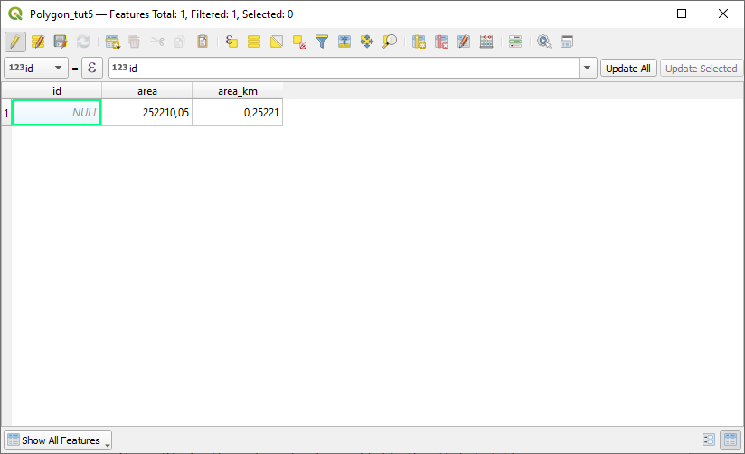
  <figcaption>Figure 24: Another column has been added to the attribute table.</figcaption>
</figure>

## Exercise

In Figure 23 you can see two red circles. The first circle in the West marks the area where a river connects with the sea. The second circle in the East marks the area where the river start to become hard to identify in the satellite image.

<figure markdown>
  
  <figcaption>Figure 25: Start and end point for the Polyline to be created in the exercise.</figcaption>
</figure>

To train the just learned skills you should now complete the following exercise:

1. Load the raster dataset “S2_Neapel_sm2.tif”. Adapt the visualization settings if you want.

2. Create a new Shapefile of type ”Line”.

3. Digitize a spatial line object between the two red circles as shown in Figure 25. Follow the course of the river while digitizing the line object.

4. Calculate the length of the river segment you have digitized in meters and kilometer.

5. Adapt the visualization of newly created spatial line object and give the line a deep blue colour and a line width of 5 pixels.

6. Zoom to the Polyline object you have created and export the current view by selecting “Import/Export” -> “Export Map to Image” from the main menu of QGIS (Figure 26). This will be the proof that you have completed this Tutorial.

