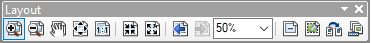
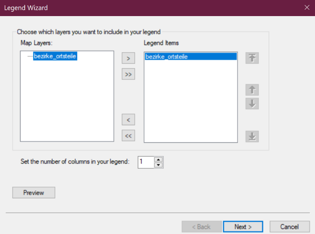

## Einführung in ArcMAP

Wir verwenden **ArcMap**. ArcMap wird verwendet, um geographische Informationen zu visualisieren, zu verwalten, zu erstellen, zu analysieren und zu teilen. Es ermöglicht Benutzern, Karten zu erstellen, geographische Daten zu bearbeiten, geographische Daten zu analysieren und schließlich Berichte und Karten zu erstellen.

### Fragen und Probleme

Solltet ihr während des Arbeitens mit ArcMap auf Probleme oder Fehler stoßen, seid ihr nicht allein. Wir stehen bereit, um euch bei Fragen oder Schwierigkeiten zu unterstützen.

### Vorbereitung

Legt einen **Ordner** auf Ihrem Computer an, in dem ihr alle Daten für unseren Kurs speichert (z.B. `...\Mintoring`).

Bitte ladet die Daten, mit denen wir heute arbeiten, von der FU-Box herunter . Klickt auf ein Thema um den Link dahin zu öffnen. Klickt dann auf den Button "Download all files", um den Datensatz auf euren Computer herunterzuladen.

Die möglichen Themen sind:

- [Para](https://box.fu-berlin.de/s/KN4a6YbTpaxwX7z)
- [Mato Grosso](https://box.fu-berlin.de/s/4o26HCc4AL7xfBW)
- [Rondonia](https://box.fu-berlin.de/s/AbMem5DG3rzwW5d)
- [Acre](https://box.fu-berlin.de/s/Ptsk7tzmdTnRSss)

### ArcMAP

Öffnet ArcMap unter `Start > Programme > ArcGIS > ArcMap`.

Bei dem sich öffnenden Fenster werdet ihr gefragt, ob ihr eine Vorlage öffnen möchten.
Da wir ein neues Projekt anlegen, wählt bitte `CANCEL`.

Ihr seht nun die **ArcMap-Benutzeroberfläche**.

### Definieren des Arbeitsverzeichnisses

Wir müssen das **Arbeitsverzeichniss** definieren.

Geht dafür in der ArcMap- Menüleiste auf `GEOPROCESSING > ENVIRONMENTS > WORKSPACE` und gebt für für den `CURRENT WORKSPACE` und `SCRATCH
WORKSPACE` euer Arbeitsverzeichnis an, in dem ihr eure Daten speichert (z.B. `...\Mintoring`).

Klickt dafür auf das Ordnersymbol und navigiert zu eurem Ordner. Dazu müsst ihr zunächst mit `Connect to Folder` eine Verbindung mit dem Laufwerk, auf dem sich **euer Ordner** befindet, erstellen.

### Daten öffnen und visualisieren in ArcMap

Nun wollen wir die ersten **Geodaten** in ArcMap **öffnen und visualisieren**.

In ArcMap werden Daten über `Add Data` geöffnet.

Öffnet die Dateien mit den Endungen `.shp` und `.tif`

Die Daten erscheinen in ArcMap sowohl im **Kartenfenster** (rechts) als auch im **Table of Contents** (links) hierarchisch gelistet.
Der Datensatz, der im `Table of Contents` oben gelistet ist, liegt auch im Kartenfenster oben, d.h. er kann evtl. darunterliegende Datensätze verdecken.
Ihr könnt die **Reihenfolge** der Datendarstellung im Kartenfenster verändern, indem ihr einen Datensatz im `Table of Contents` anklicken und an eine andere Position (nach unten/oben) verschiebt.

Erkundet die Daten mit den vorhandenen Werkzeugen in der Toolbar (**Zoom in, Zoom out, Pan/Verschieben, Full extent/volle räumliche
Ausdehnung, Fixed zoom in, Fixed zoom out**).

### Attributtabelle öffnen

**Vektordaten** sind dadurch charakterisiert, dass sie neben der geometrischen Information (wo genau liegen die Punkte/Flächen im Raum)
auch **Sachdaten** enthalten können. Diese Sachdaten sind über die `Attributtabelle` direkt mit der räumlichen Information verknüpft.
Beispielsweise wäre die Umrandung eines Bezirkes im Raum eine räumliche/geometrische Information.
Die Einwohnerzahl für den jewiligen Bezirk, oder auch der Name des Bezirkes wären Sachinformationen/Sachdaten

Diese `Attributtabelle`kann in ArcMap über das `KONTEXTMENÜ (Rechtsklick auf den entsprechenden Datensatz im Table of Contents) > OPEN ATTRIBUTE TABLE` angeschaut werden.

Öffnet die `Attributtabelle` eurer Daten und seht euch die enthaltenen Sachdaten an.

Um herauszufinden, welche Zeile der `Attributtabelle` für welches Geoobjekt (z.B. Ortsteil) im Kartenfenster steht,
kann man die entsprechende Zeile selektieren. Klickt dafür hier in der `Attributtabelle` auf den Anfang der ersten Zeile.
Das entsprechende Element ist nun sowohl in der `Attributtabelle` als auch im Kartenfenster selektiert.

### Anpassen der Datendarstellung

Die graphische Darstellung der Daten, also deren **Farb- und Formgestaltung**, erfolgt nach dem Öffnen in ArcMap zufällig.
Ziel ist es, die Daten so darzustellen, dass alle wichtigen Daten **sichtbar**, **inhaltlich passend** und **gut voneinander unterscheidbar** visualisiert werden.

Die einfache Visualisierung erfolgt über einen Doppelklick auf das jeweilige Symbol (Punkt bzw. Linie) unterhalb des Layernamens im `Table of Contents`.
Es öffnet sich ein neues Fenster: `Symbol Selector`. In diesem kann die geometrische Form, deren Größe und Farbgestaltung für einen Layer ausgewählt werden.

Für die Visualisierung ist eine Darstellung nach dessen Eigenschaften in der `Attributtabelle` erforderlich.

Diese Visualisierung erfolgt über das `KONTEXTMENÜ (Rechtsklick auf den entsprechenden Datensatz im Table of Contents) > PROPERTIES` ein neues Fenster öffnet sich: `LAYER PROPERTIES > SYMBOLOGY`.

Wählt nun auf der linken Seite unter `Show` die Option `CATEGORIES > UNIQUE VALUES`.

Unter `VALUE FIELD` könnt ihr eine der Spalten der `Attributtabelle` auswählen.

Ihr könnt entweder eine Farbzuweisung über die `COLOR RAMP` auswählen oder mit einem Doppelklick auf das Farbkästchen zu jedem Attribut eigene Farben für das jeweilige Attribut auswählen.

Die Funktion, einen Layer transparent darzustellen, findet ihr im Fenster `LAYER PROPERTIES > DISPLAY > TRANSPARENT`.

Bestätigt anschließend mit `OK`.

### Speichern des ArcMap-Projekts

Es ist es immer wichtig, eure Ergebnisse zu **speichern**. Sämtliche Veränderungen in der Darstellung der Daten im Kartenfenster, die wir vorgenommen haben, sollten in einem ArcMap-Projekt gespeichert werden.

Speichert euer ArcMap-Projekt in der Menüleiste unter `FILE > SAVE AS` in eurem Ordner mit dem Namen `Mintoring.mxd`

## Erstellen einer Karte

### Kartenlayout erstellen

Wir wollen nun eine **Karte** erstellen. Dafür werden wir in einem ersten Schritt das **Kartenlayout** an unsere Wünsche anpassen.

Für die Erstellung eines Kartenlayouts müsst ihr in ArcMap den sogenannten `Layout View` aktivieren. Bisher haben wir immer in der `Data View` gearbeitet und in dieser Darstellungsveränderungen für die Daten vorgenommen. Für die Anpassungen im Kartenlayout muss die `Layout View` aktiviert sein.

Dies könnt ihr in der Menüleiste unter `VIEW > LAYOUT VIEW` aktivieren.

### Kartenlayout anpassen

Wir wollen nun das Papierformat der Karte in ein **A3-Querformat** ändern.

Ändert das voreingestellte Papierformat in der ArcMap-Menüleiste unter dem Reiter `File > Page and Print Setup`. Wählen Sie `Paper > Size` und wählen Sie ein A3-Format aus.

Wählt unter `Paper > Orientation > Landscape` Querformat. Dadurch wechselt ihr das
Seitenformat von **Hoch- zu Querformat**.

Ändert bei `Name` den Namen zu `Microsoft to PDF` und bestätigt mit `OK`.

Im nächsten Schritt wollen wir den **Kartenrahmen** unserer Karte an das gewählte Papierformat anpassen.

Öffnet in der ArcMap-Menüleiste unter `Customize > Toolbars > Layout` die Editierungswerkzeuge eurer Karte (falls die Layout-Toolbar nicht schon geöffnet sein sollte). Mit dieser Layout-Toolbar könnt ihr Elemente innerhalb Ihres Kartenlayouts verschieben und den Zoom für die Ansicht der Karte verändern.

Setz den **Zoom** für euer Papierformat auf `50%`.

Ihr könnt nun den Kartenrahmen eurer Karte anpassen. Die Platzierung des Kartenrahmens
im Layout wird durch ein schwarzes Rechteck angezeigt. Um den Kartenrahmen im `Layout View` anzupassen, klickt mit der rechten Maustaste auf die Darstellung des Datensatzes.

Hinweis: Falls ihr bereits Werkzeuge aus der `Layout-Toolbar` ausprobiert haben solltet, könnt ihr den Kartenrahmen nicht direkt aktivieren. Bitte klickt dafür zuerst auf den schwarzen Pfeil in der ArcMap-
Werkzeugleiste Tools (`Tools-Werkzeugleiste > Select Elements`) und klickt danach auf die Darstellung des Datensatzes.

Der Kartenrahmen ist nun aktiviert (zu erkennen an der hellblau-schwarzen Strichelung und den Kästchen an den Eckpunkten) und kann verändert werden.

Ihr könnt die **Position des Kartenrahmens** ändern, indem ihr in mit gedrückter linker Maustaste verschieben. Die Größe des Kartenrahmens könnt ihr durch die Eckpunkte verstellen.

### Einfügen der erforderlichen Kartenelemente bzw. Kartenrandangaben

In der **ArcMap-Menüleiste** findet ihr unter dem Reiter `Insert` die wichtigsten Kartenelemente, die ihr in eurer Karte verwenden solltet.

#### Kartentitel

Platziert unter `Insert > Title` einen **Kartentitel** in eure Karte.

Gebt der Karte eine geeignete Überschrift.

Ihr könnt das Textformat der Überschrift durch einen Doppelklick auf den Titel jederzeit
formatieren.

Platziert die Überschrift an einer geeigneten Stelle eurer Karte.

#### Legende

Öffnet den `Legend Wizard` unter `Insert > Legend`.

Über die mittleren Pfeiltasten können ihr den gewünschten Layer von `Map Layers` zu `Legend Items` verschieben. Es werden nur **Legenden der Layer** erzeugt, die in der `Legend Items`-Liste aufgeführt sind. Achtet darauf, dass der Layer unter `Legend Items` gelistet ist.

Platziert die Legende an eine geeignete Stelle im Kartenrand.

Das Legendenmenü kann jederzeit mit Doppelklick auf die Legende wieder geöffnet werden. Die Einstellungsmöglichkeiten sind so vielfältig, dass wir das hier nicht alles detailliert beschreiben können.

Wichtig: Die Legendeneinträge werden automatisch angepasst, wenn zum Beispiel Attributfarben und -einträge im `Symbology`-Menü (in der Data View!) verändert werden. Es können ebenso neue Geodaten in die Legende übernommen oder herausgelöscht werden.

#### Nordpfeil

Öffnet den `North Arrow Selector` unter `Insert > North Arrow`.

Wählt einen passenden **Nordpfeil** aus und bestätigt mit `OK`.

#### Maßstab

Öffnet den `Scale Bar Selector` unter `Insert > Scale Bar`.

Wählt einen **geeigneten Maßstab** aus und bestätigt mit `OK`.

Platziert den Maßstab an einer geeigneten Stelle.

Ihr könnt den Maßstab jederzeit durch einen Doppelklick anpassen.

#### Koordinatensystem

Öffnen Sie die `Data Frame Properties` durch einen Doppelklick auf das Layer Symbol
im `Table of Content`.

Wählt den Reiter `Grids`.

Erzeugt ein neues **Koordinatensystem** durch Klicken der Option `New Grid`.

Wählt `Measured Grid: divides map into a grid of map units` und bestätigt mit `Weiter`.

Wählt `Appearance` die Option `Labels only`. Setzt den Abstand unter `Intervals` für die X-
und die Y-Achse auf `10000 Meters`, um in diesem Abstand Koordinaten am Kartenrand
einzufügen. Bestätigt mit `Weiter`.

Behaltet die Voreinstellungen bei und bestätigt mit `Weiter`.

Bestätigt zuletzt mit `Finish`.

Bestätigt nun eure Anpassungen in den Data Frame Properties mit `Übernehmen` und
anschließend `OK`.

Ihr könnt jederzeit Änderungen an der Darstellung des Koordinatensystems vornehmen. Dazu
öffnet durch einen Doppelklick auf das Layers-Symbol im `Table of Contents` die `Data Frame Properties`. Unter dem Reiter `Grids` könnt ihr euer Koordinatensystem auswählen und über `Properties` anpassen.

#### Weitere Elemente

**Zusätzliche Karteninformationen** (wie z.B. das Datum der Kartenerstellung, der Name des/r Kartenautors/in, Name des verwendeten
Koordinatensystems etc.) können aber auch über `Insert > Text` in den Kartenrand eingefügt und dort auchverändert werden.

Der Text sollte folgendes Enthalten:

- Authorinen
- Datum
- Quelle

### Exportieren der Karte als Bildformat

Wenn ihr mit eurer Darstellung der Karte zufrieden seid, wählt in der ArcMap- Menüleiste unter `File > Export Map`.

Gebt den gewünschten **Speicherort** an und gebt der zu **exportierenden Karte** unter `Dateiname` die Bezeichnung `Bezirke_Berlins`.

Unter der Option `Dateityp` können ihr euch ein **Bildformat** aussuchen, in dem die Karte gespeichert wird. Wählt `JPG` oder `PDF`.

Gebt unter `Resolution` eine **Auflösung** von 300 dpi an.

Bestätigt mit `Speichern`.
