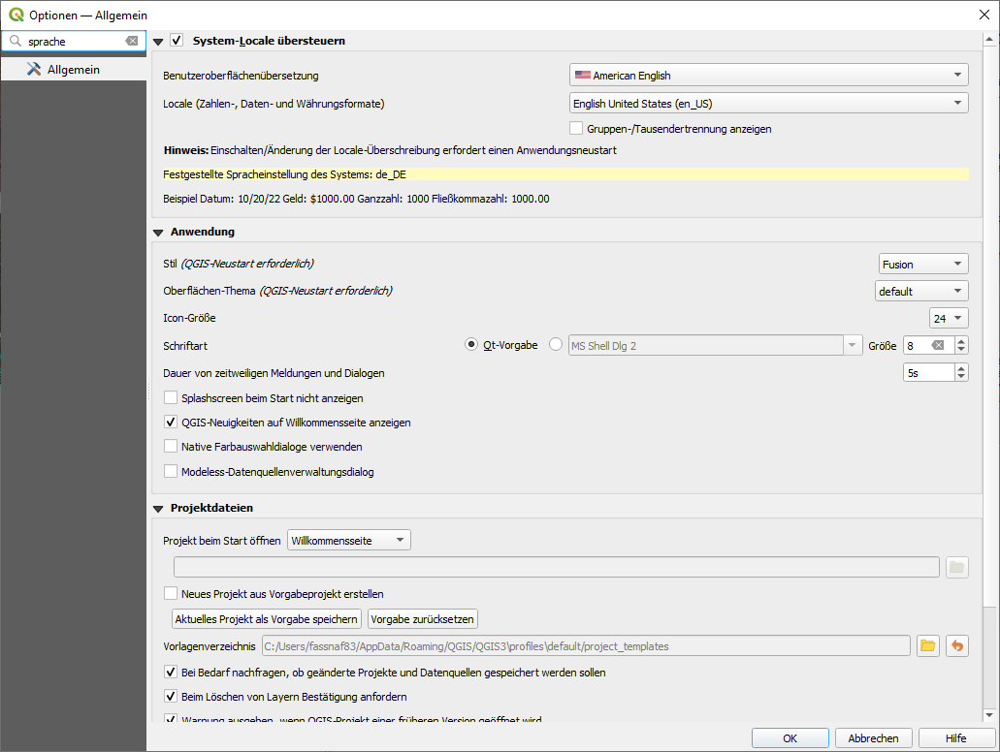

# Getting to know the graphical user interface Test

**Abstract** 
After completing this tutorial, the participant has an understanding of the Q-GIS graphical user interface, knows how to activate and deactivate windows, is familiar with the QGIS-toolboxes and is able to
set the language of QGIS.

Developed with QGIS version - Bialowieza 3.22.5

## Setting the language of QGIS

Before starting to work with QGIS we will set the language settings of QGIS to English. This is necessary as all descriptions of the Tutorials will refer to the english QGIS version. Working in another language might cause unnecessary confusions. To switch the language to English, we first start QGIS by double-clicking the desktop icon called QGIS Desktop 2.x.x with GRASS 7.x.x (in your case the x-es will be some numbers indicating the QGIS version you have installed on your computer). Alternatively you can start QGIS from the start menu of your computer - the exact way how to do this varies with operating system and the Linux/Windows/Apple operating system version you have installed - but it is assumed that you know how to start a program on your computer. 

Then within QGIS, we open the **Settings** menu in the main menu bar of QGIS and select -> **Options** as shown in Figure 1.

<figure markdown>
  
  <figcaption>Figure 1: Open the settings menu</figcaption>
</figure>

This will open a new window as shown in Figure 2. In this new window we check the **override system locale/System-Locale übersteuern** box at the top of the window and then select **American English** / **English United States** from the drop down menus marked with 1 in Figure 2. Then we press **OK** and completely close QGIS. When we now restart QGIS, the language should have switched to English and we are ready to start with the Tutorials.

<figure markdown>
  
  <figcaption>Figure 2: Change the language settings</figcaption>
</figure>

## The Graphical User Interface (GUI) of QGIS

<figure markdown>
  
  <figcaption>Figure 3: The QGIS graphical user interface</figcaption>
</figure>

After opening QGIS and selecting a new project, the graphical user interface of QGIS will look as demonstrated in Figure 3. Depending on whether you already worked in QGIS before, some windows/docks might be missing or additional ones are shown. How to open or close certain windows will be addressed in section 3 of this tutorial.
In Figure 3, the most important section of the QGIS GUI are marked with red numbers. A brief description on each of these sections is given in Table 1.

| QGIS section | Description  |
|--------------|--------------|
| Section 1    |This is the main visualization screen or window in QGIS. Once data is loaded, the files will be displayed here.  |
| Section 2    |This is the Layer Window. All loaded geodata will be displayed in this window in form of a single layer. The order of the listed layers determines their order in the visualization screen. Layers that are above other layers, will also be dis played above them. Right-clicks on the layers enable multiple direct actions that can be applied to the layers and additionally provide access to further dialogues to change the visualisation of the layer or access its detailed properties.  |
| Section 3    |This is the main file menu of QGIS where all options of the program that are not included in toolboxes can be accessed.  |
| Section 4    | This is the standard tool bar of QGIS. Most frequently needed tools like saving, navigating in the visualization screen or selecting data are provided. |
| Section 5    | This is the Vector-editing tool bar. It is required to change vector files (for example shapefiles). These changes can include for example adding new or editing existing spatial objects (polygons/lines/points) to or in an existing shapefile. |
| Section 6    | This is the toolboxes-window. Here all analysis tools of QGIS and official add-ons (including for example GRASS GIS and SAGA GIS). The toolbox window has a search option on the top. Most analysis steps (except for visualiza-tion settings) are conducted with the tools provided in these toolboxes. |
| Section 7    | This is the browser window where you can easily search your files and drap & drop it to the Layer window below to load the geodata to QGIS |

<figure markdown>
  <figcaption>Table 1: Brief description of the individual window sections in QGIS as shown in Figure 3</figcaption>
</figure>

## Opening, closing and arranging windows / docks

Closing one of the windows (for example Section 2, 8 or 6) is accomplished by simply clicking the **x** symbol on the top right of a window.

As a first exercise try to close section 2 and 7 by clicking the **x** symbols in the top right of the windows.

As a result only the visualization window in the center (Section 1 - which cannot be closed) and the toolbox window (Section 6) remain open. As one of the key-actions in each GIS-project is the re-arrangement of Geodata-layers in the Layer window, we should now re-open the Layer window. This is a bit more complicated than closing it. To achieve this we have to 

select **View** in the main file menu (Section 3) -> Panels -> Layer panel (Figure 4 ).

Now the Layer window should re-appear.

<figure markdown>
  
  <figcaption>Figure 4: Re-opening a closed window</figcaption>
</figure>

The same procedure can be repeated for any (accidentally) closed window/panel. As you can see in the file menu there are numerous panels available that are not used by default in QGIS. Some of the available panels might be helpful depending on how you work in QGIS. For example you can try to activate the **Statistics** window. Once data is loaded, it will
give you the option to display some statistical summaries of the information on the currently selected layer.

As a next exercise we will learn how to rearrange panels in the QGIS GUI. Panels can be arranged by **simple clicking and draging any panel in the grey bar on top of the panel depicting its title**. By doing this, panels locked to the sides of the GUI-space can be released and positioned at another place. To lock the panel on one of the sides of the GUI, the panels have to be dragged to the corresponding side until they lock. **Try to rearrange the currently open panels by positioning the Layer panel on the right side and the toolbox window to the left side of the GUI**. This should result in a GUI as depicted in Figure 5.

<figure markdown>
  
  <figcaption>Figure 5: The QGIS GUI after re-arranging windows</figcaption>
</figure>
