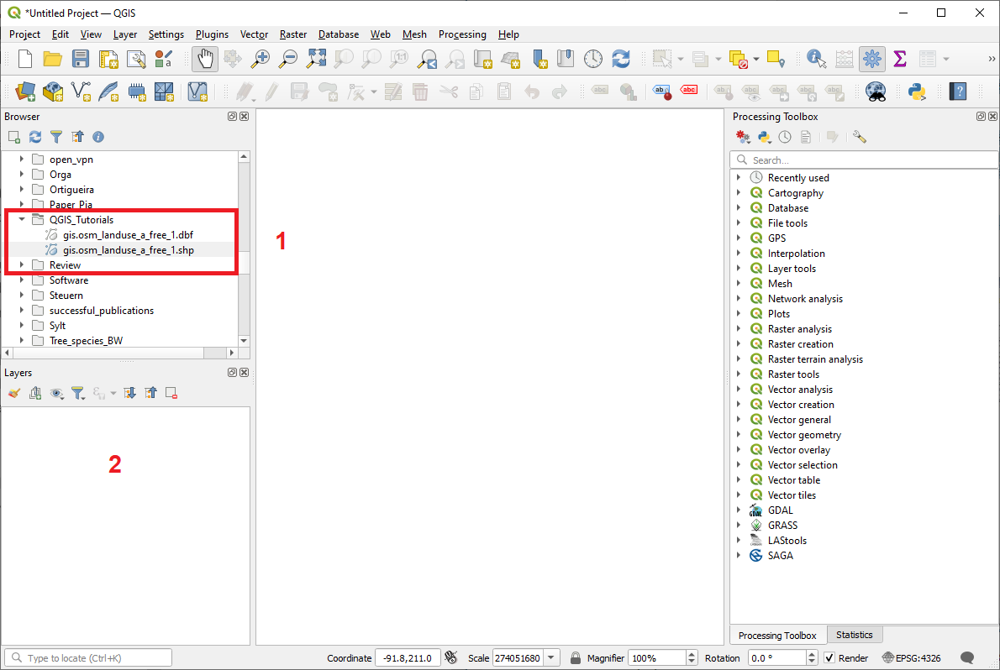
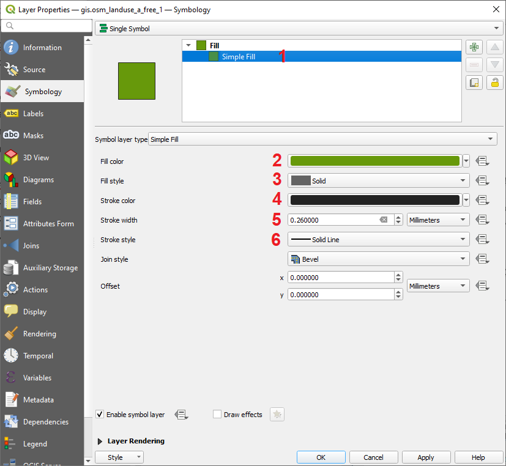
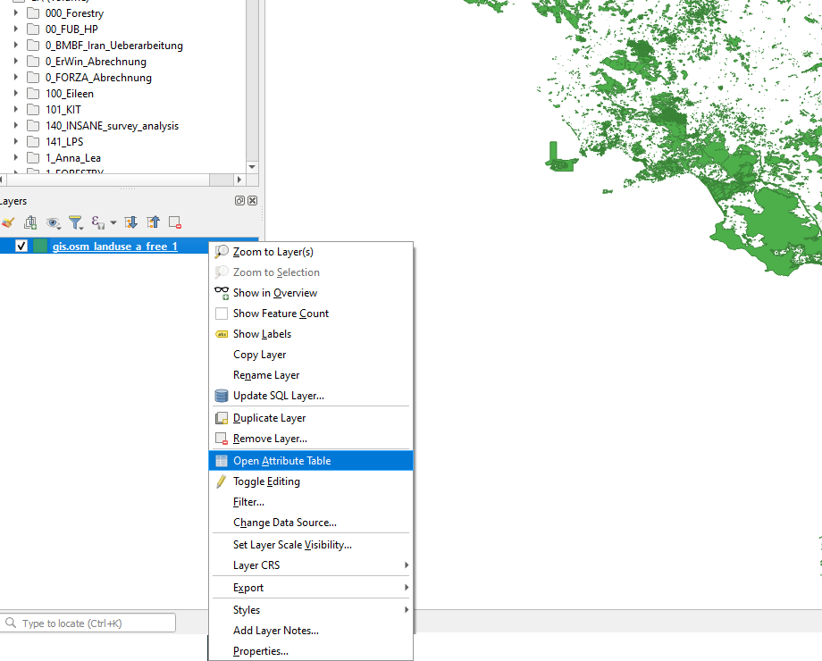
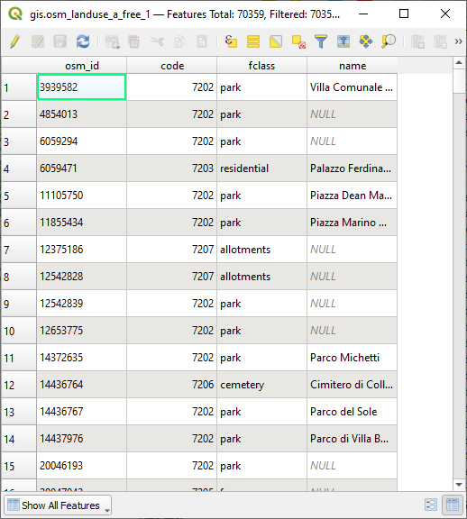
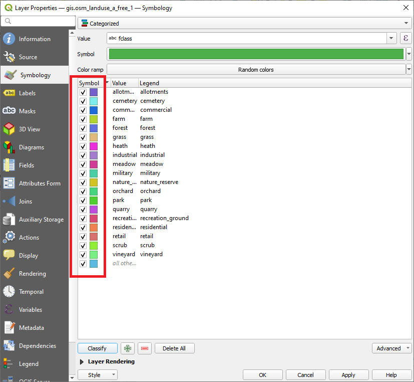
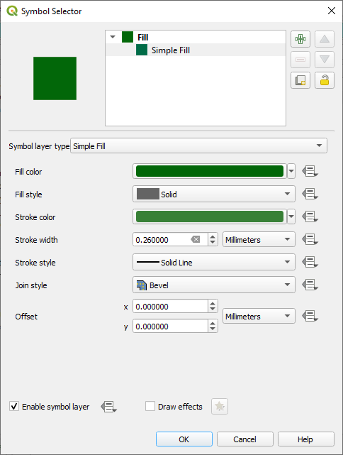
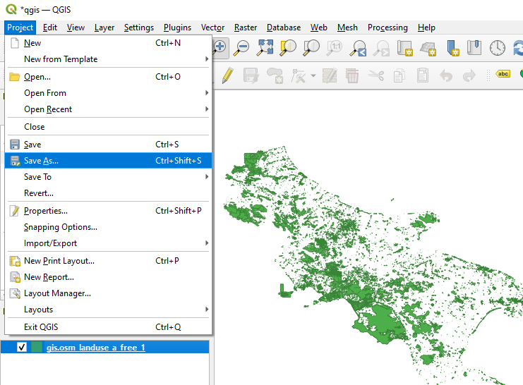

# Loading and visualizing Shapefiles / Vector data

**Abstract** 
After completing this tutorial, the participant knows how to load a Shapefile (vector file) and how to make use of the visualization options in QGIS to adapt the colours, symbols and format of the spatial features (points, lines, polygons) contained in the shapefile. You will additionally learn how to save a QGIS project.

Developed with QGIS version - Bialowieza 3.22.5

## Download data for the tutorial

For this and the subsequent tutorials you will need to work with some geodata. Please download the data required for this tutorial here:

[Download](https://drive.google.com/file/d/11dSbeH8sMdgBS8nPqvtt3sae62bco02P/view?usp=sharing)

This zip-file contains two ESRI Shapefiles (vector-data) - the first one named **gis.osm_landuse_a_free_1.shp** contains a land-use dataset of Southern Italy and the second dataset is a global dataset named **newsweek_data.shp** which contains some demographic information for each country of the Earth.

<figure markdown>
  
  <figcaption>Figure 1: Files contained in the zipped file for Tutorial 2</figcaption>
</figure>

Both shapefiles consist of several data files as shown in Figure 1. You will learn why a single shapefile consists of multiple datafiles later on in the course.

## Loading a Shapefile (vector file) in QGIS

After opening QGIS and selecting a new project, the graphical user interface of QGIS will look as demonstrated in Figure 2. In Figure 2, we can use the browser window to navigate to the folder which contains the files we have just downloaded.
Then we can open the file **gis.osm_landuse_a_free_1.shp** by **simply dragging and dropping the file in the layer window** (marked with 2 in Figure 2).

<figure markdown>
  
  <figcaption>Figure 2: Openning a Shapefile in QGIS</figcaption>
</figure>

This will open the selected shapefile and automatically display it in the main window of QGIS (Section 1 in Figure 1). You should now see something similar to Figure 3. The colours will most likely differ from the ones displayed in Figure 3 as QGIS randomly assigns a colour to each newly loaded shapefile (vector file). How colours can be adapted and how the attributes stored in shapefiles can be used to colour-code and format individual spatial objects (polygons, lines, points) will be explained in the next section.

<figure markdown>
  
  <figcaption>Figure 3: After opening the shapefile in QGIS</figcaption>
</figure>

## Basic visualization of Shapefiles in QGIS

As next step we will change the colour of the complete loaded Polygon-shapefile by using the properties dialogue that is available for each dataset loaded into QGIS. In order to do this either double click the entry of the shapefile-layer in the layer window of QGIS as shown in Figure 4 or alternatively perform a right-click on the same layer and from the appearing text menu select **properties**.

<figure markdown>
  
  <figcaption>Figure 4: Double-click the Shapefile layer</figcaption>
</figure>

This will open a new window as displayed in Figure 5 with many functionalities. In this tutorial we will focus on the options to adapt the visualization settings of the vector file. To open the corresponding tab in the window select the tab **Symbology** (the corresponding tab may have also been opened as standard setting). 

<figure markdown>
  
  <figcaption>Figure 5: The properties window with the **Symbology** tab activated. The latter allows to modify the the visual appearance of the vector file in numerous ways</figcaption>
</figure>

We will now explore five options to adapt the visual appearance of the shapefile. Everytime we conducted a change and want to see the effects on the visualization in the main QGIS window we have to first confirm our choice by clicking **apply** and then press **ok** to close the **properties** dialogue window. We can later return to the properties dialogue by repeating the steps described above, that is by double-clicking the shapefile-layer as indicated in Figure 4 or by performing a right-click and selecting **Properties**. The first adaptation that we will try out is to change the colour of the whole Shapefile. In order to do this first click the area marked with **1** in Figure 6. This will change the available options in the tab. Then click **Fill color-area** marked with **2**. A new window will open from which you can select any colour you want. Select a colour, press **OK**, then **Apply** and **OK** again. 

You will see that the colour of the shapefile has changed to the colour you selected.

<figure markdown>
  
  <figcaption>Figure 6: Changing the colour of the complete shapefile</figcaption>
</figure>

As a second option we will explore how to not only assign a new colour but also change the style and colour of the outline and the filling of the polygons. to change the fill-style of the polygons

we first click the area named **Fill** and marked with 1 in Figure 7. Then we can select any fill type we want from the list of option provided below. We could for example select a quite complex pattern such as the one marked with 6. Then, we can further customize the pattern of the filling and also the outline of each polygon by clicking through the areas marked with 2, 3, 4 and 5 and modify colors or line widths etc.

<figure markdown>
  
  <figcaption>Figure 7: Changing the fill pattern and the colour of the outline of the shapefile</figcaption>
</figure>

Please try out a few different settings and have a look how they affect the visualization in the main windows after you pressed the **apply** button and closed the **properties** dialogue by clicking **OK**.

You should now be able to adapt the visualization of a shapefile as a whole, that is all spatial objects in the Shapefile are displayed with the same visualization parameters. However, in many cases a shapefile does not only contain a single class of interest but several ones. For example our currently loaded shapefile contains information about the land cover classes of the depicted areas. So we know where in the area covered by the shapefile we can find
industrial areas, cemeteries, parks or residential areas. We might be interested in visualizing this also in the map. We could for example give a green colour to parks while we could assign a grey or red colour to areas covered with residential areas or industry. In the next Section, we will learn how this can be accomplished with QGIS.

## Using information from the attribute table of the shapefile to colour-code classes within a single shapefile

To make sound use of the information stored in the attribute table, we need to first understand what information is contained in the attribute table. So let us have a look at the table by

right-clicking on the shapefile-layer and selecting **Open Attribute Table** as demonstrated in Figure 8

<figure markdown>
  
  <figcaption>Figure 8: Opening the attribute table of the shapefile</figcaption>
</figure>

This will open the attribute table of the Shapele in a new window. The window will approximately look like the window shown in Figure 9.

<figure markdown>
    
  <figcaption>Figure 9: The attribute table of the gis.osm landuse a free 1 Shapefile</figcaption>
</figure>

As you can see there are four columns available in the attribute table of our Shapele: **osm id**, **code**, **fclass** and **name**. Here, the osm id is a unique identifier number assigned by the Open Street Map system which is
the data source for our Shapefile. This identifier makes each object in a given Open Street Map dataset clearly identifiable. The code **field** shows a land cover code for each object in the Shapefile. It basically is a numeric description of the next field **fclass** where a descriptive term for the land cover type is given. In Figure 9 you can for example see that all polygons assigned to the class **park** have the code **7202**. Finally, there is another column called name which indicates an official name for the given polygon. For example the name of a park or a cemetery. In the next step, we will now make use of the information stored in the fclass column to assign meaningful colours to the individual land cover classes. In order to do this

we first open the shapefile properties dialogue, as explained above and select the style tab. Then we press the drop-down menu marked with **3** in Figure 6. Here we select the option **categorized**. This will lead to the window shown in Figure 10. Here, we can now use the drop-down-menu marked with **1** to select the
column from the attribute table which we want to use to colour-code our spatial objects in the Shapele. Here, we will select the class **fclass** and then confirm the choice by pressing the **classify** button marked with **2** in Figure 10.

<figure markdown>
  
  <figcaption>Figure 10: Colour-code the polygons of the Shapefile using the attribute table</figcaption>
</figure>

This will lead to a situation similar to the one depicted in Figure 11. The colours are again likely to be dierent as QGIS selects the colours randomly. We can now assign meaningful colours to each of the land-cover types by double-clicking any of the colour boxes marked in Figure 11. In the new pop-up dialogue we can assign a new colour and also make more detailed changes to the format of the filling and the outlines by selecting **simple fill** and use the then appearing properties as shown in Figure 12.

<figure markdown>
  
  <figcaption>Figure 11: Visualization options for displaying categories</figcaption>
</figure>

<figure markdown>
  
  <figcaption>Figure 12: Colour and format selection for each land cover class</figcaption>
</figure>

You should now be able to load and visualize a Shapefile by either changing the style for the whole Shapefile or classify and colour-code the spatial objects of the Shapefile to some discrete classes using information given in
the attribute table. In the exercise of this Tutorial, you will find out how it is possible to colour-code the spatial objects of a Shapefile using attribute table information from an attribute with continuous values.

## Saving a QGIS project

 After learning how to adapt the visualization of a Shapele, you might want to know how you can save these settings for the next time you open QGIS. The easiest way to save the visualization settings but also all other things you have accomplished while working with your data in QGIS is to store the current situation as a QGIS-project. You can do this by 

selecting **Project** -> **Save as...** from the main file menu of QGIS as shown in Figure 13. This will open a new dialoge where you can define an output folder and then enter a name for the QGIS-project and click **save** to save the file. QGIS-project files of the latest version of QGIS have the file format ending **.qgz** while older versions used **.qgs** as standard setting.

<figure markdown>
  
  <figcaption>Figure 13: Saving a QGIS project</figcaption>
</figure>

After storing the project file it is possible to re-load the status of your QGIS project in the future by selecting **Project** -> **open** from the main file menu and then navigating to the **.qgz** file that you have stored earlier.
Alternatively, you can also double-click this file in the Windows Explorer (or similar data explorer apps in Linux or MacOS environments). This will automatically load QGIS and the project. It is important to understand, that the QGIS project-files themselves do not contain any geodata. Project files only store links to the data which are
stored on the hard disk of your computer. That means if you delete or move your files to another folder while QGIS is closed and then want to re-open the QGIS-project you had been working on, QGIS will tell you that some of the files of the project cannot be found anymore and they will not displayed in the project. So again: project files only remember the visualization options, the layer order, and which windows and toolboxes were opened when you stored the project file. It does not include the geodata itself! That is also why project files are typically rather small in size. But this also means that if you will send this project file to a colleague, she/he will not be able to see what you saw unless you are also sending all the geodata to her/him.

## Exercise

Amongst the files you downloaded you will find a shape file called **newsweek data.shp**.

Try do conduct the following exercises:

1. Load this dataset to QGIS and have a look at its attribute table.

2. Identify the column that contains information about the life expectancy across the different countries of the Earth.

3. Visualize the life-expectancy values for each countries using the **Style**-Tab of the **Properties diaologue** and the corresponding columns from the attribute table

Some tips: Instead of using the option **categorize** use the option **graduated**. As **mode** try out the option **Natural jenks**; try to also vary the number of classes and see how this affects the visualization.

4. Export the current view by selecting **Project** -> **Save as Image** from the main menu of QGIS (Figure 14). This will be the proof that you completed the Tutorial.

General advice: Don't be shy to try out a few different options and settings!! This is the only way to learn how things work.

<figure markdown>
  
  <figcaption>Figure 14: Save current map view as image</figcaption>
</figure>
