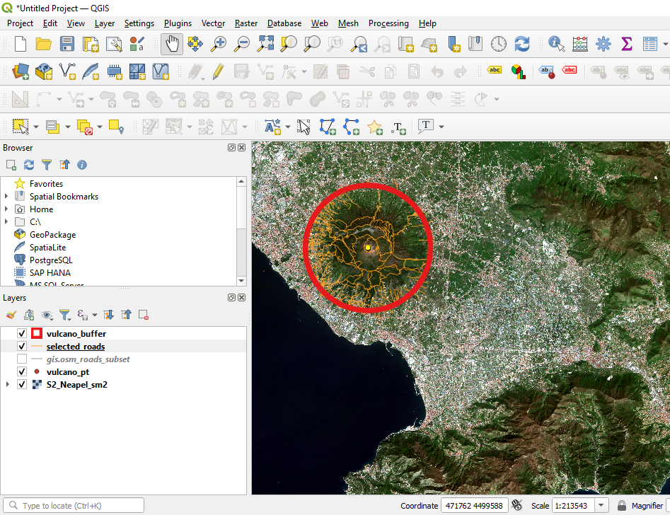
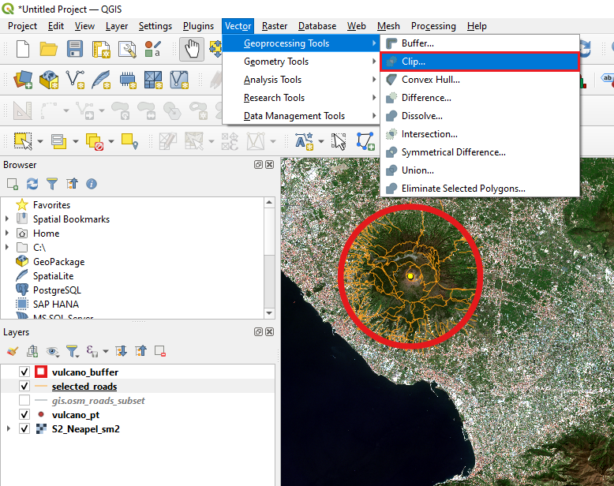
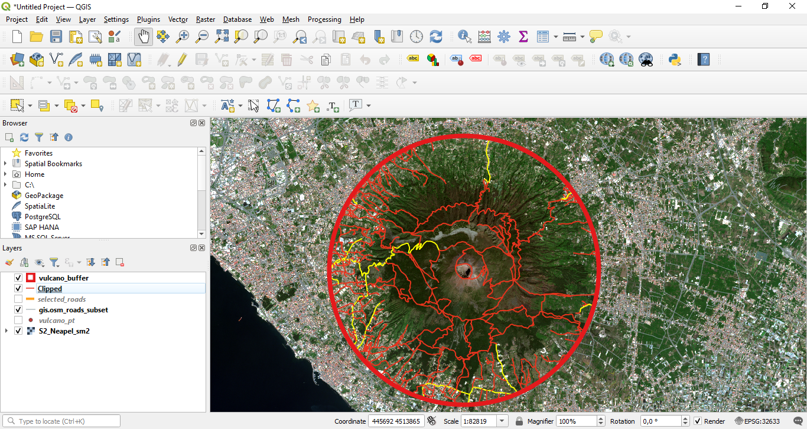

# Spatial and semantic selection in QGIS

**Abstract**

After completing this tutorial you will know how to perform a spatial selection and a selection based on the contents of the attribute table of Shapefiles / vector files. Developed with QGIS version - Bialowieza 3.22.5

In this Tutorial we will a new Shapefile named **gis.osm_roads_free_1** that you can download [here](https://drive.google.com/file/d/1Fl30MTA_4i9DguX9uP10_KGaqFCN0Bim/view?usp=share_link)

Don't forget to unzip the Shapefile.

## Performing a spatial selection / spatial query
In this tutorial we will first learn how to perform a spatial selection, which means selecting a subset of spatial features of a vector shapefile based on their location. Then we will learn how we can select spatial features based on information stored in the attribute table.

To start,

**we again load the raster dataset “S2_Neapel_sm2.tif” located in the “Datasets/S2” folder and adapt the visualization settings to have a balanced view of all classes by using the channels R=3, G=2, B=1 and loading new max / min values using the “Symbology”-tab in the properties window.**

Following the already known procedures, we will now create an empty Point shapefile by

**selecting the menu “Layer” then “Create Layer” and “New Shapefile Layer”. Be careful to select the correct coordinate reference system and select “Point” as Shapefile Type. Then we will zoom into the area of the vulcano and create a new Point in the just created Point-Shapefile that is located in the center of the vulcano - by now you should already know how to accomplish this. We will then save our edits and stop the editing mode.**

This should lead to a similar situation as shown in Figure 1. Next, we will load the Shapefile “gis.osm_roads_free_1” by

**starting the dialogue to load a Shapefile (as already learned in Tutorial 2) and then navigating to the folder where you have saved the file provided above, select the file, and confirm with “open”.**

<figure markdown>
  
  <figcaption>Figure 1: Adding a point to the center of the crater.</figcaption>
</figure>

This will result in the situation shown in Figure 2. The newly loaded Shapefile contains information on the position and type of the transportation network of the area. We now assume that our vulcano is in the mood for some chaos and erupts. Due to the magma flow all roads in a distance of 5000 m from the crater get destroyed. To be able to plan restoration measures and support emergency activities, we want to automatically select all roads in a distance of 5000 m from the crater center.

<figure markdown>
  
  <figcaption>Figure 2: Loaded road network layer.
  </figcaption>
</figure>

We will accomplish this, using a spatial selection which is also called a “spatial query”. In QGIS this requires two steps. First, we need to create a buffer around the crater center point, which we have created as first step of this Tutorial. Then we can automatically identify all spatial features of the ““gis.osm_roads_subset” layer that intersect with the buffer polygon.

So as first step,

**use the buffer tool, you already know, to create a buffer with a distance of 5000 m around the point located in the center of the crater. After adapting the visualization settings of the Buffer (increase thickness of the outline to 2; set filling to transparent; change outline colour to red) you should see a situation as shown in Figure 3**

<figure markdown>
  
  <figcaption>Figure 3: Buffer in red over the road network layer.
  </figcaption>
</figure>

Next, we will learn two approaches to select all spatial features of the road network that are located within the buffer zone of the crater. For the first option, we will use

**the “select by location” tool. This tool can be found in the toolbox under “Vector selection” -> “Select by Location" as seen in Figure 4.**

<figure markdown>
  
  <figcaption>Figure 4: Opening the “Spatial Query” dialogue.
  </figcaption>
</figure>

**this will open up a new dialogue as shown in Figure 5. In the new dialogue, we will parameterize the settings. We have to define the vector file from which we want to select some spatial features – in this case the road network layer – and we have to define the vector file which contains the spatial features which are used to define the area for selecting the spatial features - in our case the 5000 m buffer layer. We also have to define how the two vector files should interact to decide which features get selected. In this case we select “intersect” – this will select all spatial features of the road network layer that intersect with the buffer polygon. Finally, we select “Creating new Selection” to cancel all eventually earlier performed selections within the road network layer. If we now press “Run” we should create a situation as shown in Figure 6. As you can see, all roads located within the buffer are now selected and hence marked with yellow colour.**

<figure markdown>
  
  <figcaption>Figure 5: The “Spatial query” dialogue.
  </figcaption>
</figure>

<figure markdown>
  
  <figcaption>Figure 6: Situation after performing the spatial query.
  </figcaption>
</figure>

## Extracting the selected features to a new Shapefile
Now there are two option to proceed. We could either perform some additional analyses on the selected feature while keeping them in the original Shapefile. Or alternatively, we could store the selected features in a new Shapefile and then continue our analyses with this new layer. We will follow the latter approach here. So, to store the selected features to a new Shapefile, we will

<figure markdown>
  
  <figcaption>Figure 7: Saving the selected features to a new Shapefile.
  </figcaption>
</figure>

**first close the spatial query dialogue. Then we will perform a right click on the “gis.osm_roads_free_1” layer and from the appearing menu we will select "Export" and then “Save Selected Features As...” (see Figure 7). This will open up a new window as shown in Figure 8. Here, we will define an output name (field marked with “1” in Figure 8 and activate the checkbox “Save only selected features” (if not already activated) to store only the spatial features that have just been selected with the spatial query. After pressing “OK” the new Shapefile will be stored and added to the list of layers. After de-activating the “gis.osm_roads_subset” layer and dragging the newly created layer to the top of the layer window section, you will see a situation as shown in Figure 9.**

<figure markdown>
  
  <figcaption>Figure 8: The “Save As...” dialogue.
  </figcaption>
</figure>

<figure markdown>
  
  <figcaption>Figure 9: Situation after the selected spatial features have been saved to a new Shapefile.</figcaption>
</figure>

## Clipping instead of selecting
An alternative to the just described work-flow of first selecting the Polygons within the buffer and then to save the selected features as a new Shapefile, is to directly clip-out all spatial features located within the buffer zone. We will now follow this approach by applying the “Clip” tool. We can open the corresponding dialogue by

**selecting “Vector” -> “Geoprocessing Tools” -> “Clip” from the main menu of QGIS as shown in Figure 10. This will open the “Clip tool” shown in Figure 11. Here, we have to define the “Input Layer” from which we want to create a subset, and the “Clip Layer” which will be used to define the spatial area for which a subset of the “Input Layer” will be created. In our case the “gis.osm_roads_free_1” layer will be the “Input Layer” and the “Buffer layer” will be the Clip Layer. We additionally define an output name (“Clipped”) for the new Shapefile and press “Run”.** 

Then a new Shapefile will be created. After rearranging the layers a bit and changing the visualization settings, it becomes clear that this process has led to almost the same results as the preceding workflow. In Figure 12, the two Shapefiles are positioned on top of each other with one of the two layers having an outline with a larger line width. You can see that the two Shapefiles extracted using the Buffer-Shapefile with two different approaches match perfectly within the buffer zone, but the result from the first procedure has some road segments that expand over the buffer zone. This is because in the first procedure we did not use the buffer to cut intersecting line segments but we selected the "complete" line segments which intersected in any point with the buffer zone.

<figure markdown>
  
  <figcaption>Figure 10: Opening the “Clip” tool.</figcaption>
</figure>

<figure markdown>
  
  <figcaption>Figure 11: The “Clip” tool dialogue.</figcaption>
</figure>

<figure markdown>
  
  <figcaption>Figure 12: The two extracted subsets of the road network using the buffer Shapefile match perfectly. One of the two subsets is displayed in a wide orange line, and the second subset in a more narrow red line.</figcaption>
</figure>

## Performing a query on the attribute table
We have now a Shapefile containing all roads that have been affected by the eruption of the vulcano. Now we would like to have a closer look at the road types that have been affected. To do this, we will first open the attribute table of one of the two Shapefiles containing only the roads located in the buffer zone. We open the attribute table by

**performing a right–click on the corresponding layer and selecting “Open attribute table”. This will open the attribute table as shown in Figure 13. The attribute table has 10 columns in total.**

<figure markdown>
  
  <figcaption>Figure 13: The attribute table of the road layer.</figcaption>
</figure>

Here, we will focus on the column named “fclass” which contains information about the type of road. Let us assume that the type of road is important for estimating the cost to restore the path systems after the eruption of the vulcano as well as to prioritize restoration works.

So in the next step, we will create two more subsets from the Shapefile containing all affected roads. First, we will extract all spatial features that belong to the class “secondary” – which relate to the largest affected roads in the area. Then, we will extract all spatial features belonging to the classes containing the word “track” – there are in total 5 classes which contain the word “track”. Tracks are important for recreational activities and tourism.

So let us first create a subset of all “secondary” roads. To do this, we

**will perform a selection based on the fclass column using the tool “Select features using an expression” (marked with “1” in Figure 13). After clicking on the tool a new dialogue will appear which looks similar to the “Field calculator” we already got to know in Tutorial 5 (see Figure 14). With this tool, we can automatically select all features of the vector file that match a user–defined rule. In the given case we will set this rule to “fclass” = ’secondary’ as shown in 14. To enter this rule, we first open the menu called “Fields and Values” marked with “1” in Figure 14. Then we perform a double–click on the entry “fclass” as this is the column of the attribute table which we want to use to perform our selection. Now, “fclass” will appear in the “Expression” field on the left marked with “4”. To illustrate all unique entries of this column of the attribute table, we click the “all unique” button marked with “2”. If the "All UNique" button is not shwoing, you might have to additionally press "Show Values"-button first.  Now all different classes listed in the ”fclass” column will appear. Next, we click the “=” sign marked with “3” and then we double–click the entry ’secondary’ marked with “5”. We then press “Select Features” to query all entries of the attribute table and select all entries where our rule matches.**

<figure markdown>
  
  <figcaption>Figure 14: The select features by expression tool.</figcaption>
</figure>

As we can see from the results, there is only a single entry in the column “fclass” that belongs to the class “secondary”. This single spatial feature is a roundabout close to lower left border of the buffer zone (see Figure 15). It might be hidden below the outline of the buffer polygon. You can for sure find it, if 

**perform a right-click on the layer with the selected feature and use the "Zoom to Selection" option to zoom the current view to the selected polygon**

As this is a rather small subset, we will try to additionally select all entries of the fclass column that belong to the class “tertiary” which is the next smaller category of roads. To do this,

**we re–open the attribute table and the “Select features using an expression”. This time we will set the rule to “fclass” = ’secondary’ OR “fclass” = ’tertiary’ (see Figure 16). Then we press “select” and close the tool and the attribute table. The “OR” can either be directly typed into the ”Expression” field or it can be found from the menu “Operators”.**

<figure markdown>
  
  <figcaption>Figure 15: Only a single spatial feature got selected.</figcaption>
</figure>

<figure markdown>
  
  <figcaption>Figure 16: Adapting the selection rule to increase the subset.</figcaption>
</figure>

Now several more roads got selected as can be seen in Figure 17. We can now save this subset by

**performing a right–click on the layer containing the spatial attributed located in the buffer zone and selecting "Export" -> “Save Features As...”. Then we select an Output filename, make sure that the option “Save only selected features” is activated and press “OK”. ALternatively, you can directly use the "Save Selected Features AS..." button then the "Save only selected features” button should already be activated **

<figure markdown>
  
  <figcaption>Figure 17: Spatial location of all “secondary” and “tertiary” roads within the buffer zone.</figcaption>
</figure>

As a final step of this Tutorial we will save an additional subset with a slighly more complex rule. To do this, we

**re–open the attribute table of the Shapefile containing the spatial features located in the buffer zone. Then we open the “Select features using an expression” tool as done before. Instead of naming a single class of the “fclass” column we will this time select all classes that contain the text-part “track”. To do this, we will set the rule to “fclass” LIKE ’%track%’ (see Figure 18). The operator “LIKE” can also be found in the “operator” menu as marked with “1” in Figure 18. This operator will search for all entries in the fclass column that contain the text–part “track” and will select it. The “%”–sign is a placeholder for any textparts that can come before or after the text–part ’track’. Then we press “Select”.**

<figure markdown>
  
  <figcaption>Figure 18: Using the “LIKE” operator to construct a more complex selection rule.</figcaption>
</figure>

With these settings a total of 109 spatial features gets selected (your total number of features might slightly differ depending how your center point for the crater and the corresponding buffer zone was defined). The locations of the selected features are shown in Figure 19. If we open the attribute table and scroll down a bit, we can see that all entries of the flcass column that contain the text–part “track” got selected, including for example the classes “track”, “track_grade1”, “track_grade2” and so on (see Figure 20).

<figure markdown>
  
  <figcaption>Figure 19: Locations of all spatial features containing the text–part “track” in their fclass label.</figcaption>
</figure>

<figure markdown>
  
  <figcaption>Figure 20: All classes containing the text–part “track” got selected in the attribute table.</figcaption>
</figure>

## Exercises
To further practice the just learned skills, you should now complete the following exercises:

1. Build a subset of all spatial elements belonging to the class “footway” as defined in the “fclass” column of the road–layer within the buffer zone

2. Create a subset of all spatial elements belonging to the class “residential” and having a length longer than 150 m.

3. Adapt the visualization of the two newly created subsets. All footway-elements should be in red colour and with a line width of 3 points; all residential-elements should be in green colour and with a line width of 5 points. Only the satellite image and the two newly created subsets should be active in the display.

4. Zoom to the buffer area and export the current view by selecting “Project” -> “Save as Image” from the main menu of QGIS. This will be the proof that you have completed this Tutorial.

