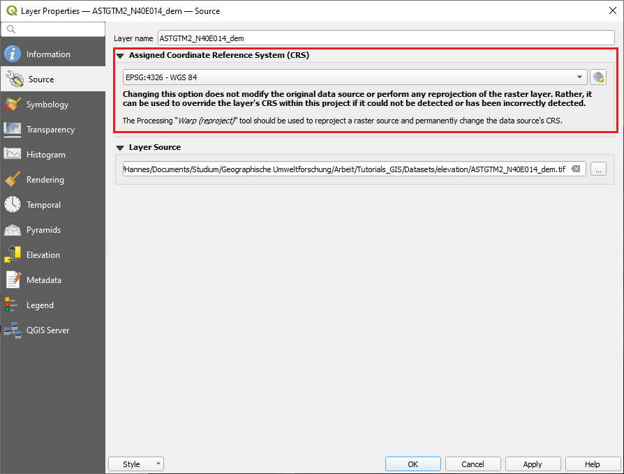
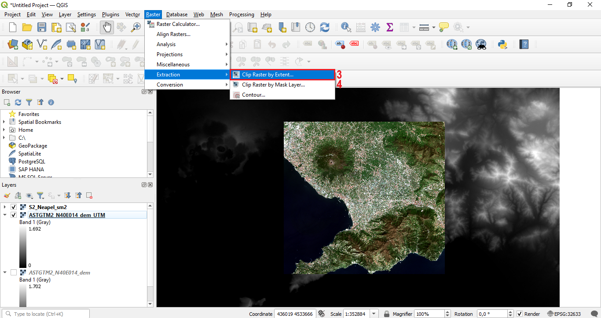
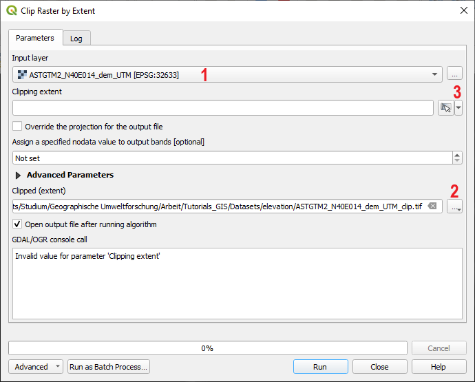
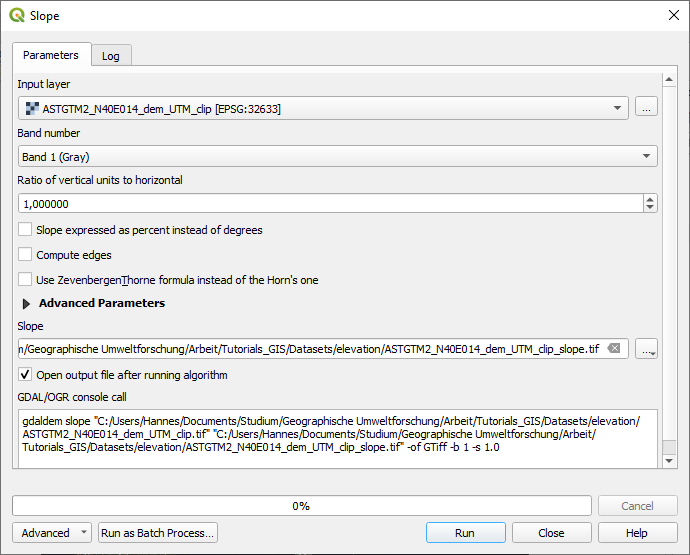
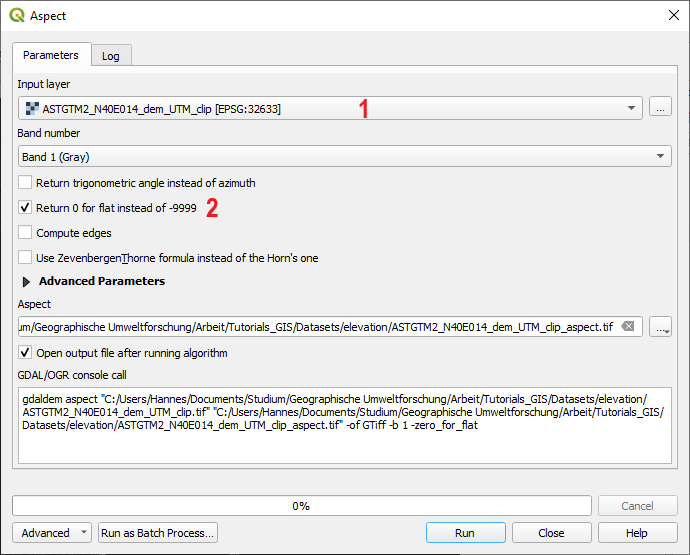
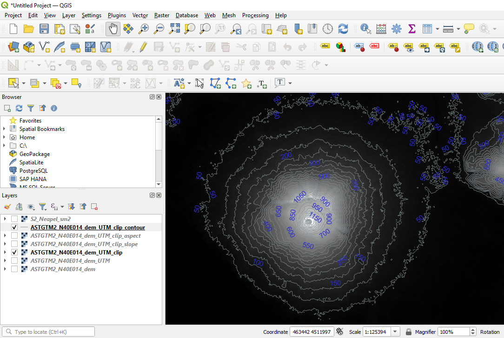
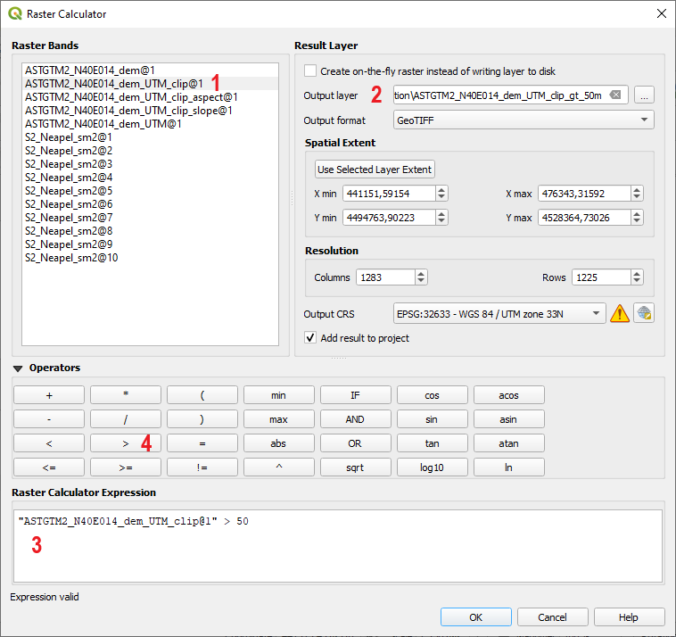
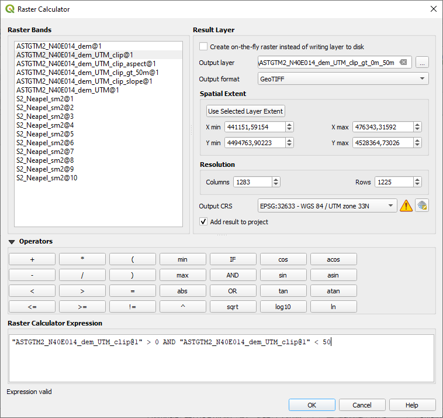
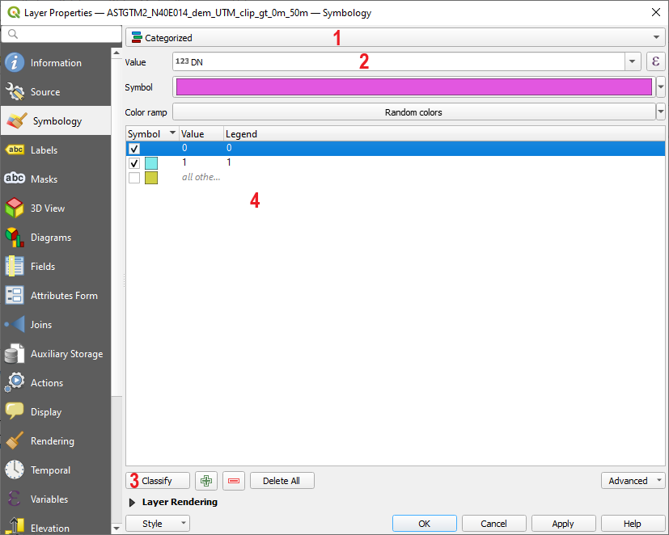

# Working with elevation raster datasets

**Abstract**

After completing this tutorial you will know how to work with raster files containing elevation data. You will be able to calculate an aspect image, a slope image and know how to set height thresholds. Furthermore, you will learn how a raster file can be clipped to a desired extent and how an elevation raster can be transformed to height contour lines and how labels can be added to a vector file. Last but not least, you will learn how to re–project raster files in QGIS to adapt their coordinate reference systems. Developed with QGIS version - Bialowieza 3.22.5

## Reprojecting and cutting a raster to a desired extent
In this tutorial we will learn how we can use a raster dataset containing elevation information to extract additional information concerning for example the exposition also referred to as aspect (which direction a certain pixel or area is facing) or the steepness (slope) of a certain location in the raster dataset. In this Tutorial we will make use of a elevation dataset provided by United States Geological Survey (USGS). This dataset stems from a satellite mission called ASTER. The data of ASTER was transformed to an almost global elevation dataset by analysing a huge amount of satellite images that were collected from differing view angles (typically more than 10 and in some cases over 30 satellite images for each location of the Earth). Elevation datasets can also be collected from other sources including field data (for example using **traditional survey techniques** which is rather time-intensive or **GPS** which is faster but also less precise as the z-position generally works not as accurate as x- and y-position using standard GPS devices) and remote sensing data as for example airborne laserscanning or since recently also airborne photogrammetry using aerial images. The currently most accurate, spatially continuous elevation datasets can be collected with laserscanning devices mounted on airplanes or helicopters (we will hear about this in the theoretic lectures after the  christmas break).

However, as stated before, in this tutorial we will use the freely available ASTER datasets with a pixel size of approximately 30 m.

As a first step

**we again load the raster dataset “S2_Neapel_sm2.tif” located in the “Datasets/S2” folder and adapt the visualization settings to have a balanced view of all classes by using the channels R=3, G=2, B=1 and loading new max / min values using the “Symbology”-tab in the properties window. Then we add the ASTER dataset which is called “ASTGTM2_N40E014_dem.tif” and which can be downloaded here:**

https://drive.google.com/file/d/1TjHeuPUX_SLzBFrQqblocHJOUJg45UTG/view?usp=share_link

This will lead to the situation shown in Figure 1. There are now two problems that we need to address. The first problem is not directly apparent, but currently the ASTER dataset and the satellite image have differing coordinate systems. This could lead to some problems when both images are used jointly in a geoprocessing tool. Hence, as a first step, we will reproject the ASTER dataset to the same coordinate reference system as the satellite image.

<figure markdown>
  
  <figcaption>Figure 1: After loading the two raster datasets.
  </figcaption>
</figure>

Furthermore, as you can see in Figure 1 the elevation dataset covers an area that is larger than the satellite image and hence overlaps it completely. We will address this problem in a second step by clipping the ASTER dataset. But let us start with the reprojection.

To re–check whether the ASTER dataset really has a different coordinate reference system (CRS) than the satellite image we can

**perform a right–click on the “ASTGTM2_N40E014_dem” layer and select “Properties”. Then we select the “Source” tab and as seen in Figure 2, the current CRS is set to EPSG 4326. If we now check the same entry for the “S2_Neapel_sm2” layer, we will see that here the CRS is set to EPSG 32633. This is also the CRS defined for the current QGIS project as seen in the bottom right of the QGIS project (next to the little world globe). We close the window by pressing “cancel” and then start the “Reproject” tool by selecting “Raster” -> “Projections” -> “Warp (Reproject)...” from the main menu in QGIS as shown in Figure 3**

<figure markdown>
  
  <figcaption>Figure 2: The coordinate system of the ASTER elevation dataset.
  </figcaption>
</figure>

<figure markdown>
  
  <figcaption>Figure 3: Opening the “Warp” tool.</figcaption>
</figure>

This will open a new dialogue as seen in Figure 4. Here we can reproject the ASTER elevation data by

**first selecting the “ASTGTM2_N40E014_dem” layer as input file in the field marked with “1”. After selecting the ASTER layer, the field “Source CRS” is automatically updated to match the CRS of the selected layer. Then we set an output file in the field marked with “2” and we need to specify a target CRS in the field marked “4”. In this case, we will select the CRS with the EPSG code 32633 which is the same CRS as currently defined for the satellite image. After defining the correct Target CRS we press “OK” and QGIS will re-project the raster and add it as a new layer. If you now check the CRS of the new layer by performing a right–click, selecting “Properties” and the “General” tab, you will see that the CRS is now also set to 32633.**

<figure markdown>
  
  <figcaption>Figure 4: Parameterizing the “Warp” tool.</figcaption>
</figure>

As next step, we will clip the re-projected elevation dataset to match roughly the extent of the satellite image. To do this we

**select “Raster” -> “Extraction” -> “Clip Raster by Extent” from the main menu in QGIS as shown in Figure 5. This will open a new dialogue as shown in Figure 6. In the given case we have to define three variables. We have to select the “ASTGTM2_N40E014_dem” layer as input dataset in the field marked with “1”. Then we have to define an output filename in the field marked with “2”. Finally, we have to define the clipping extent by drawing a rectangle in the QGIS window after pressing the drop down menu (marked with “3” in Figure 5) and selecting "draw on canvas". We now draw a rectangle in the main visualization window which matches roughly the extent of the satellite image as seen in Figure 6. Then we press “OK” to clip the raster.**

It of course helps to drag the satellite image above the elevation dataset in the “layer window” section of QGIS for drawing the rectangle as the satellite image is otherwise fully covered by the elevation dataset. Please make also sure that you select the re–projected elevation dataset as input file as otherwise an error message might appear that originates from the differing CRS systems, eventhough this might not be apparent from the error message.

<figure markdown>
  
  <figcaption>Figure 5: Opening the “clip” tool.</figcaption>
</figure>

<figure markdown>
  
  <figcaption>Figure 6: Parameterizing the clip-tool in QGIS.</figcaption>
</figure>

## Calculating slope and aspect images from a digital terrain model
We have just successfully re–projected and clipped our elevation dataset. Next, we will calculate a slope and an aspect image from the elevation dataset. We will start with calculating a slope image by,

<figure markdown>
  
  <figcaption>Figure 7: Searching and selecting the “Slope” tool in the processing toolbox of QGIS.</figcaption>
</figure>

**selecting “Processing” -> “Toolbox” from the main menu in QGIS to open the Processing Toolbox window (in case it is not already open). Then we will type “slope” into the search field of the Processing Toolbox window (marked with “1” in Figure 7) and select the tool “slope” as marked with “2“ in Figure 7. In the new dialogue, we select the re–projected and clipped elevation dataset as input file, define an output file and leave all other settings as they are (see Figure 8). We then confirm by pressing “run”.**

<figure markdown>
  
  <figcaption>Figure 8: Parameterizing the “slope” tool in QGIS.</figcaption>
</figure>

The newly created slope image should now appear in the main visualization window of QGIS (see Figure 9). The slope image shows the steepness of the terrain for each pixel of the raster dataset. If you compare the patterns of the slope image with the satellite scene, you will see that for example most of the urban areas are located in rather flat areas, while the mountainous areas and the vulcano have notably higher slopes.

<figure markdown>
  
  <figcaption>Figure 9: The slope image for study area.</figcaption>
</figure>

We can now calculate the aspect image accordingly, by

**typing “aspect” into the search field of the Processing Toolbox window (marked with “1” in Figure 10) and select the tool “aspect” as marked with “2“ in Figure 10. In the new dialogue, we select the re–projected and clipped elevation dataset as input file (see field marked with “1” in Figure 11), define an output file and leave all other settings as they are (see Figure 11 except for the option “Return 0 for flat (instead of -9999)” as marked with “2” which we activate by checking the box. We then confirm by pressing “run”.**

<figure markdown>
  
  <figcaption>Figure 10: Searching and opening the “aspect” tool in the processing toolbox of QGIS.</figcaption>
</figure>

<figure markdown>
  
  <figcaption>Figure 11: Parameterizing the “aspect” tool.</figcaption>
</figure>

The newly created “aspect” image should now appear in main visualization window of QGIS. As you can see in Figure 12, the aspect image is a quite nice visualization of the terrain situation within the area as for examples valleys show contrasing aspect values for each side of the valley which are typically facing opposite directions and hence become very clearly visible in the aspect image. This is particularly well visible in the southern and eastern parts of the image where mountainous terrain is dominating the landscape.

<figure markdown>
  
  <figcaption>Figure 12: The aspect image of the study area.</figcaption>
</figure>

## Extracting contour lines from the digital terrain model
Currently our elevation data is stored in a raster layer dataset. On the one hand side this advantageous as we have a height value for each position in out test area. However, on the negative side, we cannot display the satellite image and the height information at the same time as only one raster dataset can be efficiently displayed at one time. A well-known alternative to an elevation raster dataset are height iso-lines also called contour lines which are frequently applied in topographic maps. In QGIS there is an option to automatically create contour lines from the elevation raster dataset. We will now make use of this option by

**selecting “Raster” -> “Extraction” -> “Contour...” from the main menu of QGIS as shown in Figure 13. In the new dialogue we select the re–projected and clipped raster file as Input file (field marked with “1” in Figure 14), define an output file for the contour lines (field marked with “2”), we set the height interval to 50 m (field marked with “3”). We can change the “Attribute name” (marked with “4”) if we want to. We then press “OK” to calculate the contour lines.**

<figure markdown>
  
  <figcaption>Figure 13: Opening the “Contour” tool in QGIS.</figcaption>
</figure>

<figure markdown>
  
  <figcaption>Figure 14: Parameterizing the “Contour” tool.</figcaption>
</figure>

This will create the contour lines as illustrated in Figure 15. However, with the given illustration, the contour lines do not yet carry a lot information. We can see which pixels in the image have identical height values but we do not yet see where high and low values are. Hence, we will now add some labels to the contour lines indicating the height of the corresponding contour line.

<figure markdown>
  
  <figcaption>Figure 15: The contour lines extracted from the elevation dataset.</figcaption>
</figure>

To add labels to the contour lines vector file, we

**right–click on the contour lines layer and select “Properties”. Then, we select the “Labels” tab from the menu on the left. This will lead to the dialogue window shown in Figure 16. In this window we will first change the drop down menu marked with “1” to the option “Single labels”. Next, we have to define the column of the attribute table which contains the labels we want to show in the map. We do this by selecting the entry “ELEV” using the drop down menu marked with “2”. We can additionally change the size of the label–text and the colour using the options marked with “3” and “4”. We then press “OK”.**

<figure markdown>
  
  <figcaption>Figure 16: Adding labels to the contour lines extracted from the elevation dataset.</figcaption>
</figure>

This will result in the situation depicted in Figure 17 where we can now see the contour lines with labels indicating their height.

<figure markdown>
  
  <figcaption>Figure 17: Contour lines with labels added.</figcaption>
</figure>

## Applying thresholds to a raster file
As final step of this Tutorial, we will learn how to apply thresholds to raster files using the elevation data as an example. We will use the raster calculator tool to accomplish this. Thresholds are used to define all areas located above or below a certain value. In our example these will be elevation heights, however, in theory thresholds can be set for any raster file.

<figure markdown>
  
  <figcaption>Figure 18: Opening the “raster calculator”.</figcaption>
</figure>

we will now learn two approaches for setting thresholds. We will first

**open the raster calculator by selecting “Raster” -> “Raster Calculator...” from the main menu in QGIS as shown in Figure 18. Now the “raster calculator” tool will be opened as seen in Figure 19. We will now create our first threshold image by composing a rule (here called expression) which defines the threshold we want to apply. To do this we first define an output file using the field marked with “2”, then we double-click the clipped and re–projected elevation data layer listed in the “Raster Bands” section marked with “1”. When double-clicking the layer, it will appear in the “Raster calculator expression” section marked with “3”. We will now complete the expression by first clicking the “greater than” button marked with “4” and then entering the digits “50” into the expression window. With this expression, all pixels in the re–projected and clipped elevation raster with values above 50 m will be set to 1 and all pixels with values below 50 m will be set to 0. To check whether this works, we press the “OK” button.**

<figure markdown>
  
  <figcaption>Figure 19: Defining a threshold rule in the “raster calculator”.</figcaption>
</figure>

This will lead to the situation shown in Figure 20 where we can see that a binary raster image has been created where all pixels in the rasterfile have either a value of 0 or 1. We can clearly see, that especially the areas around the vulcano and the areas in the South and East – from which we know that they are rather mountainous – were found to have elevations above 50 m as indicated by the white colour which stands for a value of 1.

Be aware that it could also happen that you see a completely grey output image. In this case you might have to adapt the symbology of the raster and define a minimum value of 0 and a maximum value of 1. You should already be familiar with the steps you have to conduct to accomplish this.

<figure markdown>
  
  <figcaption>Figure 20: The resulting binary mask showing all areas with elevation above 50 m.</figcaption>
</figure>

One thing, that we could see critical in the current binary image is that we make no difference between areas on land and in the sea. In the elevation dataset, all areas covered by sea have a fixed elevation value of 0. So in the next step, we will apply another threshold but this time we want to extract all areas that are located higher than 0 m and lower than 50 m. To do this,

**re–open the raster calculator tool as learned above. This time we set the threshold expression as indicated in Figure 21. We then press “OK”.**

This will lead to a new situation as shown in 22. We can now see that especially the central part of the image and some parts along the coast fulfill the criteria of having an elevation between 0 and 50 m. We now might be interested to overlay this information with our satellite image. Currently, the raster layer is just black and white and we can only activate and deactivate the layer to see which areas in the satellite scene are located between 0 and 50 m. In the following we will learn a more elegant approach for visualizing both datasets together.

<figure markdown>
  
  <figcaption>Figure 21: Defining a slightly more complex threshold rule.</figcaption>
</figure>

<figure markdown>
  
  <figcaption>Figure 22: Resulting binary image when applying the slightly more compley rule.</figcaption>
</figure>

## Converting raster datasets to vector polygons
One way to mark all areas of the satellite image located at elevations between 0 and 50 m is to first transform the threshold raster layer to a polygon file and then only keep the Polygons that have a value of 1 (that means, they match the rule defined above of having a location between 0 and 50 m). To do this, we

**select “Raster” -> “Conversion” -> “Polygonize (Raster to Vector)...” from the main menu in QGIS as shown in Figure 23. In the new dialogue shown in Figure 24, we only have to define an output file and then press “OK”.**

<figure markdown>
  
  <figcaption>Figure 23: Opening the tool to “Polygonize Raster to Vector files”.</figcaption>
</figure>

<figure markdown>
  
  <figcaption>Figure 24: Parameterizing the “Polygonize Raster to Vector” tool.</figcaption>
</figure>

This will create a Shapefile that matches the patterns of the raster layer. Polygons will be composed by stitching all spatially connected pixels having either a value of 0 or a value of 1 together. The corresponding resulting polygon layer can be seen in Figure 25.

<figure markdown>
  
  <figcaption>Figure 25: The polygon layer created with the “Polygonize Raster to Vector” tool.</figcaption>
</figure>

In Figure 26 you can see the same file after the visualization settings of the Polygon vector layer have been adapted. This view can be reached by

**right–clicking the newly created polygon layer and selecting “Properties” and then clicking the “Symbology” tab. Here, we now select the ”Categorized” display option from the drop–down menu marked with “1” in Figure 27. We then select “DN” in the “Column” field marked with “2” and press classify (marked with “3”) which will display the two different values of the DN column in the attribute table which was created based on the digital numbers (DN) of the raster layer which we transformed to Polygons in the preceeding step. We can now adapt the colours of both categories by double clicking the squares in the “Symbol” column of the section marked with “4” and as learned in Tutorial 2. Here, the colour for the outline and filling of the Polygons with value 0 were set to transparent to make them visually disappear. Polygons with a DN value of 1 were set to a transparent red. Try to accomplish this on your own by adapting the visualization settings in the “Style tab” of the “Properties dialogue” as learned in the earlier Tutorials.**

<figure markdown>
  
  <figcaption>Figure 26: Polygon layer with adapted visualization settings.</figcaption>
</figure>

<figure markdown>
  
  <figcaption>Figure 27: Visualization settings of the polygon vector layer.</figcaption>
</figure>

## Exercises
To further practice the work with elevation datasets, try to identify the top height of the vulcano by using the Info–Button of the main menu of QGIS which you already know from Tutorial 4. Report the approximate top height in a Word-Document.

Furthermore, let us assume that a certain endemic plant species of this region of Italy only grows in altitudes between 300 and 800 m. To identify the potential habitat of this species in our study area, create a Polygon layer that marks all areas located between an elevation of 300 and 800 m. Adapt the visualization settings of this Polygon by changing the color to green and set the transparency to 50 percent. Then make sure that only the satellite image and the just created Polygon are activated in the current display (Polygon on top of the satellite image). Then zoom to the full extent of the satellite image and export the current view by selecting “Project” -> “Save as Image” from the main menu of QGIS. This will be the proof that you have completed this Tutorial.
