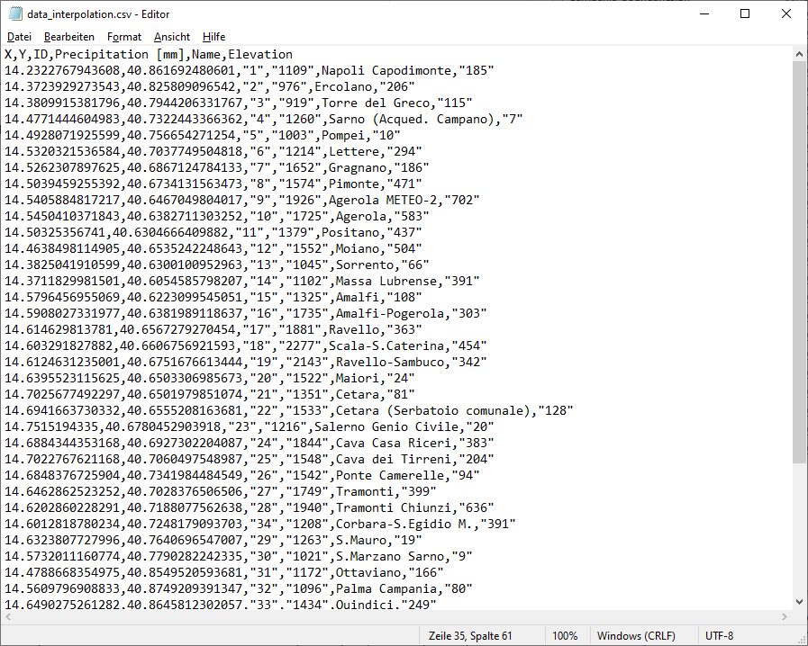
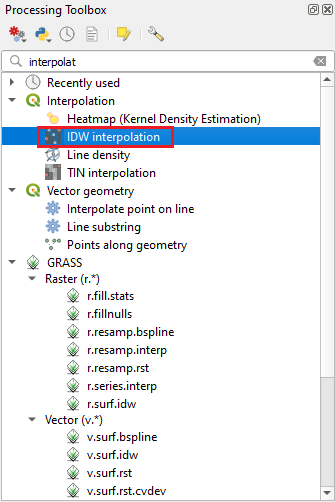
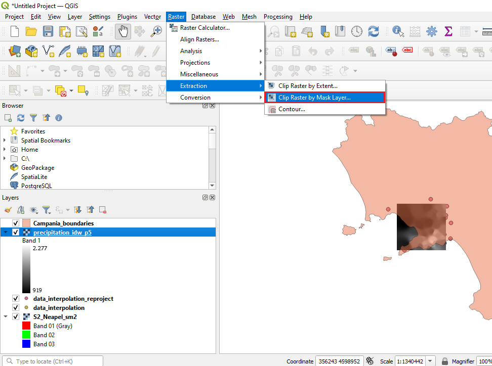
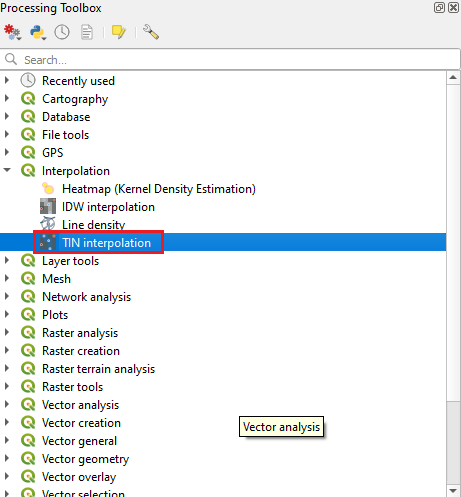
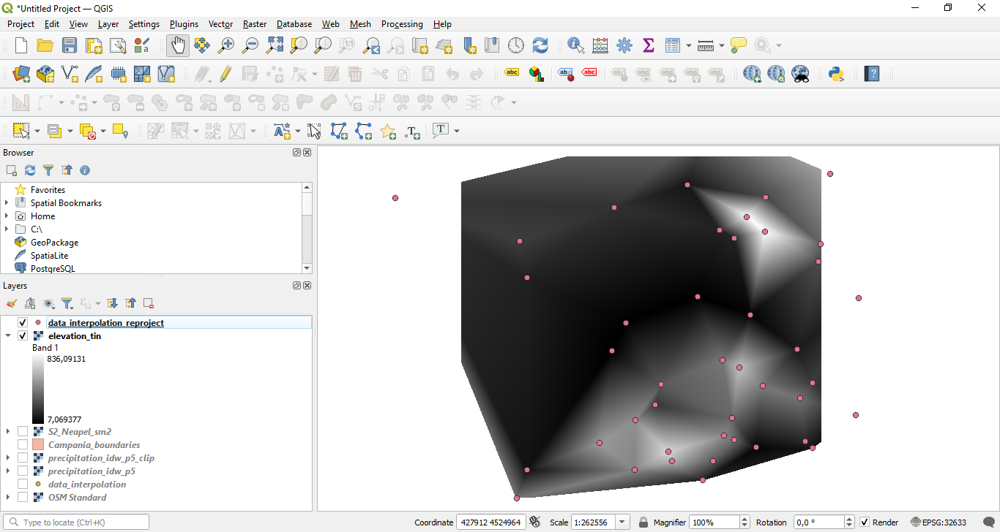

# Spatial interpolation

**Abstract**

After completing this tutorial you will know how to to derive a continuous surface of estimates from discrete points with measured values. This process is called interpolation. 

## Loading Datasets and Reprojecting
In this tutorial we will learn how to interpolate punctual precipitation and elevation measurements. We will make use of a precipitation dataset provided by the "Centro Funzionale Multirischi della Protezione Civile Regione Campania§. This dataset contains measurements of annual precipitation from the year 2021 in mm/year. We will also use global elevation data provided by United States Geological Survey (USGS) and a dataset representing the NUTS (Nomenclature of territorial units for statistics) and Statistical regions provided by Eurostat.

You can access the precipitation dataset and a shapefile of the outline of the land-masses of the study area here:

https://drive.google.com/file/d/1xEZ7rflbptivMOpsOzOYHFQcQ4sePr_P/view?usp=share_link

If we load the dataset in a common text-editor, the file should look as shown in Figure 1:

<figure markdown>
  
  <figcaption>Figure 1: The precipitation csv file.</figcaption>
</figure>

We can see that the file contains 6 columns including the X and Y coordinates of the measurement stations, an ID, the annual precipitation value recorded at this station, the name of the station and it elevation.

We will now load this data into QGIS, along with the Sentinel-2 satellite image.

To do this,

**we again first load the raster dataset “S2_Neapel_sm2.tif” and adapt the visualization settings to have a balanced view of all classes by using the channels R=3, G=2, B=1 and loading new max / min values using the “Symbology”- tab in the properties window. Then we additionally load the points stored in the file “data_interpolation.csv"**

To load a text file as spatial layer in QGIS, we select “Layer” -> “Add Layer” -> “Add Delimited Text Layer...” from the main menu in QGIS as shown in Figure 1. This will open a new dialogue as shown in Figure 2.

<figure markdown>
  
  <figcaption>Figure 2: Loading a csv file.</figcaption>
</figure>

We now first select the “data_interpolation.csv” as input file in the field marked with “1”. Next we choose the file format "CSV" in the area marked with "2". This will tell QGIS how the individual columns in the csv-file are separated. Afterwards we set the Geometry Definition. The csv file contains point coordinates and we hence select the corresponding option (marked with "3"). To tell QGIS where the points are located, we have to define a x-field containing the x-coordinates (Longitude) and the y-field containing the y-coordinates (Latitude). Finally we set the coordinate reference system to EPSG:4326 - WGS 84 (see area marked with "5") and click Add. We select the EPSG:4326 system since the points in the csv file are stored as geographic coordinates.

<figure markdown>
  
  <figcaption>Figure 3: Adding a delimited Text.</figcaption>
</figure>

This should lead to a situation as depicted in Figure 4.

<figure markdown>
  
  <figcaption>Figure 4: After loading the two datasets.</figcaption>
</figure>

We now have two datasets with different projections which we need to change in the next step to prepare the data for interpolation.

**To reproject the point data stored in the geographic coordinate system, we select “Vector” -> “Data Management Tools” -> “Reproject Layer...” from the main menu in QGIS as shown in Figure 5. This will open a new dialogue as shown in Figure 5.**

<figure markdown>
  
  <figcaption>Figure 5: Reprojecting a vector layer.</figcaption>
</figure>

Here we can reproject the precipitation data by

**first selecting the “data_interpolation” layer as input file in the field marked with “1”. After selecting the layer,  we set an output file in the field marked with “3” in Figure 6 and we need to specify a target CRS in the field marked “2”. In this case, we will select the CRS with the EPSG code 32633 which is the same CRS as currently defined for the satellite image. After defining the correct Target CRS we press “OK” and QGIS will re-project the point-vector layer and add it as a new layer. If you now check the CRS of the new layer by performing a right–click, selecting “Properties” and the “General” tab, you will see that the CRS is now also set to 32633.**

<figure markdown>
  
  <figcaption>Figure 6: Reproject layer.</figcaption>
</figure>

## IDW Interpolation

Wer are now ready to interpolate the precipitation values provided in the csv-file. We will use the extent of the satellite image as area for the interpolation. Interpolation results can vary significantly based on the method and parameters you choose. QGIS in its standard installation provides two interpolation methods: Triangulated Irregular Network (TIN) and Inverse Distance Weighting (IDW). For the first part of the tutorial we are using the IDW method.

First from the Processing Toolbox search and locate the "Interpolation" -> "IDW interpolation" tool as shown in Figure 7. (Remember in the main menu click "Processing" -> "Toolbox" in case the toolbox is now shown). Double-click to launch it. 

<figure markdown>
  
  <figcaption>Figure 7: Processing Toolbox.</figcaption>
</figure>

In the new dialogue window we

**first select the “data_interpolation_reproject” layer as input file in the field marked with “1” in Figure 8. After selecting the interpolation layer,  we select the interpolation attribute "Precipitat" marked with "2" and click on the plus symbol to add it to the attribute window below. Next we set the "Distance coefficent P" marked with "3".** 

P is a important coefficcent in this method, because weights are proportional to the inverse of the distance (between the data point and the prediction location) raised to the power value P. So as mentioned above the result is dependent on this parameter.  As a result, as the distance increases, the weights decrease rapidly. The rate at which the weights decrease is dependent on the value of P. If P = 0, there is no decrease with distance, and because each weight is the same, the prediction will be the mean of all the data values in the search neighborhood. As P increases, the weights for distant points decrease rapidly. If the P value is very high, only the immediate surrounding points will influence the prediction.

**After setting P (you may try some different values for that) we set the extent (marked with "4" in Figure 8). For this we calculate the extent from our satellite image. Next you can set the Pixel size marked with "5". Note that the pixel size will affect the calculation time. Before you run the algorithm you can name an output file in the field marked with "6".**

<figure markdown>
  
  <figcaption>Figure 8: IDW Interpolation dialogue.</figcaption>
</figure>

The IDW interpolation tool will then output a black and white interpolated raster surface onto the map area as shown in Figure 9. Based on your P value and your pixel size it may look different.

<figure markdown>
  
  <figcaption>Figure 9: IDW interpolation result.</figcaption>
</figure>

The next step is to clip the interpolation result to the land mass since we did not have any precipitation observation for the sea and we could assume that precipitation patterns differ over the sea. 

To clip the interpolation layer 

**we load the "Campania_boundaries.shp" as learned in earlier tutorials.** 

This should lead to a situation as depicted in Figure 10.

<figure markdown>
  
  <figcaption>Figure 10: After loading the campania boundaries.</figcaption>
</figure>

Next
**we select “Raster” -> “Extraction” -> “Clip Raster by Mask Layer...” from the main menu in QGIS as shown in Figure 11.**

<figure markdown>
  
  <figcaption>Figure 11: Opening the clipping tool.</figcaption>
</figure>

In the new dialogue window we

**first select the “precipitation_idw_p5” layer as input file in the field marked with “1” in Figure 11. After selecting the input layer,  we select the Mask layer "Campania_boundaries" marked with "2" in Figure 12. As you can see in Figure 12 we are lucky that both layer have the same CRS, else we would have to reproject the layers before. Next we save the file in the field marked with "3" as a geoTIFF file.  Now click "Run"**

<figure markdown>
  
  <figcaption>Figure 12: Clip Raster by Mask Layer.</figcaption>
</figure> 

The new clipped layer will be added to the canvas and only shows the land mass as depicted in Figure 13.

<figure markdown>
  
  <figcaption>Figure 13: Clipped Raster.</figcaption>
</figure> 

**To make the visual appearance more pleasing, we can customize the symbology. To do it, right click the clipped raster result and select Properties (Or simply you can double click the layer name). The Layer Properties window will appear as shown in Figure 14. Select the Symbology tab marked with "1". In the Band Rendering option change the Render type to Singleband pseudocolor. (marked with "2") Then you can set your color ramp marked with "3". The color should fit to the object which is shown in a map. To classify you can set a classification mode (marked with"4") and the number of classes (marked with "5"), just explore if you want.**

After modifying the colour ramp values to reflect the range of values in a suitable way click ‘apply’ and ‘ok’ and you will now have coloured map of the IDW interpolation surface for precipitation in mm/year as shown in Figure 14.

<figure markdown>
  
  <figcaption>Figure 14: Symbology.</figcaption>
</figure>

<figure markdown>
  
  <figcaption>Figure 15: Result of the IDW interpolation.</figcaption>
</figure>

## TIN Interpolation
Next, we will also try the second interpolation method which is available in the base-installation of QGIS, that is the Triangulated Irregular Network (TIN) method. This time we will not interpolate the precipitation data but the elevation point data which is also stored in the csv-file.

First from the Processing Toolbox search and locate the "Interpolation" -> "TIN interpolation" tool as shown in Figure 16.

<figure markdown>
  
  <figcaption>Figure 16: Processing Toolbox.</figcaption>
</figure>

In the new dialogue window we

**first select the “data_interpolation_reproject” layer as input file in the field marked with “1” in Figure 17. After selecting the interpolation layer,  we select the interpolation attribute "Elevation" (area marked with "2" in Figure 16) and click on the plus symbol to add it to the attribute window below. As a interpolation method we keep "linear". We set the extent by clicking the button marked with "3" to the extent from our satellite image. Next you can set the Pixel size marked with "4". Last we save the output as a .tif file by defining the filename in the field marked with "5" and run the algorithm.**

<figure markdown>
  
  <figcaption>Figure 17: TIN Interpolation dialogue.</figcaption>
</figure>

The TIN interpolation tool will then output a black and white interpolated raster surface onto the map area as shown in Figure 18.

<figure markdown>
  
  <figcaption>Figure 18: TIN interpolation result.</figcaption>
</figure>

In the next step we clip the land mass like we did before with the IDW interpolation. You should already know how to accomplish this by now. The new clipped layer will be added to the map area and only shows the land mass and the interpolated triangles as depicted in Figure 19.

<figure markdown>
  
  <figcaption>Figure 19: Clipped Raster.</figcaption>
</figure>

Now we can customize the symbology as we did for the output layer of the IDW interpolation. Feel free to modify the symbology as you like. One option is shown in Figure 20.

<figure markdown>
  
  <figcaption>Figure 20: Result of the TIN interpolation.</figcaption>
</figure>

## Exercise
Run each interpolation method for the input layers for which you did not yet run it and play around a bit more with the settings. Have a look at the outputs and discuss which method with which settings you believe provides "most realistic looking" results. Prepare a simple map (using the skills you acquired in the last tutorial) containing the view of what you would consider best interpolation result you obtained during your trial runs.

If you want to compare your results to a more sophisticated climate interpolation dataset, you can search for the so called "WorldClim" dataset and download the corresponding file for "annual precipitation", load it to QGIS and compare it with your own result.
