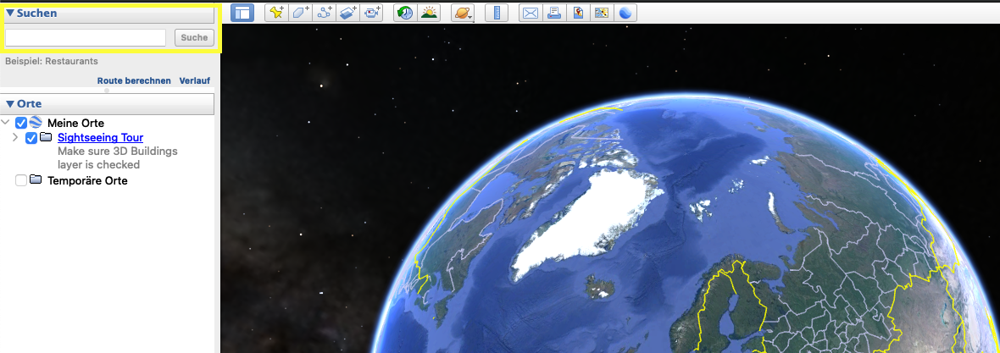
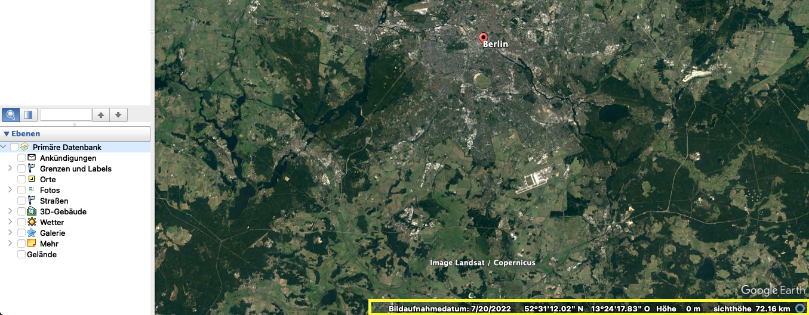
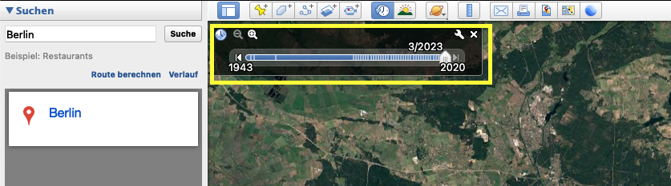
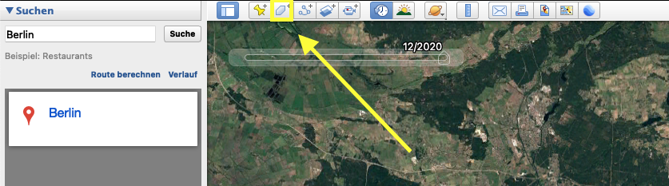
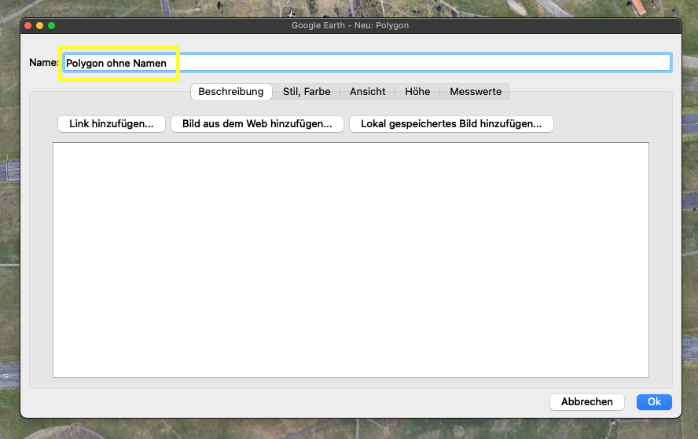
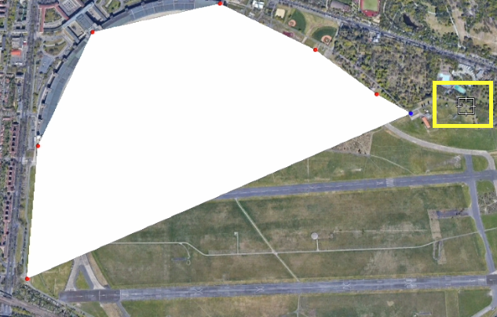
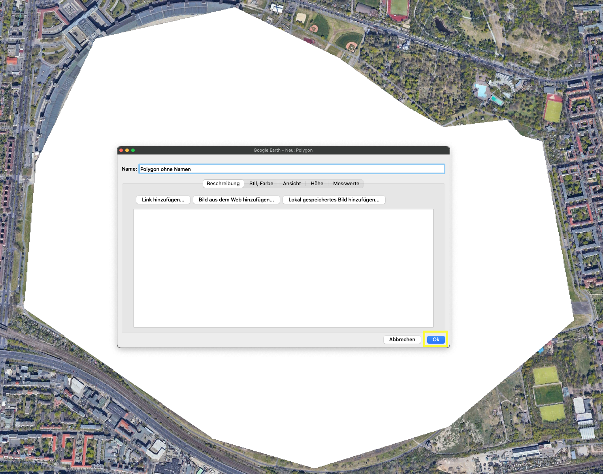

## Zeitplan

9:00: Treff

9:00 - 10:00: Gespräch

10:00 - 10:30 : [Einführung in Google Earth](https://remote-sensing-at-fu-berlin.github.io/schuelerpraktikum/handout/#einfuhrung-in-google-earth)

10:30 - 12:00: [Projektarbeit](https://remote-sensing-at-fu-berlin.github.io/schuelerpraktikum/handout/#projektarbeit)

12:00 - 12:30: Mittagpause

12:30 - 14:00: [Projektarbeit](https://remote-sensing-at-fu-berlin.github.io/schuelerpraktikum/handout/#projektarbeit)

14:00 - 15:00: Druck und Praktikumsprotokoll

## Einführung in Google Earth

Unser Praktikumsziel ist es eine Karte zu Landnutzungs und Landveränderungs eines Gebietes zu erstellen. Hierfür verwenden wir Google Earth Pro. Google Earth Pro ist eine Software, die einen virtuellen Globus darstellt. Sie kann Satellitenbilder mit Informationen überlagern und auf der Erde anzeigen. Es folgt eine kleine Einführung die die wichtigsten Werkzeuge dieses Programmes. Wenn weitere Fragen enstehen, sind wir für Sie da.

### Zeitliche und räumliche Orientierung in Google Earth

Mit der **Suchfunktion**, *oben links in der Seitenleiste*, können Sie ein Gebiet Ihrer Wahl fokusieren.

In der **Statusleiste**, *unten rechts im Fenster*, können sie verschiedene Informationen wie das *Aufnahmedatum* und die *Koordinaten* herausfinden.

### Historische Bilder

Mit dem **Historische Bilder** Werkzeug, *oben links im Fenster* , können sie ältere Aufnahmen aufrufen. Verwenden sie dafür den Regler und verschieben ihn auf der Zeitachse.

### Digitalisieren

Um ein Gebiet zu markieren, kann das **Polygon** Werkzeug verwendet werden.

Wenn sie das Werkzeug anklicken erscheint ein neues Fenster . Hier können sie den Namen ihrer Markierung festlegen. Vergeben sie Aussagekräftige Namen.

Ihr Mauszeiger wird zu einem *Fadenkreuz* mit dem sie nun eine Gebiet markieren können. Dafür spannen sie mit mehreren **Klicks** eine Markierung auf.

Um dieses Polygon zu speichern, rufen sie das zuvor geöfnete Fenster auf und bestätigen sie mit **ok**. Das können Sie für mehrere Gebiete und Zeiträume durchführen. Sodass Sie am Ende eine Sammlung von Markierungen haben. Dabei sollten die Markierung immer stets mit der Projektidee im Hinterkopf gemacht werden. Sie sollten also im Zusammenhang eine Aussage besitzen.

## Projektarbeit

Unser Praktikumsziel ist es eine Karte zu Landnutzungs und Landveränderungs eines Gebietes zu erstellen.  Einige Fragen die Sie sich vorher stellen sollten sind:

- Fällt Ihnen ein Gebiet ein, das Sie zu dem Thema näher untersuchen möchten? (Falls nicht, haben wir auch eine Idee)
- Welche bestandteile verändern sich in diesem Gebiet?
- Wie kann man diese veränderung am besten darstellen?

Sind diese Fragen beantwortet, können Sie loslegen und den Anleitungsschritten im oberen Teil folgen.  
