# Calculating semivariograms and Autocorrelograms #

## Overview ##

In this lecture you will learn how to calculate a semivariogram and an autocorrelogram for a transect and you will get to know a function in R to derive a variogram from a raster image. The code-examples are mostly based on a Tutorial taken from the book "Learning Landscape Ecology" that is also available in ILIAS.

## Datasets used in this Tutorial ##

In this tutorial we will use one of the landscape metric-layers that we calculated in one of the earlier Tutorials as well as a Shapefile which contains the transect for which we will calculate the semivariogram and the autocorrelogram.

The data are available here:

[https://drive.google.com/open?id=1ni4CKdlRaFO6JoJWuI_9qDb6R2GBE2S4](https://drive.google.com/open?id=1ni4CKdlRaFO6JoJWuI_9qDb6R2GBE2S4)

## Step 1: Getting familiar with the dataset ##

We will now first have a look at the data that we are working with. So please download the dataset given at the link above, unzip the files, and then open the QGIS project by double-clicking the file

**overview.qgz**

Now QGIS should open and show the following:

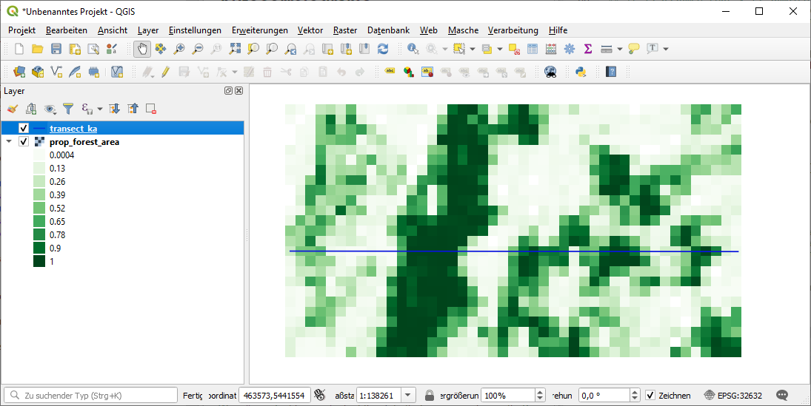

As you can see we only have to datasets displayed: The landscape metric showing the proportional forest cover from 0 to 1 (100%) and a transect that intersects the raster in East-West direction.

In the following we will now extract the raster values for all pixels that the line intersects and use these pixel values to calculate a semivariogram and an autocorrelogram for the proportional forest cover.

## Step 2: Calculating the Semivariogram ##

We already learned in today's theoretical lecture how we calculate the mean semivariance γ for a lag distance of *h*. It is actually a quite simple formula where we first calculate the squared difference of all point pairs (*z(i)* and *z(i+h)*) that can be derived at a given lag-distance *h*. We then sum these squared differences and divide the sum by two times the number of point pairs at the given lag-distance *(2N(h)*):

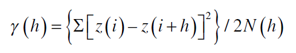 

A short reminder: the lag-distance is the distance between two points (or pixels). If we have a pixel size of 100 m then a lag distance of 100 m would mean that directly neighboring pixels are paired. If the lag distance would be 300 m then each pixel would be paired with pixels that are located 3 pixels away (in other words, there are two pixels inbetween the two pixels that will be paired). Remember also this graph:

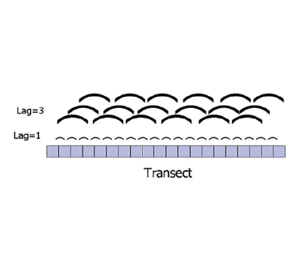 

By comparing the semi-variances of point pairs with different lag-distances, we can quantify/depict how the spatial distance influences the correlation between points. Remember, the semi-variance will be low (values show low variance and are hence very similar) for highly correlated values, while it will be high for point-pairs with low correlation.

Before we proceed with the calculation of the semi-variance, we will have to load our datasets by running the following code:

	
	# load required packages (as usual, please install missing packages)
	require(raster)
	require(rgdal)
	require(usdm)

  	# set working directory that contains the data
	setwd("D:/Multiskalige_FE/5_Practicals/Tag_4")

	# load tif file containing landscape metric (here prop. forest area in a 500 x 500 m area)
	img <- stack("prop_forest_area.tif")
	  
	# load shapefile (polyline) that contains the transect for which we want to calculate
	# the semivariogram and the autocorelogram
	shp <- readOGR(".", "transect_ka")

Next, we will intersect the raster-file with the transect and extract the values of the raster file for all pixels along the transect. We use the "unlist()" function as the extract command in this case will return a list. 

	  
	# overlay the shapefile-transect with the image and derive the raster values
	# as the extract command delivers a list, we use the unlist command to 
	# decompose the list to a vector file
	pr_for<- unlist(extract(img, shp))

We can now have a look at the extracted values by running:

	pr_for

This will show us:

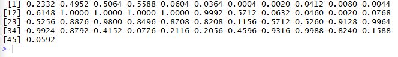 

These will be the values for which we calculate our semi-variogram. To do this, we will now first derive the spatial resolution of our image as this will determine the rythm of our lag-distances. It would not make sense to select for example a lag distance of 1 m if our pixel size is 10 m as we would not be able to build pairs with pixels that are only 1 m apart.
	 
	# get the pixel size of the image using the res() command of the raster package
	res_img <- res(img)[1]
	res_img
	  
This will return a value of 500 which indicates that our raster dataset has a spatial resolution of 500 m. That means that our lag-distances will be 500, 1000, 1500, 2000,... and so on.

We calculate a vector with the corresponding values using the following code:

	# create a vector file with the same length as the extracted values of the transect
	# which indicates the position on the transect. As each pixel is 500 m large, we use
	# steps of 500 m.
	tr_pos <- seq(res_img, length(pr_for)*res_img, res_img)
These values at the same time indicate the position of each pixel on the transect.

We will now calculate the semi-variance for the different lag-distances. Based on the function available in R, this requires several steps and the calculation might not be 100% intuitive at the first glance. However, when putting some thought into it, it should become quite clear.

First, we calculate the distance of each pixel to all other pixels on the transect by running:

	# calculate the lag-distances between each point
	lag <- dist(tr_pos)
	lag

This will result in a quite bix matrix looking like that:

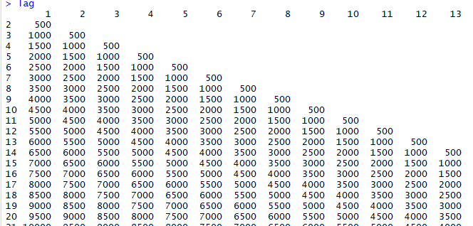

You can interpret this like this: the column named 1 represents the first pixel on the transect. In the rows you can then see the lag distance to each of the pixels that follows. The second column represents the second pixel on the transect, the third column the third pixel and so on. This matrix will help us later on to identify all point pairs with a unique lag distance. 

Next, we calculate the semivariance for all point pairs by running:

	varTP <- dist(pr_for)^2*.5
	varTP

This will result in a matrix with the same structure as our **lag**-matrix, we have just calculated, but of course the values are different.

It is important to understand that we now already have all important inputs together to calculate the mean semivariances for all lag-distances. The two things that are still missing are: 

1. we have to split our **varTP** matrix to be able to treat the semi-variances for each lag-distance individually
2. we have to calculate the mean semi-variance for each lag distance (the **N** in the formular has not been considered yet).

We accomplish this by first running:

	# split the seminvariance values up depending on what spatial lag they occur at    
	TP.split<-split(varTP,lag)     
	TP.split   

Here we can now see the semi-variances for each lag-distance. In the figure below the last few entries are shown where we can see that the number of point pairs constantly decreases and that for the largest lag-distance (22000 m) only one point pair is available:

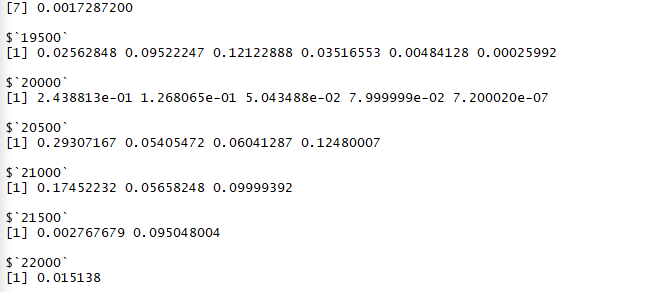

Next, we calculate the mean semi-variance for each lag-distance by running:

	# compute the mean semivariance at each spatial lag
	TP.gamma <- sapply(TP.split,mean) 
	TP.gamma

This simply calculates the mean value for each of the lines of values depicted in the preceeding figure.

This will result in one value (the mean semi-variance) for each lag-distance:

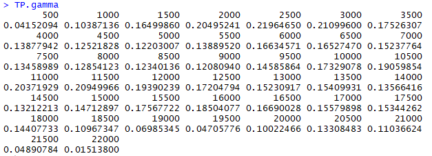

Now we have all the information to plot our semi-variogram by simply plotting the mean semivariance over the lag-distance.

The corresponding code looks like this:

	# extract the values of the unique spatial lags
	lag.uni<- as.numeric(names(TP.gamma))
	# visually examine the variogram for the landscape metric and the transect
	plot(lag.uni,TP.gamma,xlab='Spatial Lag (m)',ylab='Semivariance Forest prop. [%]',type='o') 
	abline(v=max(lag)/2,lwd=2,col='dodgerblue',lty=2)

The will lead to this graph:

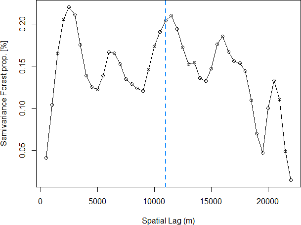

We have now plotted the semi-variogram across all possible lag-distances, however, as we discussed before, the large lag-distances have only very few points left and they might hence have a very limited reliability. Typically it is recommended to only consider lag-distances up to half of the maximum lag-distance. The corresponding lag-distance is marked with the blue dashed line in the graph.

If we compare this graph with the original raster dataset, we can interpret the semi-variogram a bit. The maximum semivariance is reached at a lag-distance of 2500 m (or five pixels) - i we have a look at the raster dataset we can see that there are several elements of the landscape along the transect that are approximately 5 pixels long. There is a almost forest-free zone 6 pixels at the Eastern start of the transect, then there is a fully forest covered area which also covers 5 pixels, afterwards there is another forest-free zone of 4-5 pixels followed again by a sparsely forested areas with a length of about 6 pixels. At lag-distances smaller than these landscape element sizes, the correlation between the values will be high (the semi-variance low) while at larger lag-distances, they will get small.

This matches the curve depicted in the semi-variogram. Hence, at the given spatial grain of 500 m, the landscape elements along our transect tend to change every 2500 m and even though there are some more fluctuation afterwards, we could be quite sure that if we take some sort of field measurements and make sure that each maesurement is at least 2500 m away from all other measurements, there should be no problem with spatial autocorrelation in the models we build from these data. 

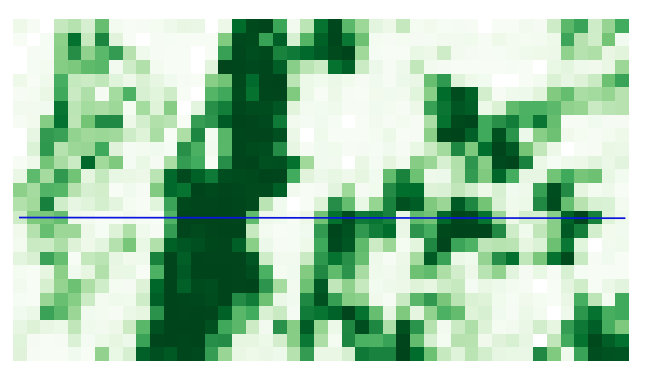

## Step 3: Calculating the Autocorrelogram ##

In this part of the tutorial, we will calculate the autocorrelogram. We will here take a slightly different approach and prepare a function to calculate autocorrelation along a simple transect. More detailed explanations of the function are given in the comments of the code. The function looks like this:

	
	# The name of the function is "a.cor" and the it only requires one input variable x where
	# x is a vector containing the regular measurements along the transect
	a.cor<-function(x){
	 ## This function computes autocorrelation of the variable x.
	 ## It is assumed that x is sampled along a linear, uniformly-spaced transect.
	 ## This function is not appropriate for computing spatial autocorrelation for 
	 ## more complex spatial arrangements of data.

	 # first compute the total size of x 
	 len<-length(x)  
	 # create an empty output variable	
	 r<-rep(NA,len-2) 
	 # loop through all the possible spatial lags (h)
	 for(h in 1:(len-2)){ 
		 # compute the autocorrelation at each lag
		 # in this case the correlation would be a simple Pearson's correlation
		 # by using clever subsetting of the vector files, the correlation will always
		 # be calculated for the correct point pairs
	     r[h] <- cor(x[1:(len-h)],x[(1+h):len]) 
	  }
	 # print the output variable (which will be the value to be returned by the function)
	 r 
	}
	 

If we run the code above, R will not yet perform an actual analysis yet, but will simple create the a new function called "**a.cor**"which is also visible in the environment window in RStudio (at the very bottom normally):

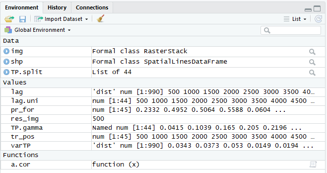

We will now apply this function to our vector containing the proportional forest cover values along the transect:

	# now that we have our function we can compute the autorcorrelation for all possible lags
	correl<-a.cor(pr_for)
	
This will return the correlation for all possible lag-distances of the given vector. Be aware that in this case, the code is not considering real metric distances but simply positions in the vector. As we are working with regular distances (each measurement on the transect is equally far away from the next measurement), this does not affect the results.

This has to be considered when finally plotting the autocorrelogram. We use the variable **tr_pos** containing the lag-distances (created in Step 2) to define the lag distances on the x-axis. We can then plot the autocorrelogram using the following code:

	# plot the autocorrelogram 
	# we use tr_pos[1:43] as for the way we calculate the spatial autocorrelation no value is avaiable for the first and last lag-distances
	plot(tr_pos[1:43],correl,xlab='Spatial lag (m)',ylab='Autocorrelation',main='Forest Proportion',type='o')
	abline(v=max(tr_pos)/2,col='dodgerblue',lty=2,lwd=2)
	abline(h=0)

This will result in the following graph:

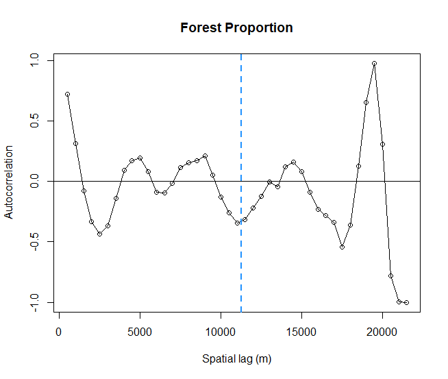

As we can see, the curve is very similar to the semi-variogram but mirrored. One thing that might have to be discussed, is the fact that correlations can be positive and negative and hence the optimal lag-distance at which no spatial autocorrelation occurs anymore might be interpreted differently in this graph (the curve starts fluctuating around 0 at approximately 3500-4000 m instead of the maximum semi-variance that was achieved at 2500 m.

## Step 4: Calculating a Semivariogram for a Raster-file ##

In the preceeding steps, we calculated the semivariogram and the autocorrelogram in a rather "manual" way, which helps to understand what steps are required to produce the final graphs. On the negative side, the methods we used above are only suitable for a 1D-transect. However, in remote sensing we are typically working with raster datasets and it is of course also possible to calculate variograms for 2D-environments. Then, the pixel-pairs are not only created in the 1D space but in the 2D space. The remaining calculations are the same.

In R, there is a package that allows to calculate Variograms for single-band raster layers. The code is really simple:

	## calculate a variogram from a raster using the usdm package
	## the function has some additional settings that can be checked using
	## ?Variogram
	## in many cases the standard settings should be ok
	var_ras <- Variogram(img[[1]])
	plot(var_ras)

Running this code, will lead to:

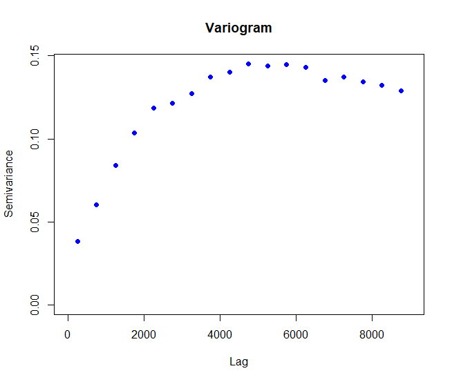

As we can see, this variogram looks a lot smoother than the semi-variogram we computed for the transect. This might be due to the fact, that by considering more pixels in the raster, the number of point pairs is a lot higher and the semi-variogram is less influenced by the the particular landscape structure along the transect. When checking the information provided for the function **Variogram()** (by typing):

	?Variogram

you will find out that the function actually is not using all pixels to calculate the semi-variogram but takes a random sample of pixels, representative of the raster layer. You can change the amount of pixels used during that step. It is also possible to change the lag-interval. In the standard setting, the pixel size is used, similarly as we did in the 1D-example above. However, it is possible to also use larger intervals. This might be relevant for analysing very high resolution images where not all possible lag-distances may have to be considered to get a meaningful diagram.

This was the last part of the Tutorial and in ideal case, you will now have a better understanding what semi-variograms and auto-correlograms are and how they are computed. In the course, we will not get into more details about this topic, but this could be one setion of the course that could also be examined with more details in small experiment or literature search to hand in as final assignment.
